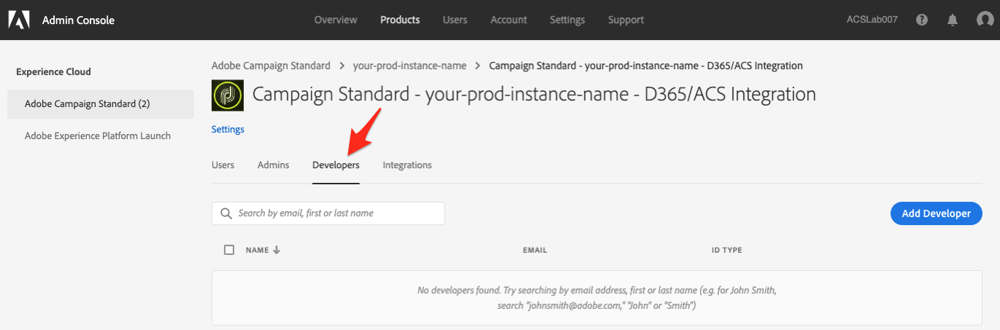

# Zugriff auf die Adobe Campaign Standard-Integration mit der Selbstbedienungsanwendung Microsoft Dynamics 365

Für diese Konfiguration müssen Sie mit einem Experience Cloud-Administrator (EC) für Ihr Unternehmen arbeiten. Dies sind die ersten Schritte, die erforderlich sind, um Ihnen Zugriff auf die Benutzeroberfläche der Self-Service-Integration zu gewähren. Sobald Sie Zugriff auf das Tool haben, richten Sie Verbindungen zu Ihren Daten ein und konfigurieren den Datenfluss zwischen Adobe Campaign und Microsoft Dynamics 365.

>[!NOTE]
>
>Sie müssen Kontakt zu Ihrem Kundenbetreuer aufnehmen und die Adobe Campaign Standard-Organisations- und Instanznamen angeben. Ein Ticket wird protokolliert, um die Aktivierung der Integrations-App für Ihr Unternehmen anzufordern.

## hinzufügen eines Profils

In diesem Abschnitt erfahren Sie, wie Sie mit der Selbstbedienungs-App Microsoft Dynamics 365 Zugriff auf die Adobe Campaign Standard-Integration gewähren. Benutzer, die Zugriff auf Ihr Unternehmen in Adobe Experience Cloud haben, haben keinen Zugriff auf die Self-Service-App für die Integration, es sei denn, Sie befolgen die folgenden Schritte, um ihnen Zugriff zu gewähren.

>[!IMPORTANT]
>
> Diese Schritte erfordern die Rolle **Administrator** im Experience Cloud Ihres Unternehmens.

1. Gehen Sie zu https://experience.adobe.com/ und melden Sie sich beim Adobe Experience Cloud an.
1. Greifen Sie auf die Admin Console **zu.**

   

1. Klicken Sie auf **[!UICONTROL Produkte]**, um auf Ihre Experience Cloud-Lösungen zuzugreifen.

   

   >[!IMPORTANT]
   >
   >Die restlichen Schritte in diesem Abschnitt werden für jede Ihrer Instanzen der Kampagne (dev, text, production) ausgeführt.

1. Klicken Sie auf die erste Instanz zu konfigurieren.

   

   Die Instanzseite sollte etwa wie folgt aussehen:

   

1. Klicken Sie auf die Schaltfläche **[!UICONTROL Neues Profil]** und fügen Sie einen neuen Eintrag namens **Campaign Standard - Ihr-prod-instance-name - D365/ACS-Integration**

   * Wenn Sie diesen Eintrag in der Liste sehen, müssen Sie nicht fortfahren. Klicken Sie im linken Menü auf **Adobe Campaign Standard** und überprüfen Sie die anderen Instanzen der Kampagne.

   * Ersetzen Sie &quot;your-prod-instance-name&quot;durch den tatsächlichen Namen Ihrer Instanz.

1. Sie können das Dropdown-Feld **[!UICONTROL Berechtigungsgruppe]** mit dem Standardwert belassen.

1. Wenn Ihre Einträge ähnlich wie folgt aussehen, klicken Sie auf die Schaltfläche **[!UICONTROL Fertig]**.

   

   Das neue Profil wurde hinzugefügt.

   

## Gewähren Sie Zugriff auf Benutzer {#add-users-to-profile}

Wählen Sie auf der Seite **[!UICONTROL Produkte]** Ihre Kampagne aus und führen Sie die folgenden Schritte aus:

1. Klicken Sie auf das zuvor erstellte neue Profil:  **Campaign Standard - Ihr-prod-instance-name - D365/ACS-Integration**

   

1. Klicken Sie auf die Registerkarte **[!UICONTROL Entwickler]**.

   

1. Klicken Sie auf die Schaltfläche **[!UICONTROL Hinzufügen Developer]**

1. Geben Sie den Namen oder die E-Mail-Adresse des Benutzers ein, den Sie hinzufügen möchten.  Wählen Sie das Ergebnis aus, das dem Benutzer entspricht.

   Wenn der Benutzer zum ersten Mal zum Org hinzugefügt wird, geben Sie Details ein.

1. Klicken Sie zur Bestätigung auf **[!UICONTROL Speichern]**.
