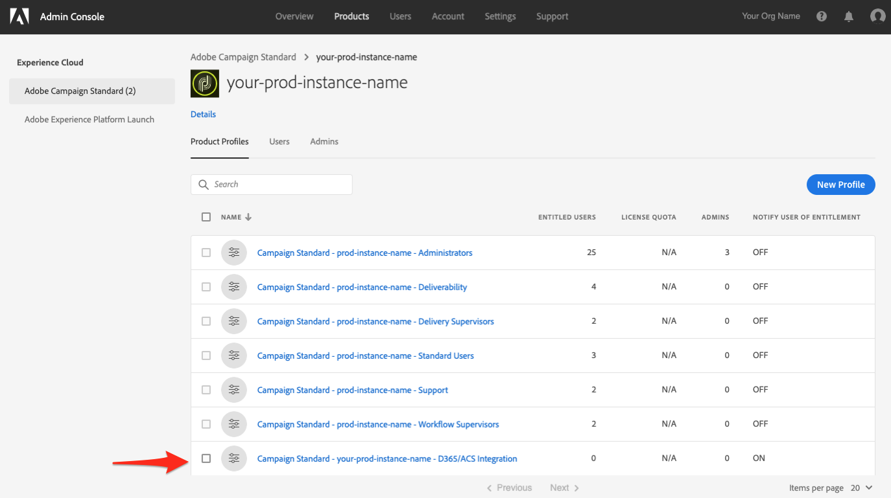

# Zugriff auf die Selfservice-Anwendung zur Integration von Adobe Campaign Standard mit Microsoft Dynamics 365

Für diese Konfiguration müssen Sie mit einem EC-Administrator (Experience Cloud) Ihres Unternehmens zusammenarbeiten. Dies sind die ersten Schritte, die erforderlich sind, damit Sie Zugriff auf die Benutzeroberfläche der Selfservice-Integrationsanwendung erhalten. Sobald Sie Zugriff auf das Tool haben, richten Sie Verbindungen zu Ihren Daten ein und konfigurieren Sie den Datenfluss zwischen Adobe Campaign und Microsoft Dynamics 365.

>[!NOTE]
>
>Nehmen Sie Kontakt zu Ihrem Adobe-Support-Mitarbeiter auf und geben Sie die Adobe Campaign Standard-Organisations- und -Instanznamen an. Daraufhin wird ein Ticket erstellt, um die Aktivierung der Integrationsanwendung für Ihr Unternehmen anzufordern.

## Produktprofil hinzufügen

In diesem Abschnitt erfahren Sie, wie Sie Zugriff auf die Selfservice-Anwendung zur Integration von Adobe Campaign Standard mit Microsoft Dynamics 365 gewähren. Benutzer, die in Adobe Experience Cloud Zugriff auf Ihr Unternehmen haben, haben keinen Zugriff auf die Selfservice-Integrationsanwendung. Führen Sie die folgenden Schritte aus, um ihnen Zugriff zu gewähren.

>[!IMPORTANT]
>
> Für diese Schritte benötigen Sie die **Administratorrolle** in Experience Cloud für Ihr Unternehmen.
>

1. Gehen Sie zu https://experience.adobe.com/ und melden Sie sich bei Adobe Experience Cloud an.
1. Rufen Sie die **Admin Console** auf.

   

1. Klicken Sie auf **[!UICONTROL Produkte]**, um auf Ihre Experience Cloud-Lösungen zuzugreifen.

   

   >[!IMPORTANT]
   >
   >Die restlichen Schritte in diesem Abschnitt müssen für jede Ihrer Campaign-Instanzen (Entwicklung, Text, Produktion) ausgeführt werden.
   >

1. Klicken Sie auf die erste Instanz, die Sie konfigurieren möchten.

   

   Die Seite der Instanz sollte etwa wie folgt aussehen:

   

1. Klicken Sie auf die Schaltfläche **[!UICONTROL Neues Profil]** und fügen Sie einen neuen Eintrag namens **Campaign Standard - Name Ihrer Produktionsinstanz - D365/ACS Integration** hinzu.

   * Wenn Sie diesen Eintrag in der Liste sehen, müssen Sie nicht fortfahren. Klicken Sie im linken Menü auf **Adobe Campaign Standard** und überprüfen Sie die anderen Campaign-Instanzen.

   * Beachten Sie, dass Sie &quot;Name Ihrer Produktionsinstanz&quot; durch den tatsächlichen Namen Ihrer Instanz ersetzen müssen.

1. Sie können das Dropdown-Feld **[!UICONTROL Berechtigungsgruppe]** mit dem Standardwert unverändert lassen.

1. Wenn Ihre Einträge ähnlich wie die folgenden aussehen, klicken Sie auf die Schaltfläche **[!UICONTROL Fertig]**.

   

   Das neue Profil wurde hinzugefügt.

   

## Gewähren von Zugriff für Benutzende {#add-users-to-profile}

Wählen Sie auf der Seite **[!UICONTROL Produkte]** Ihre Campaign-Instanz aus und führen Sie die folgenden Schritte aus:

1. Klicken Sie auf das zuvor erstellte neue Profil: **Campaign Standard - Name Ihrer Produktionsinstanz - D365/ACS Integration**.

   

1. Klicken Sie auf den Tab **[!UICONTROL Entwickler]**.

   

1. Klicken Sie auf die Schaltfläche **[!UICONTROL Entwickler hinzufügen]**

1. Geben Sie den Namen oder die E-Mail-Adresse des Benutzers ein, den Sie hinzufügen möchten.  Wählen Sie das Ergebnis aus, das dem Benutzer entspricht.

   Wenn der Benutzer zum ersten Mal zur Organisation hinzugefügt wird, geben Sie die erforderlichen Details ein.

1. Klicken Sie zur Bestätigung auf **[!UICONTROL Speichern]**.
