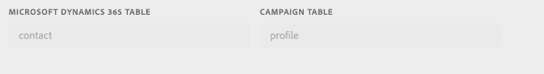
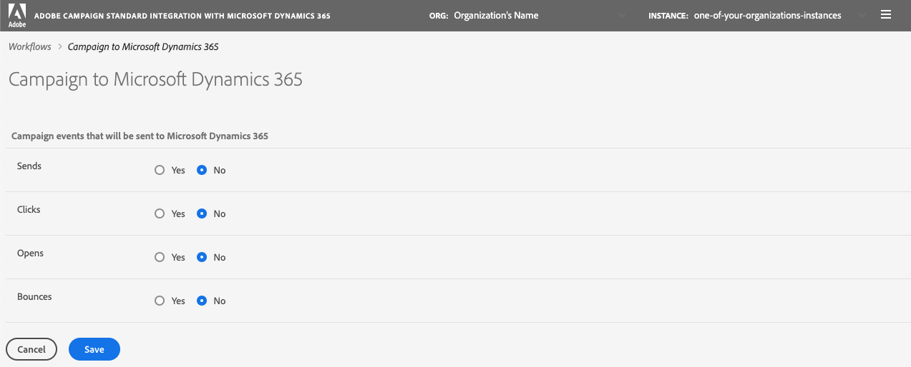

# Daten synchronisieren

Sie können Tabellen von Microsoft Dynamics 365 mit Campaign und Campaign-Marketing-Metriken mit Microsoft Dynamics 365 synchronisieren. Die Synchronisation wird durch drei dedizierte technische Workflows ausgeführt: **[!UICONTROL Microsoft Dynamics 365 zu Campaign]**, **[!UICONTROL Campaign zu Microsoft Dynamics 365]**, **[!UICONTROL Opt-in/Opt-out]**. [Weitere Informationen finden Sie in diesem Abschnitt.](../../integrating/using/d365-acs-self-service-app-workflows.md) 

>[!IMPORTANT]
>Sie müssen den Workflow **[!UICONTROL Microsoft Dynamics 365 zu Campaign]** anhalten und wieder starten, damit Ihre Änderungen berücksichtigt werden. [Mehr dazu](../../integrating/using/d365-acs-self-service-app-workflows.md)
>

## Tabellen von Microsoft Dynamics 365 Campaign zuordnen

Die Seite **[!UICONTROL Microsoft Dynamics 365 zu Campaign]** enthält eine Liste von Entitäten in Microsoft Dynamics 365 sowie die benutzerdefinierten Ressourcen in Adobe Campaign, mit denen sie synchronisiert werden. Sie können neue Mappings hinzufügen und vorhandene Mappings bearbeiten oder löschen.

Hier finden Sie eine Beschreibung der einzelnen Spalten in dieser Tabelle:

* **[!UICONTROL MICROSOFT DYNAMICS 365-TABELLE]**: Diese Spalte gibt an, welche Entität in Microsoft Dynamics 365 die Datenquelle für das Mapping sein wird.

* **[!UICONTROL CAMPAIGN-TABELLE]**: Diese Spalte gibt an, welche Ressource in Adobe Campaign das Datenziel für das Mapping sein wird.

* **[!UICONTROL AKTIONEN]**: Nachfolgend sind mögliche Aktionen aufgeführt:

   * Klicken Sie auf das Symbol **[!UICONTROL Bearbeiten]**, um dieses Mapping zu bearbeiten.

   * Verwenden Sie das Symbol **[!UICONTROL Löschen]**, um ein Tabellen-Mapping zu löschen.

   * Klicken Sie auf das Symbol **[!UICONTROL Daten erneut abspielen]**, um alle Daten in der Microsoft Dynamics 365-Tabelle erneut zu synchronisieren. Normalerweise synchronisiert die Integrationsanwendung nur die Daten in Microsoft Dynamics 365, die kürzlich geändert wurden.  In einigen Fällen (z. B. wenn Sie eine Änderung vorgenommen oder einen Fehler gemacht haben) möchten Sie jedoch möglicherweise, dass alle Daten erneut synchronisiert werden.  Klicken Sie in diesen Fällen auf diese Schaltfläche. Beim nächsten Anhalten/Starten des Workflows **[!UICONTROL Microsoft Dynamics 365 zu Campaign]** beginnt dann die Synchronisation Ihrer Daten.

     Wenn Sie auf die Schaltfläche **[!UICONTROL Daten erneut abspielen]** klicken und die Prüfungen erfolgreich sind, wird das Symbol deaktiviert. Dies bedeutet, dass die Daten für dieses Tabellen-Mapping-Paar bei der nächsten Ausführung des Workflows **[!UICONTROL Microsoft Dynamics 365 zu Campaign]** erneut synchronisiert werden.

     Sie können die Daten nicht erneut abspielen, wenn Folgendes zutrifft:

      * Die Metrik „Rückstand“ enthält 2.000.000 (oder mehr) Elemente, die mit dem Workflow **[!UICONTROL Microsoft Dynamics 365 zu Campaign]** verknüpft sind (auf der Seite **[!UICONTROL Workflows]** angezeigt).
      * Die Microsoft Dynamics 365-Tabelle enthält 2.000.000 oder mehr Datensätze.

     Die Anzahl der Datensätze, die erneut synchronisiert werden müssen, variiert. Wenn Sie eine große Anzahl von Datensätzen haben, kann es einige Zeit dauern, bis der Synchronisationsvorgang abgeschlossen ist. Während die Integrationsanwendung den Synchronisationsvorgang abschließt, können Sie in der Metrik **[!UICONTROL Rückstand]** auf der Seite **[!UICONTROL Workflows]** entsprechende Informationen abrufen.

     >[!IMPORTANT]
     >
     > Es wird dringend empfohlen, den Integrations-Workflow anzuhalten, wenn Sie Änderungen in Adobe Campaign Standard oder Microsoft Dynamics 365 veröffentlichen. Zu diesen Änderungen gehören Aktualisierungen von Ressourcen/Entitäten (und den zugehörigen Feldern), Links, Spalten mit Kennungen usw., die derzeit von der Integration verwendet werden.
     >

## Erstellen eines neuen Mappings {#add-a-new-mapping}

Gehen Sie wie folgt vor, um ein neues Mapping zu erstellen:

1. Klicken Sie auf der Seite **[!UICONTROL Microsoft Dynamics 365 zu Campaign]** auf die Schaltfläche **[!UICONTROL Neues Mapping hinzufügen]**.

1. Verwenden Sie die Dropdown-Listen, um Microsoft Dynamics 365- und Campaign-Tabellen für das Mapping auszuwählen.
Die meisten anderen Eingaben auf der Seite hängen davon ab, welche Tabellen Sie auswählen.

   

   >[!NOTE]
   >Sie können die einzelnen Tabellen nicht öfter als einmal zuordnen. Sie werden daher feststellen, dass die Dropdown-Auswahl keine Tabellen enthält, die bereits zugeordnet wurden.

1. Klicken Sie zur Bestätigung auf **[!UICONTROL OK]**: Die Anwendung benötigt kurze Zeit, um die mit den ausgewählten Tabellen verknüpften Feldinformationen zu lesen.

Anschließend können Sie mit der Mapping-Konfiguration fortfahren. [Mehr dazu](#new-mapping-settings)

>[!IMPORTANT]
>
>Sie können die Tabellen auf dieser Seite nur auswählen, wenn Sie das Mapping zum ersten Mal hinzufügen. Vergewissern Sie sich, dass Sie die richtigen Tabellen ausgewählt haben, bevor Sie auf die Schaltfläche **[!UICONTROL Speichern]** klicken: Nach dem Speichern sind die Tabellenauswahlfelder **schreibgeschützt**.

### Vorhandenes Mapping bearbeiten

Wenn Sie ein vorhandenes Mapping bearbeiten, werden Sie bemerken, dass die Tabellenauswahl nicht bearbeitbar ist.

Das ist so gewollt, weil die Eingaben weiter unten auf der Seite auf den Feldern basieren, die mit diesen Tabellen verbunden sind. Das Ändern der Tabellen würde alle mit diesen Tabellen verknüpften Felder ungültig machen.  Wenn Sie die Tabelle ändern möchten, der das Mapping zugeordnet werden soll, müssen Sie zur vorherigen Seite zurückkehren, das zu ändernde Mapping löschen und ein neues Mapping hinzufügen.

### Konfigurieren eines einzelnen Tabellen-Mappings {#new-mapping-settings}

In diesem Abschnitt erfahren Sie, wie Sie ein **einzelnes** Mapping einer Microsoft Dynamics 365-Tabelle auf eine Adobe Campaign-Tabelle konfigurieren.

Sie können die folgenden Einstellungen definieren:

* **[!UICONTROL Tabellen]**: In diesem Abschnitt werden der Name der Microsoft Dynamics 365-Tabelle sowie die Campaign-Tabelle aufgeführt, der sie zugeordnet wird.
* **[!UICONTROL Feld-Mappings]**: Weitere Informationen finden Sie in [diesem Abschnitt](#field-mappings).
* **[!UICONTROL Feldersetzungen]**: Weitere Informationen finden Sie in [diesem Abschnitt](#field-replacements).
* **[!UICONTROL Filter]**: Weitere Informationen finden Sie in [diesem Abschnitt](#filters).
* **[!UICONTROL Erweiterte Einstellungen]**: Weitere Informationen finden Sie in [diesem Abschnitt](#advanced-settings).

### Feld-Mappings {#field-mappings}

#### Primärschlüssel

Wenn Sie ein neues Tabellen-Mapping von Microsoft Dynamics 365 auf Campaign hinzufügen, müssen Sie das ID-Feld identifizieren.

Der Microsoft Dynamics 365-Primärschlüssel ist schreibgeschützt, da die Anwendung ihn erkennt.

Für Campaign müssen Sie auswählen, welches Feld der eindeutige Schlüssel sein soll. Es muss als [benutzerdefinierte CRM-ID-Ressource](../../developing/using/uc-calling-resource-id-key.md) konfiguriert sein und darf keine Duplikate enthalten.

>[!NOTE]
>
>Sie können das ID-Feld in der Tabelle nur dann auswählen, wenn Sie **[!UICONTROL Neues Mapping hinzufügen]** ausgewählt haben. Wenn Sie auf die Schaltfläche &quot;Bearbeiten&quot; klicken, um ein vorhandenes Tabellen-Mapping zu bearbeiten, ist das ID-Feld schreibgeschützt.

Die Primärschlüssel sind immer die ersten Feldnamen, die im Abschnitt **[!UICONTROL Feld-Mappings]** aufgeführt werden. Das folgende Symbol wird rechts angezeigt, um Sie daran zu erinnern, dass es sich hierbei um die Primärschlüssel handelt.

#### Andere Feld-Mappings hinzufügen

Im Abschnitt **[!UICONTROL Feld-Mappings]** können Sie von den Primärschlüsseln abgesehen auch andere Feld-Mappings hinzufügen. Um ein neues Feld-Mapping von Microsoft Dynamics 365 auf Adobe Campaign hinzuzufügen, klicken Sie auf die Schaltfläche **[!UICONTROL Neues Mapping hinzufügen]**.

Wählen Sie in den Listen die Microsoft Dynamics 365- und Campaign-Felder aus:

Diese Listen enthalten die Feldnamen, die mit den Microsoft Dynamics 365- und Campaign-Tabellen verknüpft sind, die Sie oben auf der Seite ausgewählt haben.

Mit dem Schalter **[!UICONTROL Aktualisierungen anwenden]** können Sie steuern, ob Aktualisierungen dieses Felds von Microsoft Dynamics 365 in Campaign übertragen werden:
* Wenn  aktiviert ist, werden Aktualisierungen der Werte in Microsoft Dynamics 365 an Adobe Campaign weitergegeben, sobald die Aktualisierungen vorgenommen werden.

* Wenn  nicht aktiviert ist, wird der Wert weitergegeben, wenn die Daten zum ersten Mal geladen (oder erneut abgespielt) werden, aber inkrementelle Aktualisierungen des Feldes in Microsoft Dynamics 365 werden nicht weitergegeben.

>[!NOTE]
>
>Klicken Sie auf die Spaltenüberschrift **[!UICONTROL Aktualisierungen anwenden]**, um **alle** Schalter zu aktivieren oder zu deaktivieren.
>

Wenn Sie Feldwerte auswählen, wird der Datentyp unter den Dropdown-Menüs angezeigt.   Dies ist beim Mapping von Werten von einem Feld auf ein anderes zu beachten.

>[!NOTE]
>
> Sie können nicht mehrere Microsoft Dynamics 365-Felder einem einzigen Campaign-Feld zuordnen.

### Feldersetzungen {#field-replacements}

Verwenden Sie die Schaltfläche **[!UICONTROL Neue Feldersetzung hinzufügen]**, um eine neue Feldersetzung zu definieren.

Mit Feldersetzungen können Sie Folgendes identifizieren:

* einen Microsoft Dynamics 365-Feldnamen (der oben im Abschnitt &quot;Feld-Mappings&quot; hinzugefügt wurde),
* einen vorhandenen Wert (der in Microsoft Dynamics 365 vorhanden ist) und
* einen neuen Wert zum Schreiben in Adobe Campaign.

Eine Dropdown-Liste wird für Auswahllisten, Aufzählungen und boolesche Werte bereitgestellt. Für andere Zeichenfolgen- und numerische Typen wird ein Textfeld verwendet.

### Filter {#filters}

Verwenden Sie die Schaltfläche **[!UICONTROL Neuen Filter hinzufügen]**, um auszuwählen, welche Microsoft Dynamics 365-Datensätze an Campaign übertragen werden sollen. Sie können ein beliebiges Feld auswählen, das mit einem Datensatz verknüpft ist, um es Filtern hinzuzufügen (der Feldname muss den Feld-Mappings nicht hinzugefügt werden).

Filter können durch Angabe folgender Informationen spezifiziert werden:

* Microsoft Dynamics 365-Feldname
* einen Vergleichswert und
* einen Wert (von Microsoft Dynamics 365).
Wenn der Feldname, der Vergleichswert und der Wert für einen bestimmten Datensatz als wahr ausgewertet werden, wird der Datensatz an Adobe Campaign weitergegeben.

Sie können entscheiden, wie diese Filter ausgewertet werden, indem Sie das Eingabefeld mit der Bezeichnung **[!UICONTROL Filtervergleichsoperator auswählen]** aktivieren.  Wenn Sie **Und** auswählen, müssen alle Filter wahr sein, damit ein Datensatz an Campaign übertragen wird. Wenn Sie **Oder** auswählen, wird der Datensatz weitergegeben, wenn einer von ihnen als „wahr“ ausgewertet wird.

Die Option **[!UICONTROL Möchten Sie Datensätze in Adobe Campaign Standard löschen, die aus Microsoft Dynamics 365 herausgefiltert werden?]** steuert, ob herausgefilterte Datensätze aus Campaign gelöscht werden sollen. Wenn Sie **Nein** auswählen, verbleiben die Datensätze in Adobe Campaign. Wenn Sie **Ja** auswählen, werden sie von der Integrationslogik gelöscht.

>[!NOTE]
>
> Wenn keine Filter hinzugefügt werden, werden alle geänderten Datensätze an Adobe Campaign weitergegeben.
>

### Erweiterte Einstellungen {#advanced-settings}

Beim Konfigurieren eines Mappings können Sie die folgenden zusätzlichen Optionen einrichten:

* Setzen Sie die Option **[!UICONTROL Löschvorgänge in Microsoft Dynamics 365 auf Campaign anwenden?]** auf **Ja**, wenn Sie Löschungen, die in Microsoft Dynamics 365 auftreten, an das entsprechende Feld in Adobe Campaign weiterleiten möchten (basierend auf dem Feldnamen-Mapping). Wählen Sie **Nein** aus, um Löschungen in Microsoft Dynamics 365 zu ignorieren.

* Setzen Sie die Option **[!UICONTROL Technische Werte in Microsoft Dynamics 365-Auswahllisten verwenden?]** auf **Nein**, wenn Sie den mit einer Microsoft Dynamics 365-Auswahlliste verknüpften Anzeigewert an Campaign weiterleiten möchten. Wählen Sie **Ja** aus, um den technischen Wert weiterzuleiten.

## Campaign-Marketing-Ereignisse mit Microsoft Dynamics 365 synchronisieren

Auf der Seite **[!UICONTROL Campaign zu Microsoft Dynamics 365]** können Sie erkennen, welche E-Mail-Marketing-Ereignisse von Adobe Campaign Microsoft Dynamics 365 zugeordnet werden.

Die vier Metriken, die Sie steuern können, sind: **Sendungen**, **Klicks**, **Öffnungen** und **Bounces**.

Wählen Sie **Ja** aus, um zu bestätigen, dass Ereignisse dieses Typs an Microsoft Dynamics 365 weitergegeben werden sollen.

Klicken Sie [hier](../../integrating/using/d365-acs-self-service-app-workflows.md), um weitere Informationen zu diesen E-Mail-Ereignisflüssen zu erhalten.

## Opt-in-/Opt-out-Workflow {#opt-in-out-wf}

Mit dem **Opt-in-/Opt-out**-Workflow können Sie den Fluss der Opt-in-/Opt-out-Informationen zwischen Microsoft Dynamics 365 und Adobe Campaign identifizieren. Dabei wird davon ausgegangen, dass die Daten mit der Microsoft Dynamics 365-Entität &quot;Kontakt&quot; und der Adobe Campaign-Ressource &quot;Profil&quot; verknüpft sind.

Weitere Informationen zur Opt-out-Verwaltung finden Sie in [diesem Abschnitt](../../integrating/using/d365-acs-notices-and-recommendations.md#opt-out).

Denken Sie daran, dass Sie auf &quot;Speichern&quot; klicken müssen, um Ihre Auswahl zu speichern. Beachten Sie auch, dass Sie den Workflow **Campaign zu Microsoft Dynamics 365** anhalten und dann auf &quot;Abspielen&quot; klicken müssen, damit die Integration Ihre Änderungen übernimmt.

### Richtung der Opt-in/Opt-out-Synchronisation

Nachstehend finden Sie die Liste der verfügbaren Optionen zum Synchronisieren von Daten:

* **[!UICONTROL Deaktiviert]**: Wenn diese Option aktiviert ist, werden keine Opt-in-/Opt-out-Informationen zwischen Adobe Campaign und Microsoft Dynamics 365 ausgetauscht.

* **[!UICONTROL Unidirektional (Microsoft Dynamics 365 zu Campaign)]**: Diese Option wird verwendet, um Opt-in-/Opt-out-Informationen nur von Microsoft Dynamics 365 an Adobe Campaign zu übertragen. Die Integrationsanwendung lässt Sie den Fluss auf diesem Bildschirm nicht konfigurieren. Klicken Sie stattdessen auf die Schaltfläche **[!UICONTROL Speichern]** und gehen Sie zum Workflow **[!UICONTROL Microsoft Dynamics 365 zu Campaign]**. In diesem Workflow können Sie das Mapping von Kontakt-/Profiltabellen bearbeiten und festlegen, wie Ihre Opt-in-/Opt-out-Felder zugeordnet werden sollen.

* **[!UICONTROL Unidirektional (Campaign zu Microsoft Dynamics 365)]**: Durch diese Option wird der Abschnitt **Mappings** sichtbar. Mit diesen Eingaben können Sie definieren, welche Adobe Campaign-Felder Daten welchen Feldern in Microsoft Dynamics 365 zuordnen werden. Das bedeutet, dass ein Wert, den Sie in Microsoft Dynamics 365 manuell aktualisieren, durch den Adobe Campaign-Wert überschrieben wird, wenn dieser sich ändert.

* **[!UICONTROL Bidirektional]**: Durch diese Option wird der Abschnitt **Mappings** sichtbar. Mit diesen Paaren wird festgelegt, welche Felder in Microsoft Dynamics 365 und Adobe Campaign einander zugeordnet werden. [Weitere Informationen](../../integrating/using/d365-acs-notices-and-recommendations.md).

### Mappings

Dieser Abschnitt ist nur relevant, wenn das Feld für die Richtung der Opt-in/Opt-out-Synchronisation auf **[!UICONTROL Unidirektional (Campaign zu Microsoft Dynamics 365)]** oder **[!UICONTROL Bidirektional]** gesetzt ist. Sie können festlegen, welche Felder in Microsoft Dynamics 365 welchen Eingabefeldern in Adobe Campaign zugeordnet werden.

Die Feldnamen von Microsoft Dynamics 365 umfassen alle Feldnamen vom Typ **boolesch**.

Die Adobe Campaign-Feldnamen sind ein fester Satz von Werten, die spezifisch für Opt-in/Opt-out sind. Die Adobe Campaign-Feldnamen sind ein fester Satz von Werten, die spezifisch für Opt-in/Opt-out sind. **Der Satz von Werten in dieser Liste kann nicht geändert werden**.
