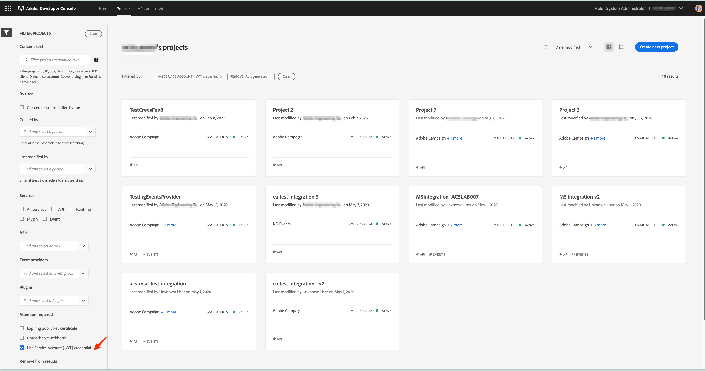
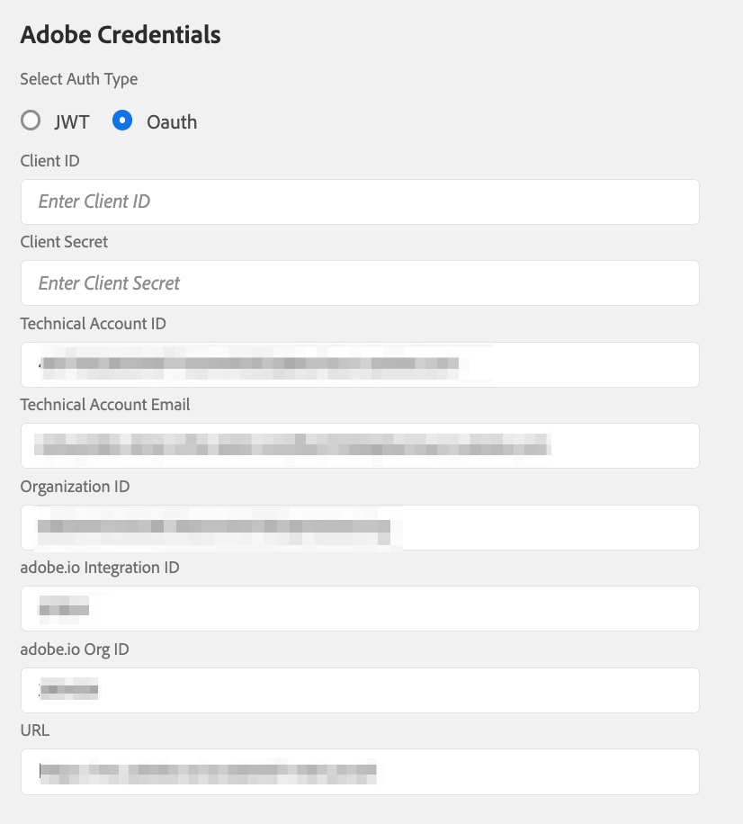

# Migrieren von Anmeldedaten von JWT zu OAuth Server-zu-Server

Die Berechtigung für Dienstkonten (JWT) wurde zugunsten der neuen OAuth Server-zu-Server-Berechtigung eingestellt. Die neue Berechtigung erleichtert die Pflege von Adobe-Anwendungen. Außerdem entfällt die Notwendigkeit, Zertifikate regelmäßig zu drehen, und es werden native Funktionen mit standardmäßigen OAuth2-Bibliotheken verwendet.

Die Anmeldedaten für das Dienstkonto (JWT) wurden zwar als veraltet markiert, funktionieren jedoch bis zum 1. Januar 2025 weiterhin. Daher müssen Sie Ihre Integration migrieren, um die neuen OAuth-Server-zu-Server-Anmeldedaten vor dem 1. Januar 2025 zu verwenden. Überprüfen Sie [Zeitpläne für die Einstellung](https://developer.adobe.com/developer-console/docs/guides/authentication/ServerToServerAuthentication/migration/#deperecation-timelines) für weitere Informationen

## Schritte zum Migrieren von Anmeldedaten von JWT zu OAuth Server-zu-Server

Die Migration zur OAuth-Server-zu-Server-Berechtigung ist ein einfacher Prozess, der eine Migration ohne Ausfallzeiten für Ihre Anwendung ermöglicht. Sie können die folgenden Schritte ausführen, um die Anmeldeinformationen zu migrieren.

1. Melden Sie sich bei [Adobe Developer-Konsole](https://developer.adobe.com/console)
2. Wählen Sie im Filtermenü auf der linken Seite die Option Berechtigung Dienstkonto (JWT) besitzen aus. Auf diese Weise werden alle Projekte angezeigt, die über eine JWT-Berechtigung (Service Account) verfügen. Klicken Sie in der Projektliste auf das Projekt, das Sie migrieren möchten.

   

3. Öffnen Sie in der linken Navigationsleiste die Registerkarte Dienstkonto (JWT)-Anmeldedaten und zeigen Sie die Migrationskarte an. Klicken Sie auf der Migrationskarte auf die Schaltfläche **Hinzufügen neuer Anmeldedaten** , um entsprechende OAuth Server-zu-Server-Anmeldedaten hinzuzufügen. Durch Hinzufügen einer OAuth-Server-zu-Server-Berechtigung zu Ihrem Projekt wird die Migration gestartet.
   
4. Die neue Berechtigung **OAuth Server-zu-Server** wird zur linken Seitennavigation hinzugefügt.
   * Klicken Sie auf Migration abbrechen , wenn Sie die Migration abbrechen möchten.
   * Klicken Sie erst auf die Schaltfläche Überprüfen und Löschen , wenn Sie überprüfen möchten, ob die neue OAuth Server-to-Server-Berechtigung funktioniert.
     

5. Aktualisieren der Anmeldeinformationen in Microsoft Dynamics 365 auf die Adobe Campaign Standard-App
   * Melden Sie sich bei der Integrationsanwendung an und navigieren Sie zur Seite Einstellungen .
   * Wählen Sie OAuth als Authentifizierungstyp aus.
   * Da die neue OAuth-Server-zu-Server-Berechtigung dieselben Anmeldeinformationen wie die alte JWT-Berechtigung (Service Account) verwendet, werden die meisten Felder bereits ausgefüllt.
   * Geben Sie die Client-ID und das Client-Geheimnis ein. Diese finden Sie im Projekt in der Adobe Developer Console.
   * Klicken Sie auf Speichern , um die Einstellungen zu speichern.
     

6. Überprüfen Sie, ob die neuen Anmeldeinformationen funktionieren.
   * Melden Sie sich bei der Integrations-App an und navigieren Sie zur Seite Workflows .
   * Stoppen Sie die aktiven Workflows. Warten Sie, bis die Workflows angehalten wurden.
   * Starten Sie die Workflows. Warten Sie, bis sich die Workflows im Status WIRD AUSGEFÜHRT befinden.
   * Überwachen Sie die Workflows einige Minuten, um sicherzustellen, dass die Workflows ordnungsgemäß funktionieren. Sie können auch die Daten in Adobe Campaign Standard und Microsoft Dynamics 365 überprüfen, um sicherzustellen, dass die Daten korrekt synchronisiert werden.

7. JWT-Berechtigung löschen, um die Migration abzuschließen
   * Melden Sie sich bei [Adobe Developer-Konsole](https://developer.adobe.com/console)
   * Klicken Sie auf die Projekte und wählen Sie das migrierte Projekt aus.
   * Klicken Sie in der linken Navigationsleiste auf die Registerkarte Dienstkonto (JWT)-Anmeldedaten .
   * Klicken Sie auf die Schaltfläche Überprüfen und Löschen .
     
   * Überprüfen Sie den Zeitstempel des letzten Zugriffs oder des zuletzt verwendeten Menüs, um zu überprüfen, ob die Integrationsanwendung Zugriffstoken mit der neuen OAuth-Berechtigung generiert oder weiterhin die alte JWT-Berechtigung verwendet.
     
   * Nachdem überprüft wurde, ob die Integrations-App die neue OAuth-Berechtigung verwendet und keine JWT-Berechtigung mehr verwendet, fahren Sie mit dem Löschen der alten Berechtigung fort, indem Sie auf die **Bestätigen und fortfahren** -Schaltfläche, um die Migration abzuschließen.
     
