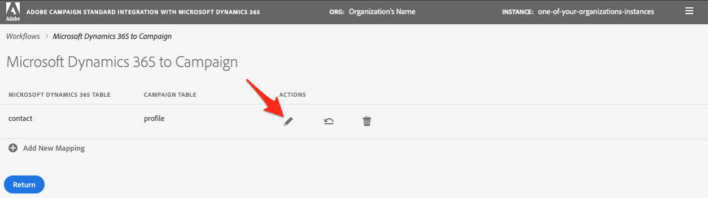

# Erste Schritte mit der Self-Service-Integrations-App {#gs-self-service-app}

Die Adobe Campaign Standard-Integration mit der Selbstbedienungs-Integrationsanwendung Microsoft Dynamics 365 ermöglicht Ihnen die Konfiguration von Datenflüssen, die Steuerung, ob und in welcher Umgebung sie ausgeführt werden oder nicht. Sie müssen jedoch einige Voraussetzungen erfüllen, bevor Sie mit der Selbstbedienungs-Integrationsanwendung beginnen.

## Konzepte und Einschränkungen {#concepts-and-restrictions}

Bevor Sie mit dem Integrationstool beginnen, müssen Sie die mit der Integration verbundenen Konzepte und Garantien verstehen und einige erste Schritte unternehmen, um Zugriff zu erhalten.

Weitere Informationen finden Sie in den folgenden Abschnitten:

* [Erste Schritte mit der Integration mit Microsoft Dynamics 365](../../integrating/using/d365-acs-get-started.md)
* [Best Practices und Einschränkungen der Integration](../../integrating/using/d365-acs-notices-and-recommendations.md)
* [Wichtige Schritte zur Implementierung dieser Integration](../../integrating/using/d365-acs-get-started.md#request-and-implement-this-integration)
* [Integration mit Microsoft Dynamics 365 verwenden](../../integrating/using/d365-acs-using-the-integration.md)

## Voraussetzungen {#self-service-app-prerequisites}

Sie müssen Microsoft Dynamics 365 und Adobe Campaign Standard so konfigurieren, dass die Integrations-App Zugriff auf Ihre Daten hat. Die Konfiguration in Dynamics 365, Adobe Campaign Standard und Adobe I/O wird einige Zeit in Anspruch nehmen. Nach der Konfiguration können Sie die Integration jedoch über die Benutzeroberfläche der Self-Service-Integrationsanwendung steuern.

Weitere Informationen finden Sie in den folgenden Abschnitten:

* [Microsoft Dynamics 365 für die Integration mit Campaign konfigurieren](../../integrating/using/d365-acs-configure-d365.md)
* [Adobe I/O konfigurieren](../../integrating/using/d365-acs-configure-adobe-io.md)
* [Benutzerdefinierte Ressourcen und benutzerdefinierte Microsoft Dynamics 365-Entitäten für die Kampagne zuordnen](../../integrating/using/d365-acs-notices-and-recommendations.md)

## Wichtige Schritte zum Konfigurieren der Self-Service-Integrations-App {#self-service-app-configuration-steps}

Anschließend können Sie mit dem Integrationstool Beginn ausführen. Führen Sie die folgenden Schritte aus:

1. [Zugriff auf die Integrations-App](../../integrating/using/d365-acs-self-service-app-control-access.md)
1. [Integrations-App für Ihre Verwendung konfigurieren](../../integrating/using/d365-acs-self-service-app-settings.md)
1. [Datensynchronisierung implementieren](../../integrating/using/d365-acs-self-service-app-data-sync.md)
1. [Synchronisierungs-Workflows konfigurieren](../../integrating/using/d365-acs-self-service-app-workflows.md)

## Link zur Integrations-App {#self-service-app-link}

Öffnen Sie einen Browser und navigieren Sie zum Anschluss, der mit Ihrer Region verknüpft ist:

* [Asien-Pazifik](http://d365-acs-ap.ea.adobe.com/)
* [Europa, Naher Osten oder Afrika (EMEA)](http://d365-acs-em.ea.adobe.com/)
* [Amerika](http://d365-acs-na.ea.adobe.com/)

## Datenschutzanforderungsbestätigung {#self-service-app-acknowledgement}

Wenn Sie zum ersten Mal zur Selbstbedienungs-Benutzeroberfläche navigieren, erhalten Sie die Datenschutzbestätigung. Sie müssen erkennen, dass Sie Ihre Rolle bei der Durchführung von Datenschutzanforderungen in Kampagne und Microsoft Dynamics 365 separat verstehen, bevor Sie fortfahren können.
Erfahren Sie mehr über Ihre Datenschutzverantwortung und wie Sie Datenschutzanforderungen verwalten können, in [diesem Abschnitt](../../integrating/using/d365-acs-notices-and-recommendations.md#acs-msdyn-manage-privacy).

## Einrichten Ihrer Anmeldedaten {#self-service-app-credentials}

Wenn Sie zum ersten Mal zur Benutzeroberfläche navigieren, sollte eine Seite mit einer Kopfzeile wie folgt angezeigt werden:

>[!NOTE]
>
> Es ist normal, Warnungen zu erhalten, die darauf hinweisen, dass keine Verbindung zu Adobe Campaign Standard oder Microsoft Dynamics 365 hergestellt werden kann, wenn die App-Einstellungen noch nicht konfiguriert wurden.

Bitte überprüfen Sie, ob die Auswahl &quot;ORG&quot; und &quot;INSTANCE&quot; die ist, die Sie konfigurieren möchten.  Ist dies nicht der Fall, klicken Sie auf die Dropdown-Liste und wählen Sie die richtige Reihenfolge und Instanz aus.

>[!IMPORTANT]
>
> Wenn Sie den Connector zum ersten Mal konfigurieren und/oder Sie mit diesem Prozess neu sind, müssen Sie **stark** dringend die Instanz &quot;stage&quot;oder &quot;dev&quot;auswählen. Vergewissern Sie sich, dass Ihre Konfiguration ordnungsgemäß funktioniert, bevor Sie das Setup in der Produktion durchführen.

Wenn Sie die richtige Reihenfolge und Instanz haben, klicken Sie auf das Menü &quot;Hamburger&quot;, um ein Dropdown-Menü anzuzeigen. Klicken Sie dann auf **[!UICONTROL Einstellungen...]** im Dropdown-Menü, um die Seite zu besuchen, auf der Sie Ihre Anmeldedaten für Microsoft Dynamics 365 und Kampagne eingeben (siehe unten).

Füllen Sie auf der Seite **[!UICONTROL Einstellungen]** die folgenden Abschnitte aus:

* Microsoft Dynamics 365-Berechtigungen
* Adoben-Anmeldeinformationen

Gehen Sie [hier](../../integrating/using/d365-acs-self-service-app-settings.md), um weitere Informationen darüber zu erhalten, wo die Informationen für die einzelnen Eingaben zu finden sind. Wenn Sie fertig sind, klicken Sie unten auf die Schaltfläche **[!UICONTROL Speichern]**.

## Überprüfen Sie die anfängliche Konfiguration {#self-service-app-initial-config}

Wenn Sie die obigen Voraussetzungen erfüllt haben und Ihre Anmeldedaten korrekt hinzugefügt haben, gehen wir nun zur Seite **[!UICONTROL Workflows]**. Weitere Informationen zum Workflows der Integrations-App finden Sie auf [dieser Seite](../../integrating/using/d365-acs-self-service-app-workflows.md).

Klicken Sie auf der Seite **[!UICONTROL Workflows]** auf das Stiftsymbol, das dem Workflow **[!UICONTROL Microsoft Dynamics 365 to Kampagne]** zugeordnet ist, um die Konfiguration zu bearbeiten.

Auf der Seite **[!UICONTROL Microsoft Dynamics 365 zu Kampagne]** können Sie auf die Liste der Tabellenzuordnungen zugreifen, die Sie konfiguriert haben.  Standardmäßig werden Sie mit einer vordefinierten Kontakt-/Profil-Zuordnung arbeiten. Alle anderen benutzerdefinierten Entitäten müssen separat konfiguriert werden.

Überprüfen Sie auf der Seite **[!UICONTROL Tabellenzuordnung bearbeiten]** den Abschnitt **[!UICONTROL Zuordnungen]**, um sicherzustellen, dass die Felder von Microsoft Dynamics 365 dem korrekten Feld in der Kampagne zugeordnet werden. Wenn Sie weitere Zuordnungen hinzufügen müssen, tun Sie dies jetzt ebenso wie alle Ersetzungen oder Filter. [Weitere Informationen](../../integrating/using/d365-acs-self-service-app-data-sync.md).

Wenn Sie neue Zuordnungen hinzufügen möchten, finden Sie weitere Informationen in [diesem Abschnitt](../../integrating/using/d365-acs-self-service-app-data-sync.md#add-a-new-mapping).

Wenn die Konfiguration korrekt ist, klicken Sie auf die Schaltfläche **[!UICONTROL Abspielen]** neben dem Arbeitsablauf **[!UICONTROL Microsoft Dynamics 365 zu Kampagne]**, um die Integration und den Datenfluss Beginn.

>[!IMPORTANT]
>
>Wir empfehlen **strong**, dies zuerst in Ihren Stage- oder Dev-Umgebung auszuführen, bevor Sie in der Produktion ausgeführt werden. Bitte überprüfen Sie, ob die stage/dev-Instanz im Header ausgewählt ist.

Nach der Ausführung sollten Sie in der Lage sein zu testen, indem Sie Einträge in Microsoft Dynamics 365 hinzufügen oder ändern und diese Änderungen in Adobe Campaign innerhalb weniger Minuten beobachten können. Wenn Sie diesen Prozess jederzeit beenden müssen, drücken Sie einfach die gleiche Taste, um ihn zu stoppen. [Mehr dazu](../../integrating/using/d365-acs-self-service-app-workflows.md#workflow-status)

## Integrations-App-Arbeitsbereich {#self-service-app-workspace}

### App-Kopfzeile {#app-header}

Mit der Kopfzeile in der Selbstbedienungs-App können Sie festlegen, welches Org und welche Instanz Sie derzeit anzeigen und/oder konfigurieren.

Wählen Sie **ORG** und **INSTANCE** aus, die Sie Ansicht/Bearbeitung vornehmen möchten. Diese Felder erscheinen schreibgeschützt, können jedoch bearbeitet werden, wenn Sie den Mauszeiger darüber bewegen.

Ein Dropdown-Menü wird angezeigt, wenn Sie auf die Schaltfläche mit den drei horizontalen Linien  auf der rechten Seite der Kopfzeile klicken.

Die Einträge im Dropdown-Menü sind

* **Einstellungen**: Wenn Sie diese Option auswählen, werden Sie zu einem Bildschirm geleitet, auf dem Sie API-Anmeldeinformationen für Microsoft Dynamics 365 und Adobe Campaign sowie andere allgemeine Anwendungseinstellungen angeben können.

* **Dokumentation**: Diese Option ist ein Link zu der für diese Integration spezifischen Adobe Campaign-Dokumentation

* **Kundenunterstützung**: Dies ist ein Link zur Dokumentation des Experience Cloud zum Öffnen eines Tickets für die Kundenunterstützung

* **Abmelden**: Dadurch werden Sie von der Anwendung abgemeldet und können sich wieder als ein anderer Benutzer anmelden.

* **Info**: Auf diese Weise wird ein Dialogfeld mit Informationen zur Anwendung, einschließlich Copyright-Informationen, angezeigt.

### Breadcrumbs {#app-breadcrumbs}

Breadcrumbs werden am oberen Rand einiger Bildschirme angezeigt, während Sie in der App navigieren.

**Beispiel:**

Nachfolgend finden Sie ein Beispiel aus dem Bildschirm **[!UICONTROL Tabellenzuordnung bearbeiten]**, in dem die Breadcrumbs und der Seitentitel angezeigt werden. In diesem Fall können Sie auf den Text **[!UICONTROL Workflows]** oder **[!UICONTROL Microsoft Dynamics 365 klicken, um zur Kampagne]** zu einem der vorherigen Bildschirme zu wechseln. **[!UICONTROL Die]** Zuordnung von Tabellen bearbeiten in den Breadcrumbs ist in diesem Fall nicht anklickbar, da es sich um den aktuellen Bildschirm handelt.

### Allgemeine Schaltflächen {#app-buttons}

Die folgenden Symbole werden auf mehreren Seiten in der Selbstbedienungs-App verwendet.

 - Hinzufügen einem neuen Artikel in eine Liste.

 - Bearbeiten Sie etwas, das bereits vorhanden ist

 - Löschen eines Elements aus einer Liste von Elementen
