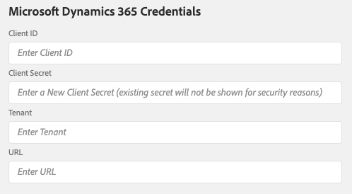

# Systeme mit der Integrations-App verbinden

## Anmeldeinformationen für die Integrations-App Hinzufügen

Mit dem Bildschirm **[!UICONTROL Settings]** können Sie Microsoft Dynamics 365- und Adobe API-Anmeldeinformationen angeben. Sie können auch Einstellungen für die Adobe Campaign-SFTP-Instanz konfigurieren.

### Microsoft Dynamics 365-Berechtigungen

Die Microsoft Dynamics 365 Credentials geben der Integrationsanwendung die Berechtigung, Ihre Daten von Microsoft Dynamics 365 abzurufen.  Sie müssen zunächst die Schritte auf dem Bildschirm [Microsoft Dynamics 365 für die Integration der Kampagne](../../integrating/using/d365-acs-configure-d365.md) konfigurieren, um die Werte zu generieren, die in diesen Bildschirm eingefügt werden. Die unten beschriebenen Eingaben verweisen auf diesen Bildschirm.

* **[!UICONTROL Client-ID]**: In  [diesem Abschnitt erfahren Sie, wie Sie auf Ihre Client-ID verweisen](../../integrating/using/d365-acs-configure-d365.md#register-a-new-app)

* **[!UICONTROL geheim]**: In  [diesem Abschnitt erfahren Sie, wie Sie Ihren geheimen Clientschlüssel generieren.](../../integrating/using/d365-acs-configure-d365.md#generate-a-client-secret)

* **[!UICONTROL Mandant]**: Hier erfahren Sie, wie Sie Ihre Mandanten-ID  [finden.](../../integrating/using/d365-acs-configure-d365.md#get-the-tenant-id)

* **[!UICONTROL URL]**: Die URL hat das Format https://&lt;servername>.api.crm.dynamik.com/

### Adoben-API-Anmeldeinformationen

Die Anmeldeinformationen für das Adobe Campaign werden mit [Adobe I/O](https://www.adobe.io/) generiert. Sie müssen den Bildschirm [Adobe I/O](../../integrating/using/d365-acs-configure-adobe-io.md) konfigurieren und den Anweisungen folgen, bevor Sie die Eingaben in diesem Abschnitt ausfüllen können.

In der folgenden Abbildung wird die Zuordnung zwischen Adobe I/O und den Bildschirmeingaben für Einstellungen detailliert erläutert.

* *Privater Schlüssel*: den Prozess zum Definieren dieser Beginn durch Klicken auf die Schaltfläche &quot;Generate public/private keypair&quot;. Dadurch wird eine ZIP-Datei erstellt, die Sie herunterladen müssen. Nachdem Sie es heruntergeladen haben, entpacken Sie die Datei, die in zwei Dateien namens certificate_pub.crt und private.key resultiert. Stellen Sie sicher, dass private.key an einem sicheren Ort gespeichert ist und nicht freigegeben wird. Öffnen Sie die Datei &quot;private.key&quot;in einem Texteditor. Kopieren Sie den gesamten Wert im Texteditor (Strg-A, dann Strg-C auf einem PC oder Cmd-A, dann Cmd-C auf einem Mac). Dies sollte die Zeilen mit &quot;BEGIN PRIVATE KEY&quot; und &quot;END PRIVATE KEY&quot; in ihrer Gesamtheit einschließen. Fügen Sie den gesamten mehrzeiligen Text in die Eingabe &quot;Privater Schlüssel&quot;im Einstellungsbildschirm ein.

* *URL*: Dieser Wert passt zum Muster https\://mc.adobe.io/&lt;campaign-instance-name>. Die Kopfzeile der Integrations-App enthält sowohl &quot;Org&quot;als auch &quot;Instanz&quot;. Der Teil &quot;Kampagne-Instanzname&quot;der URL entspricht einfach dem in diesem Instanzwert gefundenen Namen.

## Adobe Campaign-SFTP-Einstellungen {#ac-smtp-settings}

Diese Einstellungen sind optional. Sie müssen sie definieren, wenn Sie Ihre Adobe Campaign-SFTP-Instanz verwenden möchten, um Protokolle vom Connector auszugeben. Dies ist hilfreich, wenn Probleme auftreten, wenn die Integration ausgeführt wird, und Sie debuggen müssen, warum die Ausgabe Ihre Erwartungen nicht erfüllt.

Der andere Grund für die Einrichtung des SFTP-Servers wäre, wenn Sie planen, den Ausschluss-/Ausschluss-Workflow auszuführen, und es einen Datenfluss von Adobe Campaign zu Microsoft Dynamics 365 gibt, entweder **[!UICONTROL Unidirektional (Kampagne zu Microsoft Dynamics 365)]** oder **[!UICONTROL Bidirektional]**.

>[!IMPORTANT]
>
>Sie sind für die Informationen verantwortlich, die Sie aus den SFTP-Ordnern aufrufen und herunterladen können. Wenn die Informationen personenbezogene Daten enthalten, sind Sie für die Einhaltung der geltenden Datenschutzgesetze und -vorschriften verantwortlich. [Weitere Informationen](../../integrating/using/d365-acs-notices-and-recommendations.md#acs-msdyn-manage-privacy).

Um die Kampagne-SFTP-Einstellungen für die Microsoft Dynamics 365-Integration zu definieren, rufen Sie den folgenden Abschnitt auf:

Sie müssen Folgendes angeben:

* **SFTP-Host**: Dieses Feld enthält  &lt;campaign-instance-name>.Kampagne.adobe.com. Die Kopfzeile der Integrations-App enthält sowohl **Org** als auch **Instanz**. Der Teil &quot;Kampagne-Instanzname&quot;der URL entspricht einfach dem in diesem Instanzwert gefundenen Namen.

* **SFTP-Benutzer**: Wenn Sie den SFTP-Benutzer haben, fügen Sie ihn hier hinzu. Weitere Informationen finden Sie in [diesem Abschnitt](#ac-control-panel-settings). Während des Prozesses wird Ihnen der Benutzername angezeigt.

* **SFTP-Schlüssel**: Wenn Sie einen SSH-Schlüssel haben, fügen Sie ihn hier hinzu. Weitere Informationen finden Sie in [diesem Abschnitt](#ac-control-panel-settings).

* Die IP-Bereiche **müssen in Ihrer Adobe Campaign-SFTP-Konfiguration enthalten sein.** Diese müssen auf die Zulassungsliste gesetzt werden, damit die Integration den SFTP-Endpunkt nutzen kann.

* Die **Möchten Sie Protokolle in Ihr Adobe Campaign-SFTP exportieren?** können Sie bestimmen, ob die Integration Protokollinformationen an den SFTP-Endpunkt ausgibt. Dies kann zum Debugging verwendet werden, wenn Adobe Campaign oder Microsoft Dynamics 365 die erwarteten Informationen nicht anzeigt.

## SFTP-Setup in Adobe Campaign {#ac-control-panel-settings}

Discover SFTP-Verwaltung mit [Kampagne-Systemsteuerung](https://experienceleague.adobe.com/docs/control-panel/using/control-panel-home.html?lang=de) in den folgenden Abschnitten:

* [Über die SFTP-Verwaltung](https://experienceleague.adobe.com/docs/control-panel/using/sftp-management/about-sftp-management.html?lang=en#sftp-management)

* [SFTP-Speicherverwaltung](https://experienceleague.adobe.com/docs/control-panel/using/sftp-management/key-management.html?lang=en#installing-ssh-key)

* [hinzufügen IP-Bereiche](https://experienceleague.adobe.com/docs/control-panel/using/sftp-management/ip-range-allow-listing.html?lang=en#sftp-management)

* [Schlüssel verwalten](https://experienceleague.adobe.com/docs/control-panel/using/sftp-management/key-management.html?lang=en#sftp-management)

* [Melden Sie sich bei Ihrem SFTP-Server an](https://experienceleague.adobe.com/docs/control-panel/using/sftp-management/logging-into-sftp-server.html?lang=en#sftp-management)

Sobald die Konfiguration abgeschlossen ist, melden Sie sich mit dem privaten Schlüssel beim SFTP-Server an und erstellen Sie das Verzeichnis &quot;d365_loads/exports&quot;.

[Auf dieser ](https://experienceleague.adobe.com/docs/campaign-standard-learn/control-panel/sftp-management/monitoring-server-capacity.html?lang=de#sftp-management) Seite finden Sie Informationen zum Adobe Campaign Standard SFTP-Server.
