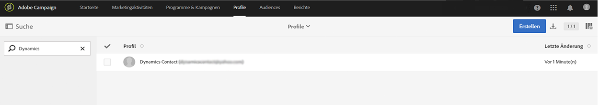
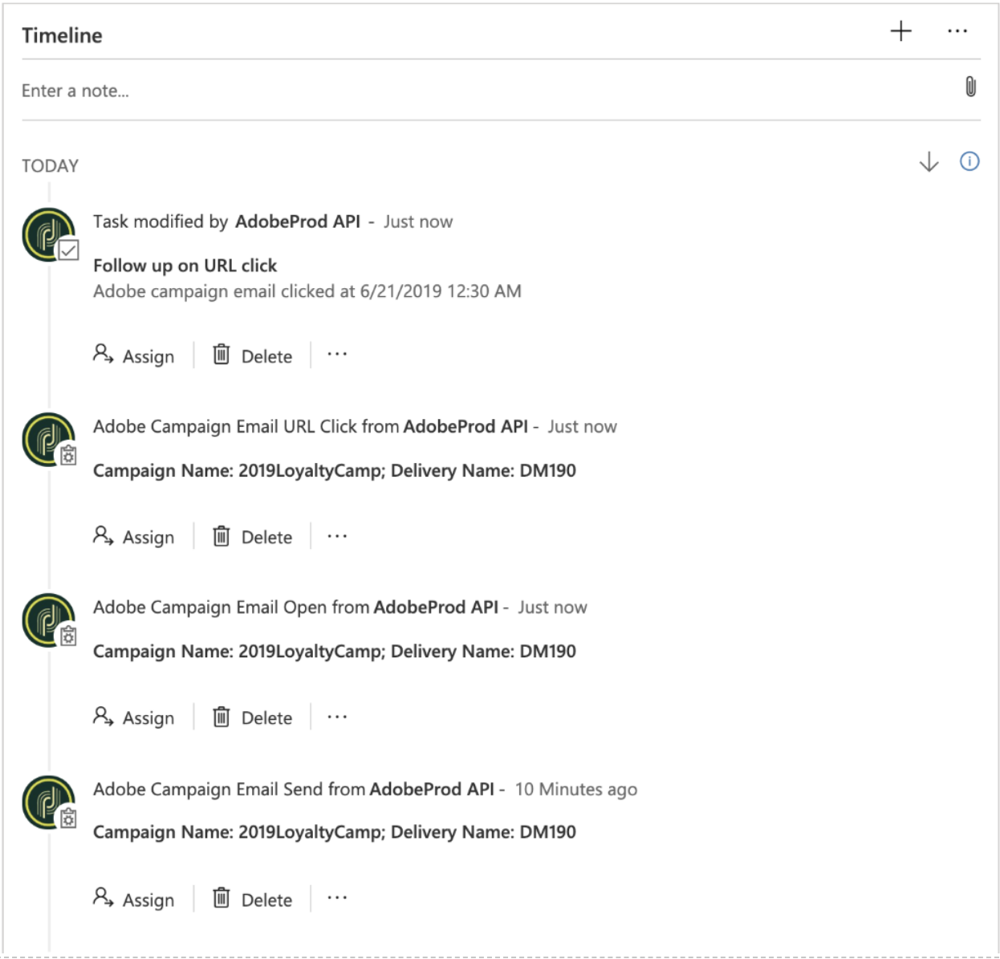

# Integration mit Microsoft Dynamics 365 verwenden

Es gibt mehrere Datenflüsse, die durch die Integration von Adobe Campaign Standard mit Microsoft Dynamics 365 ausgeführt werden. Diese Flüsse werden auf [dieser Seite](../../integrating/using/d365-acs-self-service-app-workflows.md) im Detail beschrieben.

Weitere Informationen zu den Datenflüssen finden Sie weiter unten in diesem Dokument im Abschnitt [Datenflüsse](#data-flows).

## Verwendung von Adobe Campaign Standard

Wenn ein Kontakt in Microsoft Dynamics 365 erstellt, geändert oder gelöscht wird (falls &quot;Löschen&quot; aktiviert ist), wird er an Campaign Standard gesendet. Solche Kontakte werden im Bildschirm &quot;Profile&quot; in Campaign angezeigt und können in Marketing-Kampagnen ausgewählt werden. Siehe Bildschirm &quot;Profile&quot; unten.

Wenn ein Opt-out-Attribut in Campaign geändert wird, spiegelt sich das in Dynamics 365 wider, wenn Sie die Opt-out-Konfiguration **Unidirektional (Campaign zu Microsoft Dynamics 365)** oder **Bidirektional** gewählt haben und dieses Attribut korrekt zugeordnet wurde. 

## Verwendung von Microsoft Dynamics 365

Beim ausgehenden Datenfluss werden die folgenden E-Mail-Marketing-Ereignisse von Campaign an Dynamics 365 gesendet und in der Microsoft Dynamics 365-Timeline-Ansicht als benutzerdefinierte Aktivitäten angezeigt:

* Adobe Campaign – E-Mail-Versand

* Adobe Campaign – E-Mail-Öffnung

* Adobe Campaign – E-Mail-URL-Klick

* Adobe Campaign – E-Mail-Bounce

Um die Timeline eines Kontakts anzuzeigen, navigieren Sie zu Ihrer Kontaktliste, indem Sie im Dropdown-Menü von Dynamics 365 &quot;Vertriebshub&quot; auswählen. Wählen Sie dann in der linken Menüleiste &quot;Kontakte&quot; und danach einen Kontakt aus.

>[!NOTE]
>
>Die Adobe-Anwendung **Adobe Campaign for Microsoft Dynamics 365** in AppSource muss in Ihrer Microsoft Dynamics 365-Instanz installiert werden, damit sich die Ereignisse anzeigen lassen. [Weitere Informationen](../../integrating/using/d365-acs-configure-d365.md#install-appsource-app).

Unten sehen Sie eine Abbildung des Kontaktbildschirms für &quot;Dynamics User&quot;. In der Timeline-Ansicht können Sie sehen, dass an &quot;Dynamics User&quot; eine E-Mail im Zusammenhang mit dem Kampagnennamen &quot;2019LoyaltyCamp&quot; und dem Versandnamen &quot;DM190&quot; gesendet wurde. &quot;Dynamics User&quot; hat die E-Mail geöffnet und auch auf eine URL in der E-Mail geklickt. Beide Aktionen führten zur Erstellung von Ereignissen, die auch unten angezeigt werden. In der rechten Ecke finden Sie die Relationship Assistant (RA)-Karte, die derzeit eine Aufgabe zum Nachverfolgen der angeklickten URL enthält.

Unten finden Sie eine Nahaufnahme der Timeline-Ansicht für &quot;Dynamics User&quot;.

Nachfolgend sehen Sie eine Nahaufnahme der RA-Karte (Relationship Assistant). Die AppSource-Anwendung enthält einen Workflow, der Klick-Ereignisse auf Adobe-E-Mail-URLs erfasst. Wenn ein solches Ereignis eintritt, wird eine Aufgabe erstellt und ein Fälligkeitsdatum festgelegt. Dadurch kann die Aufgabe in der RA-Karte angezeigt werden, was zusätzliche Transparenz bietet. Für Adobe E-Mail-Bounce-Ereignisse gibt es einen ähnlichen Workflow. Dabei wird eine Aufgabe hinzugefügt, mit der die ungültige E-Mail-Adresse abgeglichen wird. Diese Workflows können in der Lösung deaktiviert werden.

Wenn Sie den Betreff des Versandereignisses auswählen, wird ein Formular ähnlich dem unten stehenden geöffnet. Die Formulare für Öffnungs- und Bounce-Ereignisse sind ähnlich.

Das Formular für E-Mail-URL-Klick-Ereignisse fügt ein zusätzliches Attribut für die angeklickte URL hinzu:

Im Folgenden finden Sie eine Liste der Attribute inklusive einer Beschreibung:

* **Betreff**: Betreff des Ereignisses; bestehend aus der Kennung der Kampagne und der Kennung des E-Mail-Versands

* **Verantwortlicher**: Der in den Schritten nach der Bereitstellung erstellte Anwender

* **Bezug**: Name des Kontakts

* **Kampagnenname**: Die Kennung der Kampagne in Campaign Standard

* **Versandname**: Die Versandkennung in Campaign Standard

* **Datum von Gesendet/Geöffnet/Angeklickt/Bounce**: Datum/Uhrzeit der Erstellung des Ereignisses

* **Tracking-URL**: URL, auf die geklickt wurde

* **URL der Mirrorseite**: Die URL zur Mirrorseite der E-Mail, die gesendet, geöffnet, angeklickt oder als Bounce zurückgesendet wurde. Die Gültigkeitsdauer der E-Mail-Mirrorseite kann im Konfigurationsbildschirm der entsprechenden E-Mail-Kanalaktivität in Campaign geändert werden. [Weitere Informationen](../../administration/using/configuring-email-channel.md#validity-period-parameters).

>[!NOTE]
>
>Bei Opt-outs: Wenn ein Opt-out-Attribut in Microsoft Dynamics 365 geändert wird, spiegelt sich das in Campaign wider, wenn Sie die Opt-out-Konfiguration **Unidirektional (Campaign zu Microsoft Dynamics 365)** oder **Bidirektional** gewählt haben und dieses Attribut korrekt zugeordnet wurde.

## Datenflüsse {#data-flows}

### Eingang von Kontakten und benutzerdefinierten Entitäten

Neue, aktualisierte und gelöschte Datensätze (Hinweis: &quot;gelöscht&quot; muss aktiviert sein) werden von der Kontakttabelle in Microsoft Dynamics 365 an die Profiltabelle in Campaign gesendet.

Tabellen-Mappings können in der Benutzeroberfläche der Integrationsanwendung so konfiguriert werden, dass die Tabellenattribute in Microsoft Dynamics 365 den Tabellenattributen in Campaign zugeordnet werden. Das Tabellen-Mapping kann nach Bedarf geändert werden, um Attribute hinzuzufügen bzw. zu entfernen.

Die erste Ausführung des Datenflusses dient der Übertragung aller zugeordneten Datensätze, einschließlich der als &quot;inaktiv&quot; gekennzeichneten Datensätze. Anschließend verarbeitet die Integration nur inkrementelle Aktualisierungen. Eine Ausnahme besteht, wenn die Daten erneut abgespielt werden oder ein Filter konfiguriert ist. Es besteht die Möglichkeit, grundlegende, attributbasierte Filterregeln zu konfigurieren, um zu bestimmen, welche Datensätze mit Campaign synchronisiert werden sollen.

Grundlegende Ersetzungsregeln können in der Benutzeroberfläche der Integrationsanwendung so konfiguriert werden, dass ein Attributwert durch einen anderen Wert ersetzt wird (z. B. &quot;grün&quot; für &quot;#00FF00&quot;, &quot;F&quot; für 1 usw.).

Je nach Datensatzvolumen muss möglicherweise Ihr Campaign-SFTP-Speicher für die erste Datenübertragung verwendet werden. [Weitere Informationen](#initial-data-transfer).

Das Profiltabellenattribut &quot;externalId&quot; in Campaign muss mit dem Kontaktattribut &quot;contactId&quot; in Dynamics 365 gefüllt sein, damit der Eingang der Kontakte funktioniert. Benutzerdefinierte Entitäten in Campaign müssen ebenfalls mit einem eindeutigen ID-Attribut in Dynamics 365 gefüllt werden. Dieses Attribut kann jedoch in jedem benutzerdefinierten Entitätsattribut in Campaign gespeichert werden (d. h. es muss nicht &quot;externalId&quot; sein).

>[!NOTE]
>
>Beim Eingang benutzerdefinierter Entitäten muss für synchronisierte benutzerdefinierte Entitäten die Änderungsverfolgung innerhalb von Dynamics 365 aktiviert werden.

#### Benutzerdefinierte Entitäten

Die [Integration von Adobe Campaign Standard mit Microsoft Dynamics 365](../../integrating/using/d365-acs-get-started.md) unterstützt benutzerdefinierte Entitäten und ermöglicht die Synchronisation von benutzerdefinierten Entitäten in Dynamics 365 mit entsprechenden benutzerdefinierten Ressourcen in Campaign.

Die neuen Daten in den benutzerdefinierten Ressourcen können für verschiedene Zwecke verwendet werden, einschließlich Segmentierung und Personalisierung.

Die Integration unterstützt sowohl verknüpfte als auch nicht verknüpfte Tabellen. Die Verknüpfung wird auf bis zu drei Ebenen unterstützt (d. h. Level1->Level2->Level3).

>[!IMPORTANT]
>
>Wenn ein benutzerdefinierter Ressourcendatensatz in Campaign personenbezogene Daten enthält, gelten besondere Empfehlungen. Weiterführende Informationen finden Sie [in diesem Abschnitt](../../integrating/using/d365-acs-notices-and-recommendations.md#acs-msdyn-manage-data).

Bei der Konfiguration benutzerdefinierter Entitätsdatenflüsse ist Folgendes zu beachten:

* Die Erstellung und Änderung von benutzerdefinierten Campaign-Ressourcen sind heikle Aufgaben, die nur von erfahrenen Benutzern durchgeführt werden können.
* Bei benutzerdefinierten Entitätsdatenflüssen muss für synchronisierte benutzerdefinierte Entitäten die Änderungsverfolgung innerhalb von Dynamics 365 aktiviert werden.
* Wenn ein übergeordneter und ein verknüpfter untergeordneter Datensatz in Dynamics 365 aufgrund der parallelen Verarbeitung der Integration nahezu zur gleichen Zeit erstellt werden, besteht eine geringe Wahrscheinlichkeit, dass ein neuer untergeordneter Datensatz vor seinem übergeordneten Datensatz in Campaign geschrieben wird.

* Wenn das übergeordnete und das untergeordnete Element in Campaign mithilfe der Option **Einfache Relation mit Kardinalität 1** verknüpft sind, bleibt der untergeordnete Datensatz ausgeblendet und kann (über die Benutzeroberfläche oder API) nicht aufgerufen werden, bis der übergeordnete Datensatz in Campaign eintrifft.

* (Angenommen, **Einfache Relation mit Kardinalität 1** wird in Campaign verwendet.) Wenn der untergeordnete Datensatz in Dynamics 365 aktualisiert oder gelöscht wird und diese Änderung in Campaign geschrieben wird, bevor der übergeordnete Datensatz in Campaign angezeigt wird (nicht wahrscheinlich, aber möglich), wird diese Aktualisierung oder Löschung nicht in Campaign verarbeitet und ein Fehler ausgegeben. Im Falle einer Aktualisierung muss der betreffende Datensatz erneut in Dynamics 365 aktualisiert werden, um den aktualisierten Datensatz zu synchronisieren. Im Falle der Löschung muss der betreffende Datensatz in Campaign gesondert behandelt werden, da in Dynamics 365 kein Datensatz mehr zum Löschen oder Aktualisieren vorhanden ist.

* Wenn Sie in eine Situation geraten, in der Sie glauben, versteckte untergeordnete Datensätze zu haben und nicht darauf zugreifen zu können, können Sie den Kardinalität-Relationstyp vorübergehend in **Einfache Relation mit Kardinalität 0 oder 1** ändern, um auf diese Datensätze zuzugreifen.

Eine umfassendere Übersicht über benutzerdefinierte Campaign-Ressourcen finden Sie [in diesem Abschnitt](../../developing/using/key-steps-to-add-a-resource.md).

### Ereignisfluss beim E-Mail-Marketing{#email-marketing-event-flow}

E-Mail-Marketing-Ereignisse werden von Campaign an Microsoft Dynamics 365 gesendet, um in der Timeline-Ansicht angezeigt zu werden.

Unterstützte Marketing-Ereignistypen:
* Versand: E-Mail an den Empfänger gesendet
* Öffnung: E-Mail durch Empfänger geöffnet
* Klick: Vom Empfänger angeklickte URL innerhalb der E-Mail
* Bounce: E-Mail an Empfänger erfuhr einen Hardbounce

Die folgenden Ereignisattribute werden in Dynamics 365 angezeigt:
* Name der Marketing-Kampagne
* Name des E-Mail-Versands
* Zeitstempel
* URL der E-Mail-Mirrorseite
* URL angeklickt (nur auf Klick-Ereignisse)

E-Mail-Marketing-Ereignisse können nach Typ (Versand, Öffnung, Klick, Bounce) aktiviert bzw. deaktiviert werden, sodass nur die von Ihnen ausgewählten Ereignistypen an Dynamics 365 übergeben werden.

### Opt-out-Fluss {#opt-out-flow}

Die Opt-out-Werte (z. B. Blockierungsliste) werden zwischen den Systemen synchronisiert. Während des Onboardings stehen folgende Optionen zur Auswahl:

* **Unidirektional (Microsoft Dynamics 365 zu Campaign)**: Dynamics 365 ist die &quot;Source of Truth&quot; für Opt-outs. Opt-out-Attribute werden in einer Richtung von Dynamics 365 nach Campaign Standard synchronisiert.
* **Unidirektional (Campaign zu Microsoft Dynamics 365)**: Campaign Standard ist die &quot;Source of Truth&quot; für Opt-outs. Opt-out-Attribute werden in einer Richtung von Campaign Standard zu Dynamics 365 synchronisiert.
* **Bidirektional**: Dynamics 365 UND Campaign Standard sind beide &quot;Sources of Truth&quot;. Opt-out-Attribute werden bidirektional zwischen Campaign Standard und Dynamics 365 synchronisiert.

Wenn Sie über einen separaten Prozess zum Verwalten der Opt-out-Synchronisation zwischen den Systemen verfügen, kann alternativ der Opt-out-Datenfluss der Integration deaktiviert werden.

>[!NOTE]
>
>In der Benutzeroberfläche der Integrationsanwendung werden die Opt-out-Anwendungsfälle **Unidirektional (Microsoft Dynamics 365 zu Campaign)** und **Bidirektional** in einem separaten Opt-out-Workflow konfiguriert. [Weitere Informationen](../../integrating/using/d365-acs-self-service-app-data-sync.md#opt-in-out-wf).
>
>Der Opt-out-Anwendungsfall **Unidirektional (Campaign zu Microsoft Dynamics 365)** ist eine Ausnahme. Er wird im Eingangs-Workflow (Kontakt zu Profil) konfiguriert.

Das Mapping des Opt-out-Flusses muss vom Kunden festgelegt werden, da die Geschäftsanforderungen von Unternehmen zu Unternehmen unterschiedlich sein können. In Campaign können nur die OOTB-Opt-out-Attribute für das Opt-out-Mapping verwendet werden:

* denyList
* denyListEmail
* denyListFax
* denyListMobile
* denyListPhone
* denyListPostalMail
* denyListPushnotification
* ccpaOptOut

In Dynamics 365 haben die meisten Opt-out-Felder das Präfix &quot;donot&quot;. Sie können jedoch auch andere Attribute zu Opt-out-Zwecken nutzen, solange die Datentypen kompatibel sind.

### Erste Datenübertragung {#initial-data-transfer}

Die erste Datenübertragung kann eine Weile dauern, je nachdem, wie viele Datensätze Sie von Microsoft Dynamics 365 aufnehmen. Nach der ersten Datenübertragung übernimmt die Integrationsanwendung die inkrementellen Aktualisierungen. 
