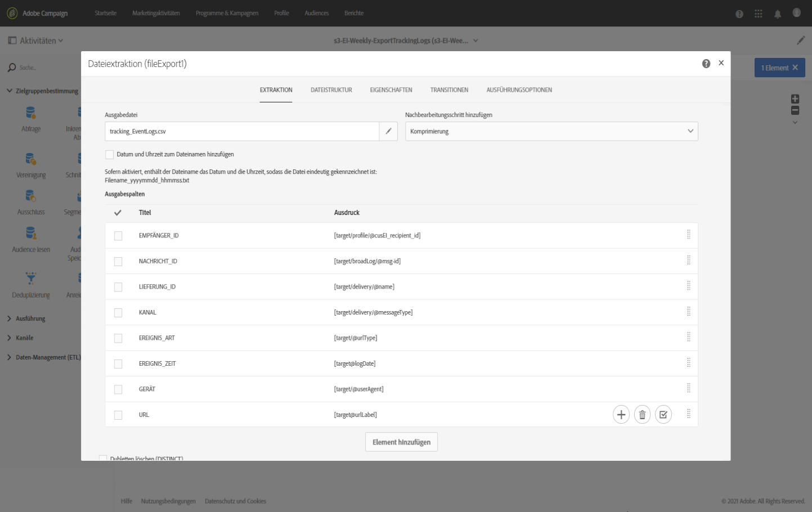
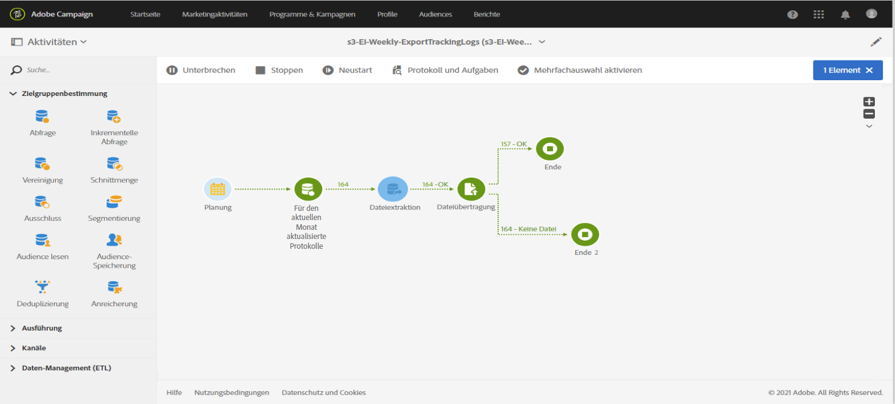
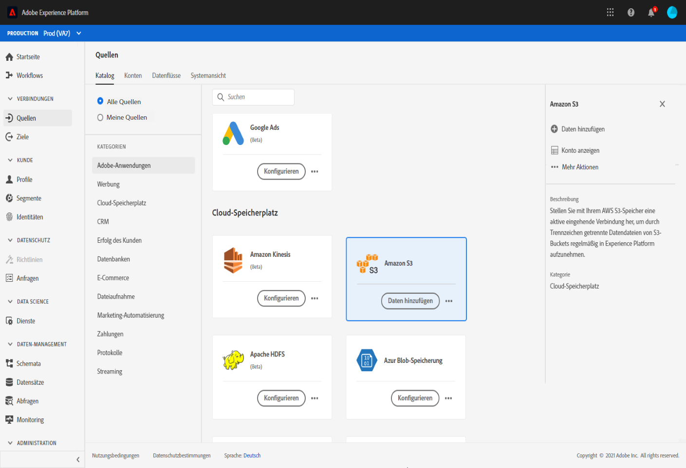
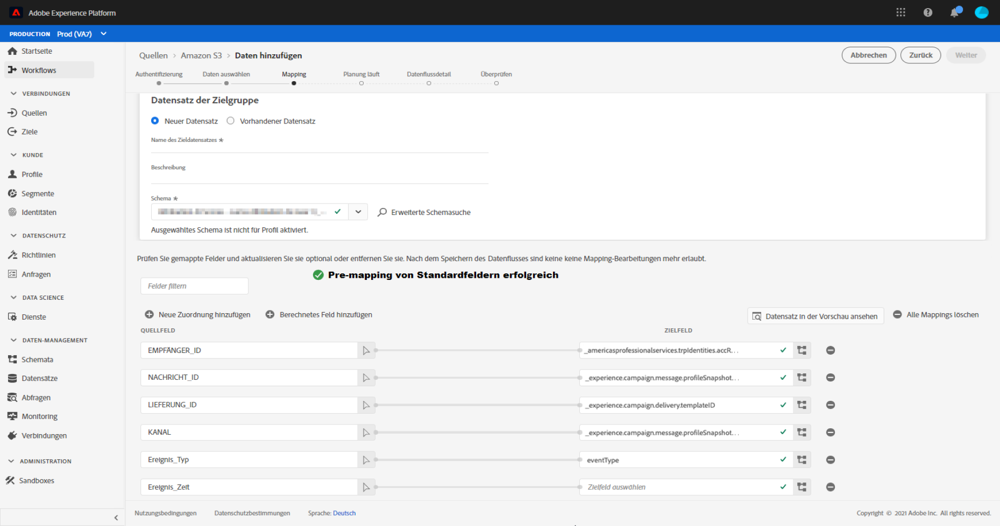

# Daten von Campaign nach Adobe Experience Platform exportieren {#sources}

Um Campaign Standard-Daten in die Adobe Echtzeit-Kundendatenplattform (RTCDP) zu exportieren, müssen Sie zunächst einen Workflow in Campaign Standard erstellen, um die Daten, die Sie austauschen möchten, in Ihren Speicherort auf Amazon Storage Service (S3) oder Azure Blob zu exportieren.

Nachdem der Workflow konfiguriert und Daten an Ihren Speicherort gesendet wurden, müssen Sie Ihren S3- oder Azure-Blob-Speicherort in Adobe Experience Platform als **Quelle** verbinden.

>[!NOTE]
>
>Wir empfehlen, nur in Campaign generierte Daten zu exportieren (z. B. Sendungen, Öffnungen, Klicks usw.) nach Adobe Experience Platform. Daten, die in einer Drittanbieter-Quelle (wie Ihrem CRM-System) aufgenommen werden, sollten direkt in Adobe Experience Platform importiert werden.

## Export-Workflow in Campaign Standard erstellen

Um Daten von Campaign Standard in Ihren S3- oder Azure-Blob-Speicher zu exportieren, müssen Sie einen Workflow erstellen, mit dem die zu exportierenden Daten bestimmt und an Ihren Speicherort gesendet werden.

Hierzu müssen Sie Folgendes hinzufügen und konfigurieren:

* Die Aktivität **[!UICONTROL Dateiextraktion]**, um die Zieldaten in eine CSV-Datei zu extrahieren. Weiterführende Informationen zur Konfiguration dieser Aktivität finden Sie in [diesem Abschnitt](../../automating/using/extract-file.md).

  

* Die Aktivität **[!UICONTROL Dateiübertragung]**, um die CSV-Datei an Ihren Speicherort zu übertragen. Weiterführende Informationen zur Konfiguration dieser Aktivität finden Sie in [diesem Abschnitt](../../automating/using/transfer-file.md).

  

Im folgenden Workflow werden beispielsweise regelmäßig Protokolle in eine CSV-Datei extrahiert und anschließend an einen Speicherort übertragen.

Beispiele für Daten-Management-Workflows sind im Abschnitt [Workflow-Anwendungsfälle](../../automating/using/about-workflow-use-cases.md#management) verfügbar.

Verwandte Themen:

* [Datenverwaltungsaktivitäten](../../automating/using/about-data-management-activities.md)
* [Über den Datenimport und -export](../../automating/using/about-data-import-and-export.md)

## Speicherort als Quelle verbinden

Die wichtigsten Schritte zum Verbinden Ihres Speicherorts auf Amazon Storage Service (S3) oder Azure Blob als **Quelle** in Adobe Experience Platform sind unten aufgeführt. Ausführliche Informationen zu jedem dieser Schritte finden Sie in der [Dokumentation zu Quell-Connectoren](https://experienceleague.adobe.com/docs/experience-platform/sources/home.html?lang=de).

1. Erstellen Sie in Adobe Experience Platform im Menü **[!UICONTROL Quellen]** eine Verbindung zu Ihrem Speicherort:

   * [Erstellen einer Amazon S3-Quellverbindung](https://experienceleague.adobe.com/docs/experience-platform/sources/ui-tutorials/create/cloud-storage/s3.html?lang=de)
   * [Azure Blob-Connector](https://experienceleague.adobe.com/docs/experience-platform/sources/connectors/cloud-storage/blob.html?lang=de)

   >[!NOTE]
   >
   >Beim Speicherort kann es sich um Amazon S3, SFTP mit Kennwort, SFTP mit SSH-Schlüssel oder Azure Blob handeln. Die bevorzugte Methode zum Senden von Daten an Adobe Campaign ist Amazon S3 oder Azure Blob:

   

1. Konfigurieren Sie einen Datenfluss für eine Cloud-Speicherplatz-Batch-Verbindung. Ein Datenfluss ist eine geplante Aufgabe, mit der Daten vom Speicherort abgerufen und in einen Adobe Experience Platform-Datensatz aufgenommen werden. Mit diesen Schritten können Sie die Datenaufnahme an Ihrem Speicherort konfigurieren, einschließlich der Datenauswahl und der Zuordnung der CSV-Felder zu einem XDM-Schema.

   Ausführliche Informationen finden Sie auf [dieser Seite](https://experienceleague.adobe.com/docs/experience-platform/sources/ui-tutorials/dataflow/cloud-storage.html?lang=de).

   

1. Nachdem die Quelle konfiguriert wurde, importiert Adobe Experience Platform die Datei von dem von Ihnen angegebenen Speicherort.

   Dieser Vorgang kann je nach Bedarf geplant werden. Es wird empfohlen, den Export abhängig von der Auslastung der Instanz bis zu 6-mal täglich durchzuführen.
