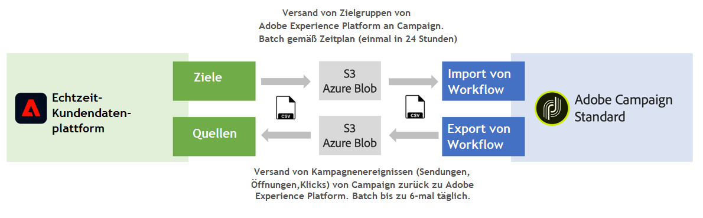

# Erste Schritte mit Quellen und Zielen {#rtcdp}

## Quellen und Ziele

Mit Adobe Experience Platform können Sie Daten zwischen der Campaign Standard- und Adobe-Echtzeit-Kundendatenplattform (RTCDP) freigeben. Auf diese Weise können Sie Adobe Experience Platform-Audiencen in Ihrer Kampagnen-Workflows Zielgruppe ausführen und dann an die Adobe Echtzeit-Daten der Kundendatenplattform zu diesen Audiencen wie Senden, Öffnen und Klicks zurücksenden.

* Mit **Ziele** können Sie Audiencen von Adobe Experience Platform in Campaign Standard erfassen. Auf diese Weise können Sie Ihre bekannten und unbekannten Daten für Ihre Marketing-Kampagnen aktivieren.
* Mit **Sources** exportieren Sie Campaign Standard-Daten (z. B. senden, öffnen, Klicks) nach Adobe Experience Platform. Auf diese Weise können Sie Daten, die Sie aus unterschiedlichen Quellen erfassen, an einem Ort zusammenfassen und die dabei gewonnenen Erkenntnisse nutzen, um mehr zu tun.

>[!IMPORTANT]
>
>Beachten Sie bei der Durchführung dieser Integration die Einschränkungen der SFTP-Datenspeicherung, die Datenspeicherung der Datenbank und die Einschränkungen des aktiven Profils gemäß Ihrem Adobe Campaign-Vertrag.

Eine detaillierte Übersicht über die Adobe Echtzeit-Kundendatenplattform, -ziele und -quellen finden Sie auf den folgenden Seiten:

* [Adobe Echtzeit-Kundendatenplattform](https://experienceleague.adobe.com/docs/experience-platform/rtcdp/overview.html)
* [Dokumentation zu Zielen](https://experienceleague.adobe.com/docs/experience-platform/destinations/home.html)
* [Dokumentation zu Quellen](https://experienceleague.adobe.com/docs/experience-platform/sources/home.html)

## Campaign Standard mit Adobe Experience Platform verbinden

Um Daten zwischen Adobe Experience Platform und Campaign Standard freigeben zu können, müssen Sie zunächst Adobe Campaign als **Ziel** verbinden und Ihre AWS S3- oder Azurblase-Datenspeicherung als **Quelle** in der Erlebnisplattform für Adoben verbinden.

Nachdem die Connectors konfiguriert wurden, können Sie einen Datenimport oder -export mit Workflows in Campaign Standard einrichten.

Weitere Informationen zum Einrichten dieser Import- und Exportprozesse finden Sie in den folgenden Abschnitten:

* [Adobe Experience Platform-Audiencen in die Kampagne integrieren](../../integrating/using/ingest-aep-data.md)
* [Exportieren von Daten aus der Kampagne nach Adobe Experience Platform](../../integrating/using/export-campaign-data.md)
