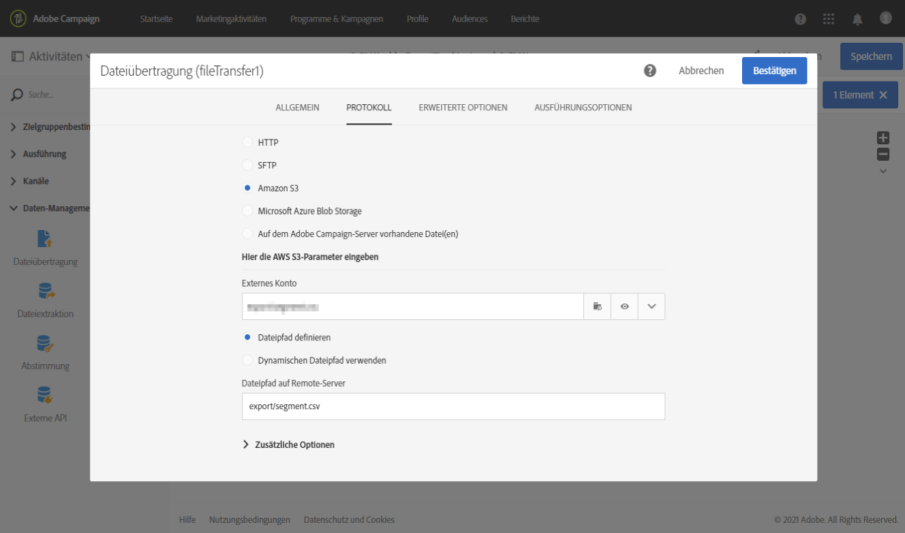
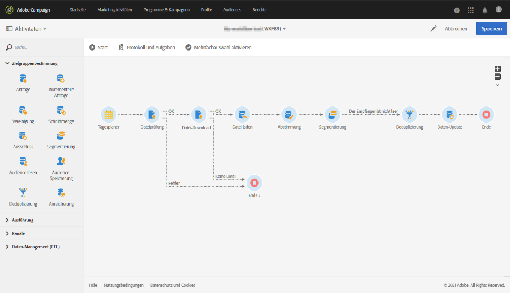

# Adobe Experience Platform-Zielgruppen in Campaign aufnehmen {#destinations}

Um Adobe Experience Platform-Zielgruppen in Campaign aufzunehmen und sie in Ihren Workflows zu verwenden, müssen Sie zunächst Adobe Campaign als ein Adobe Experience Platform-**Ziel** verbinden und mit dem zu exportierenden Segment konfigurieren.

Nachdem das Ziel konfiguriert ist, werden die Daten an Ihren Speicherort exportiert. Zur Aufnahme der Daten muss in Campaign Standard noch ein spezieller Workflow erstellt werden.

## Adobe Campaign als Ziel verbinden

Konfigurieren Sie in Adobe Experience Platform eine Verbindung mit Adobe Campaign, indem Sie einen Speicherort für die exportierten Segmente auswählen. In diesem Schritt können Sie auch die zu exportierenden Segmente auswählen und zusätzliche XDM-Felder angeben, die einbezogen werden sollen.

Weitere Informationen finden Sie in der [Dokumentation zu Zielen](https://experienceleague.adobe.com/docs/experience-platform/destinations/catalog/email-marketing/adobe-campaign.html?lang=de).

Nachdem das Ziel konfiguriert wurde, erstellt Adobe Experience Platform eine tabulatorgetrennte .txt- oder .csv-Datei an dem von Ihnen angegebenen Speicherort. Dieser Vorgang wird einmal alle 24 Stunden geplant und ausgeführt.

Sie können jetzt einen Campaign Standard-Workflow konfigurieren, um das Segment in Campaign aufzunehmen.

## Import-Workflow in Campaign Standard erstellen

Nachdem Campaign Standard als Ziel konfiguriert wurde, müssen Sie einen Workflow erstellen, um die von Adobe Experience Platform exportierte Datei zu importieren.

Fügen Sie dazu die Aktivität **[!UICONTROL Dateiübertragung]** hinzu und konfigurieren Sie sie. Weiterführende Informationen zur Konfiguration dieser Aktivität finden Sie in [diesem Abschnitt](../../automating/using/transfer-file.md).

Sie können dann Ihren Workflow gemäß Ihren Anforderungen erstellen (Datenbank mit den Segmentdaten aktualisieren, kanalübergreifende Sendungen an das Segment ausführen usw.).

Beispielsweise wird im folgenden Workflow die Datei täglich von Ihrem Speicherort heruntergeladen und anschließend die Campaign-Datenbank mit den Segmentdaten aktualisiert.

Beispiele für Daten-Management-Workflows sind im Abschnitt [Workflow-Anwendungsfälle](../../automating/using/about-workflow-use-cases.md#management) verfügbar.

Verwandte Themen:

* [Datenverwaltungsaktivitäten](../../automating/using/about-data-management-activities.md)
* [Über den Datenimport und -export](../../automating/using/about-data-import-and-export.md)
