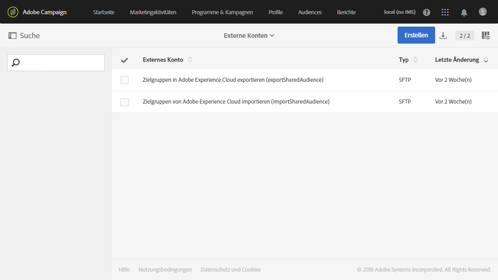
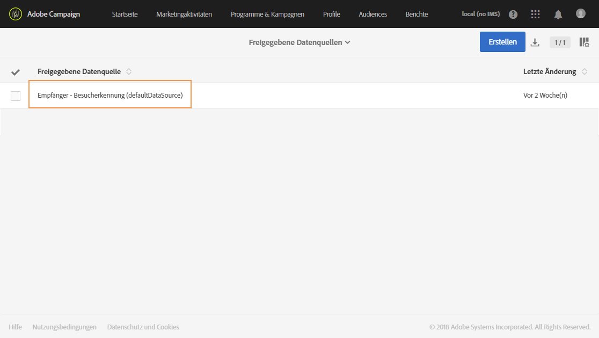
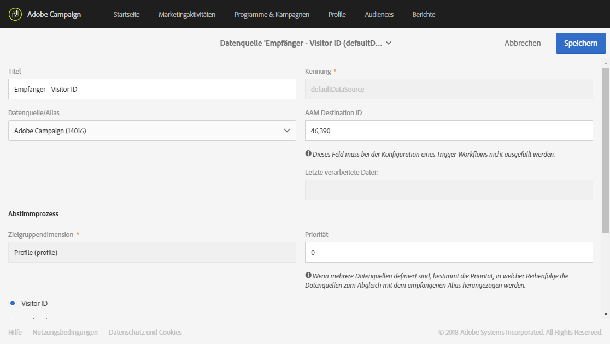

# Integration mit Audience Manager oder People Core Service bereitstellen und konfigurieren{#integration-with-audience-manager-or-people-core-service}

Die Bereitstellung und Konfiguration von Audience Manager und People Core in Adobe Campaign erfolgt in zwei Schritten: [Zunächst wird ein Antrag an Adobe übermittelt](#submitting-request-to-adobe), dann [wird die Integration mit Adobe Campaign konfiguriert](#configuring-the-integration-in-adobe-campaign).

## Anfrage an Adobe übermitteln      {#submitting-request-to-adobe}

Durch die Integration von Audience Manager (AAM) oder People Core Service können Sie Audiences oder Segmente in Adobe Campaign importieren und exportieren.

Diese Integration muss zuerst konfiguriert werden. Um diese Bereitstellung anzufordern, kontaktieren Sie den Adobe-Support und geben dabei folgende Informationen an:

<table> 
 <tbody> 
  <tr> 
   <td> <strong>Art des Antrags:</strong>  </td> 
   <td> Integration von AAM/People Core service mit Campaign </td> 
  </tr> 
  <tr> 
   <td> <strong>Organisationsname:</strong>  </td> 
   <td> Name Ihres Unternehmens </td> 
  </tr> 
  <tr> 
   <td> <strong>Kennung der IMS-Organisation</strong>  </td> 
   <td> Ihre Organisations-ID.   Auf <a href="https://experienceleague.adobe.com/docs/core-services/interface/administration/organizations.html?lang=de">dieser Seite</a> erfahren Sie, wie Sie Ihre Organisations-ID finden.</td> 
  </tr> 
  <tr> 
   <td> <strong>Umgebung:</strong>  </td> 
   <td> Beispiel: Produktion </td> 
  </tr> 
  <tr> 
   <td> <strong>AAM oder People Service</strong>  </td> 
   <td> Beispiel: Adobe Audience Manager. Achten Sie darauf, dem Bereitstellungsteam mitzuteilen, ob Sie über eine Audience Manager-Lizenz verfügen oder nicht.</td> 
  </tr> 
  <tr> 
   <td> <strong>Declared ID oder Visitor ID</strong>  </td> 
   <td> Beispiel: Declared ID </td> 
  </tr> 
  <tr> 
   <td> <strong>Zusatzinformationen</strong>  </td> 
   <td> Etwaige nützliche Informationen oder Anmerkungen </td> 
  </tr> 
 </tbody> 
</table>

## Integration in Adobe Campaign konfigurieren         {#configuring-the-integration-in-adobe-campaign}

Nach Übermittlung dieses Antrags wird dieser von Adobe bearbeitet. Sie werden ersucht, Informationen bereitzustellen, und darauf hingewiesen, dass Sie die Konfiguration abschließen müssen:

* [Schritt 1: Konfigurieren bzw. überprüfen Sie die externen Konten in Adobe Campaign.](#step-1--configure-or-check-the-external-accounts-in-adobe-campaign)
* [Schritt 2: Konfigurieren Sie die Datenquellen.](#step-2--configure-the-data-sources)
* [Schritt 3: Konfigurieren Sie den Campaign Tracking Server.](#step-3--configure-campaign-tracking-server)
* [Schritt 4: Konfigurieren Sie den Visitor-ID-Dienst.](#step-4--configure-the-visitor-id-service)

### Schritt 1: Konfigurieren bzw. überprüfen Sie die externen Konten in Adobe Campaign.   {#step-1--configure-or-check-the-external-accounts-in-adobe-campaign}

Zunächst müssen die externen Konten in Adobe Campaign konfiguriert bzw. überprüft werden. Diese Konten sollten von Adobe konfiguriert und die erforderlichen Informationen sollten Ihnen übermittelt worden sein.

Gehen Sie dabei folgendermaßen vor:

1. Wählen Sie im erweiterten Menü **Administration > Anwendungskonfiguration > Externe Konten**.

   Wählen Sie eines der folgenden für diese Integration verfügbaren externen Konten.

   

1. Geben Sie den **[!UICONTROL Receiver-Server]** im folgenden Format ein:
1. Geben Sie die **[!UICONTROL AWS-Zugriffsschlüssel-ID]**, den **[!UICONTROL geheimen Zugriffsschlüssel]** und die **[!UICONTROL AWS-Region]** ein.

Ihre externen Konten sind für diese Integration somit konfiguriert.

### Schritt 2: Konfigurieren Sie die Datenquellen.         {#step-2--configure-the-data-sources}

In Audience Manager werden diese zwei Datenquellen erstellt: Adobe Campaign (MID) und Adobe Campaign (DeclaredId). Diese beiden Datenquellen sind gleichzeitig auch in Adobe Campaign verfügbar:

* **[!UICONTROL Empfänger – Besucherkennung (Defaultdatasources)]**: Dies ist eine native Datenquelle, die standardmäßig für die Besucherkennung konfiguriert ist. Die in Campaign erstellten Segmente werden Teil dieser Datenquelle sein.
* Datenquelle **Declared ID**: Diese Datenquelle muss erstellt und mit der **[!UICONTROL DeclaredId]**-Datenquellendefinition aus Audience Manager gemappt werden.

Bitte beachten Sie, dass Adobe Campaign bei mehreren Websites mit unterschiedlichen Domains keine Abstimmung auf der Basis von ECID unterstützt.

So konfigurieren Sie die Datenquelle **[!UICONTROL Empfänger - Besucherkennung (Defaultdatasources)]**:

1. Wählen Sie in **[!UICONTROL Administration]** > **[!UICONTROL Anwendungskonfiguration]** > **[!UICONTROL Freigegebene Datenquellen]** die Option **[!UICONTROL Empfänger - Besucherkennung (Defaultdatasources)]**.

   

1. Wählen Sie **[!UICONTROL Adobe Campaign]** aus der Dropdown-Liste **[!UICONTROL Datenquelle/Alias]**.
1. Geben Sie die von Adobe bereitgestellte **[!UICONTROL AAM Destination ID]** ein.

   

1. Wir empfehlen, die Abstimmungskriterien in der Kategorie **[!UICONTROL Abstimmungsvorgang]** nicht zu ändern und immer die **[!UICONTROL Besucher-ID]** zu verwenden.
1. Wählen Sie **[!UICONTROL Speichern]** aus.

So erstellen Sie die Datenquelle **[!UICONTROL Declared ID]**:

1. Wählen Sie in **[!UICONTROL Administration]** > **[!UICONTROL Anwendungskonfiguration]** > **[!UICONTROL Freigegebene Datenquellen]** die Schaltfläche **[!UICONTROL Erstellen]**.
1. Bearbeiten Sie den **[!UICONTROL Titel]** Ihrer Datenquelle.
1. Wählen Sie in der Dropdown-Liste **[!UICONTROL Datenquelle/Alias]** die Datenquelle aus, die der **[!UICONTROL DeclaredID]**-Datenquelle aus Audience Manager entspricht.
1. Konfigurieren Sie Ihre Datenquelle, indem Sie den Wert für **[!UICONTROL Datenquelle/Alias]** und die **[!UICONTROL AAM Destination ID]** eingeben, die von Adobe bereitgestellt wurden.
1. Konfigurieren Sie den **[!UICONTROL Abstimmungsvorgang]** entsprechend Ihren Anforderungen.
1. Wählen Sie **[!UICONTROL Speichern]** aus.

>[!NOTE]
>
>Das Feld **[!UICONTROL AAM Destination ID]** muss nicht ausgefüllt werden, wenn Sie die freigegebene Datenquelle für die [Campaign-Triggers-Integration](../../integrating/using/configuring-triggers-in-experience-cloud.md) konfigurieren. Die **[!UICONTROL Priorität]** muss nur bei der Konfiguration der Triggers-Campaign-Integration definiert werden. Mit der Priorität wird angegeben, welche Datenquelle als Erste konfiguriert wird. Als Priorität kann jede beliebige Zahl, wie 1 oder 100, eingegeben werden. Je höher die Priorität ist, desto höher ist auch die Präferenz bei der Abstimmung.

### Schritt 3: Konfigurieren Sie den Campaign Tracking Server.         {#step-3--configure-campaign-tracking-server}

Für die Konfiguration der Integration mit People Core Service oder Audience Manager muss auch der Campaign Tracking Server konfiguriert werden.

Damit freigegebene Zielgruppen mit der Besucher-ID funktionieren, sollte die Tracking-Server-Domain eine Subdomain der angeklickten URL oder der Haupt-Website sein.

>[!IMPORTANT]
>
> Stellen Sie sicher, dass der Campaign Tracking Server auf der Domain (CNAME) registriert ist. Mehr Informationen zur Konfiguration von Domain-Namen finden Sie in [diesem Artikel](https://helpx.adobe.com/de/campaign/kb/domain-name-delegation.html).

### Schritt 4: Konfigurieren Sie den Visitor-ID-Dienst. {#step-4--configure-the-visitor-id-service}

Falls Ihr Visitor-ID-Dienst nie in Ihren Web-Parametern und Webseiten konfiguriert wurde, finden Sie im folgenden [Dokument](https://experienceleague.adobe.com/docs/id-service/using/implementation/setup-aam-analytics.html?lang=de) oder im folgenden [Video](https://helpx.adobe.com/de/marketing-cloud/how-to/email-marketing.html#step-two) nähere Informationen dazu.

Synchronisieren Sie Kunden-IDs mit der Declared ID mithilfe der `setCustomerID`-Funktion im ID-Dienst von Experience Cloud mit dem Integrations-Code: `AdobeCampaignID`. Die `AdobeCampaignID` sollte mit dem Wert des Abgleichsschlüssels übereinstimmen, der in der Empfängerdatenquelle festgelegt ist, die in [Schritt 2: Konfigurieren Sie die Datenquellen](#step-2--configure-the-data-sources) festgelegt wurde.

Die Konfiguration und Bereitstellung sind jetzt abgeschlossen. Die Integration kann somit zum Import und Export von Zielgruppen und Segmenten verwendet werden.
