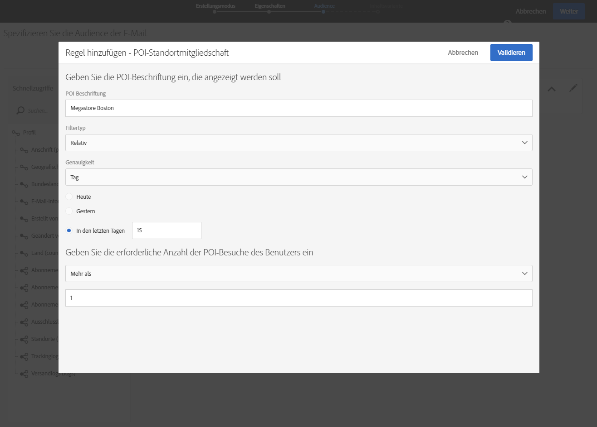
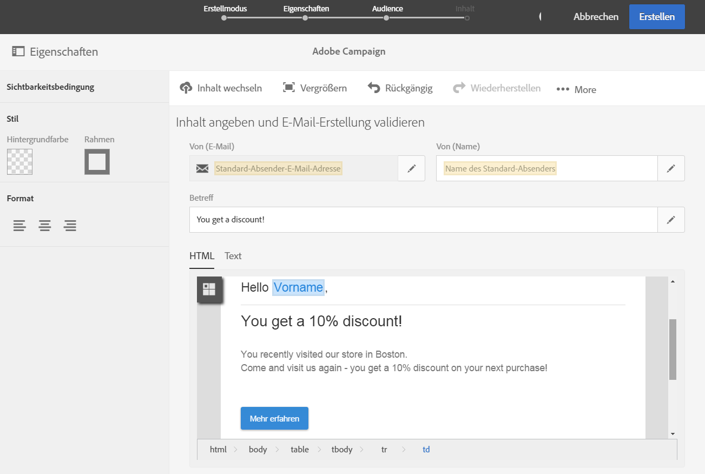

# Campaign-Nachrichten mit POI-Daten personalisieren{#personalizing-campaign-messages-with-point-of-interest-data}

Mit den von Abonnenten Ihrer Mobile App erfassten POI-Daten können Sie diesen Abonnenten über Adobe Campaign personalisierte Marketing-Nachrichten wie E-Mails senden.

Sie können auf POI-Daten nur mit Standardsendungen reagieren. [Transaktionsnachrichten](../../channels/using/about-transactional-messaging.md) können keine Standortdaten verwenden.

Die Reaktionszeit beträgt mindestens 10 Minuten.

Im Folgenden wird beschrieben, wie Sie Abonnenten, die innerhalb der letzten zwei Wochen Ihr Geschäft in Boston besucht haben, eine E-Mail senden können:

1. Erstellen Sie eine E-Mail-Marketing-Aktivität.
1. Ziehen Sie beim Bestimmen der Versand-Audience das Element **[!UICONTROL App-Abonnements]in den Arbeitsbereich.**

   

   Die Verwaltung von Audiences ist im Abschnitt [Audiences bestimmen](../../audiences/using/creating-audiences.md) beschrieben.

1. Ziehen Sie im Fenster **[!UICONTROL Regel hinzufügen - Profil/App-Abonnements]** das Element **POI-Standortmitgliedschaft]in den Arbeitsbereich.[!UICONTROL **

   

1. Geben Sie im Fenster **[!UICONTROL Regel hinzufügen - POI-Standortmitgliedschaft]den Titel des POI ein, den Sie verwenden möchten.**

   

1. In the **[!UICONTROL Filter type]** field, select **[!UICONTROL Relative]**.
1. Markieren Sie die Option **[!UICONTROL In den letzten Tagen]** und geben Sie im entsprechenden Feld **15]ein.[!UICONTROL **
1. Geben Sie an, wie oft der Benutzer den POI besucht haben muss.
1. Klicken Sie auf **[!UICONTROL Validieren], um Ihre Audience zu speichern.**

   

1. Fügen Sie zu Ihrer E-Mail Inhalt hinzu.

   

1. Bestätigen Sie die Erstellung der Aktivität, um das Dashboard der E-Mail zu öffnen.
1. Senden Sie Ihre Nachricht.

Die E-Mail mit dem Angebot eines 10 %-Rabatts wird an Abonnenten gesendet, die:

* Ihr Geschäft in Boston mindestens einmal in den letzten zwei Wochen besucht haben,
* Hatten ihre Mobile App mindestens einmal während ihres Besuchs im Vordergrund geöffnet

**Verwandte Themen:**

* [E-Mails erstellen](../../channels/using/creating-an-email.md)
* [Inhalte erstellen](../../designing/using/example--email-personalization.md)
* [Nachrichten senden](../../sending/using/confirming-the-send.md)

