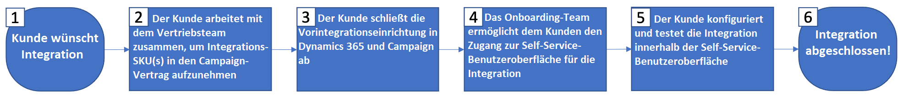

# Microsoft Dynamics 365-Integration anfordern und konfigurieren

Um diese Integration bereitzustellen, müssen Sie die folgenden Schritte ausführen.

Bitte folgen Sie dem unten stehenden Flussdiagramm und den entsprechenden Details, um die Integration anzufordern und zu konfigurieren.

Details des Flussdiagramms (sind mit den oben genannten Schritten verknüpft):

* **Schritt 1**: Es wird davon ausgegangen, dass Sie bereits über eine Lizenz für Microsoft Dynamics 365 for Sales und für Adobe Campaign Standard verfügen oder diese gerade erwerben.

* **Schritt 2**: Das Standardintegrationsangebot ist für alle Kunden kostenlos. Abhängig von Ihren Anforderungen können jedoch zusätzliche Kosten anfallen (siehe [Limits und Grenzen bei der Integration](../../integrating/using/ms-dynamics-365-integration-guardrails.md)). Ein neuer Kundenauftrag muss unterschrieben werden, um die Integration nutzen zu können.

* **Schritt 3**: Vollständige Vorintegrationsschritte für Dynamics 365 und Campaign. Siehe [Diese Integration konfigurieren](#configure-this-integration).

* **Schritte 4–7**: Das Onboarding-Team von Adobe arbeitet mit Ihnen während des gesamten Onboarding-Prozesses zusammen.

## Diese Integration konfigurieren {#configure-this-integration}

Für diese Integration müssen drei Systeme bereitgestellt und konfiguriert werden: Adobe Campaign Standard, Microsoft Dynamics 365 for Sales und das Integrations-Tool. Links zu Konfigurationsartikeln finden Sie unten.

>[!CAUTION]
>
>Für jedes System müssen diese Schritte von einem Administrator ausgeführt werden.
>
>Die Schritte in den unten stehenden Artikeln führen Sie durch das Erstellen von Integrationen/Registrierungen, die das Zuweisen von Administratorberechtigungen und/oder Administratorzugriff beinhalten.  Sie müssen vor der Ausführung sicherstellen, dass diese Schritte den Richtlinien Ihres Unternehmens entsprechen, und die Schritte dann sorgfältig durchführen.

In ADOBE CAMPAIGN müssen Sie API-Zugriff einrichten und eine neue Integration für das Integrations-Tool konfigurieren. Lesen Sie dazu [diesen Artikel](../../integrating/using/configure-adobe-io-for-ms-dynamic.md).

In MICROSOFT DYNAMICS 365 müssen Sie eine neue App-Registrierung erstellen und einen Anwender für die Verwendung der Integration aktivieren.  Informationen zum Konfigurieren von Microsoft Dynamics 365 für diese Integration finden Sie in [diesem Artikel](../../integrating/using/configure-microsoft-dynamics-365-for-campaign-integration.md).

Sie müssen mit dem Onboarding-Team von Adobe zusammenarbeiten, um die Konfiguration für eingehende, ausgehende und Opt-out-Datenflüsse einzurichten.

## Support anfordern

Support-Tickets können wie gewohnt bei der Kundenunterstützung von Adobe eingereicht werden. Die Kundenunterstützung zieht bei Bedarf Support-Mitarbeiter hinzu.

Bei Problemen mit dem Integrationsdatenfluss sollten Sie neben den folgenden Informationen auch die Report Suite als Teil der Problembeschreibung angeben:

* **Prozessverantwortlicher**: Technische Architekten

* **ES-Prozess-ID**: Wurde während des Onboarding-Prozesses bereitgestellt

* **Prozesstitel**: Integration von Adobe Campaign Standard mit Microsoft Dynamics 365

* **Problembeschreibung**: Beschreibung des Problems

Support für die Integration ist derzeit rund um die Uhr verfügbar (Montag bis Freitag, ausgenommen Feiertage und Betriebsferien von Adobe).