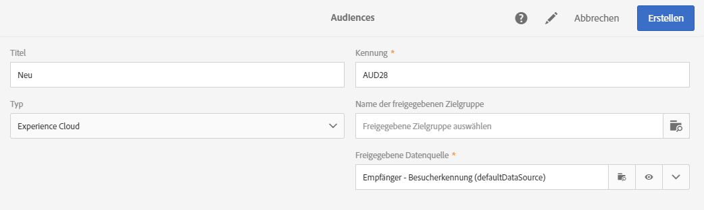
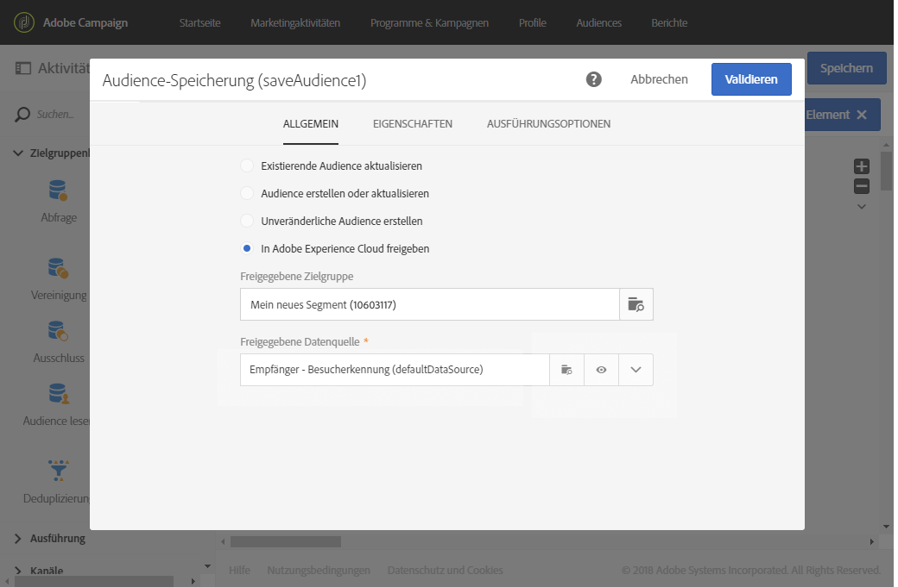
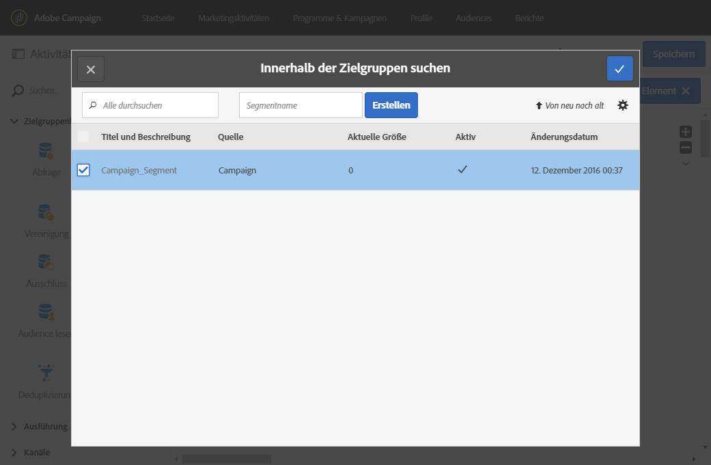

# Audiences für Audience Manager oder People Core Service freigeben{#sharing-audiences-with-audience-manager-or-people-core-service}

## Zielgruppe importieren {#importing-an-audience}

Durch die Integration von People Core Service kann eine Zielgruppe direkt in Adobe Campaign über einen technischen Workflow importiert werden, um Ihre Datenbank anzureichern. Weiterführende Informationen zur Zielgruppenfreigabe in People Core Service finden Sie in dieser [Dokumentation](https://experienceleague.adobe.com/docs/analytics/components/segmentation/segmentation-workflow/seg-publish.html?lang=de).

Der Import von Zielgruppen/Segmenten aus People Core Service in Adobe Campaign erfolgt über das Menü **[!UICONTROL Zielgruppen]**. Nutzer müssen sich einfach nur per IMS verbinden (die Authentifizierung erfolgt über die Adobe ID).

1. Greifen Sie auf das **[!UICONTROL Zielgruppen]**-Menü zu.
1. Verwenden Sie in der Aktionsleiste die **[!UICONTROL Erstellen]**-Schaltfläche, um zum Bildschirm zur Zielgruppe-Erstellung zu gelangen.
1. Vergeben Sie einen Titel für die neue Zielgruppe.
1. Setzen Sie den **[!UICONTROL Typ]** der Audience auf **[!UICONTROL Experience Cloud]**, um anzugeben, dass es sich bei der zu erstellenden Audience um eine aus People Core Service importierte Zielgruppe handelt.
1. Wählen Sie über das Feld **[!UICONTROL Name der freigegebenen Zielgruppe]** die zu importierende Zielgruppe aus. Nur Segmente können importiert werden. Granulare Daten wie Schlüssel/Wert-Paare, Merkmale und Regeln werden nicht unterstützt.

   

1. Wählen Sie die entsprechende **[!UICONTROL freigegebene Datenquelle aus]**.

   Wenn die ausgewählte Datenquelle so konfiguriert ist, dass ein Verschlüsselungsalgorithmus verwendet werden kann, können Sie über eine zusätzliche Option **[!UICONTROL Abstimmung mit einem Profil erzwingen]** auswählen. Aktivieren Sie diese Option, wenn für das Feld **[!UICONTROL Kanal]** der Datenquelle E-Mail oder Mobile (SMS) ausgewählt ist und Sie Profildaten verwenden möchten.

   Wenn Sie die Option **[!UICONTROL Abstimmung mit einem Profil erzwingen]** nicht auswählen und für **[!UICONTROL Kanal]** in der AMC Data source &quot;E-Mail&quot; oder &quot;Mobile (SMS)&quot; eingestellt ist, werden alle verschlüsselten Declared IDs entschlüsselt. Eine Zielgruppe vom Typ **Datei** mit einer Liste aller E-Mail-Adressen/Mobiltelefonnummern wird erstellt/aktualisiert. Auf diese Weise geht keine E-Mail-Adresse/Mobiltelefonnummer beim Import einer freigegebenen Zielgruppe durch diese Integration verloren, selbst wenn dieses Profil in Campaign nicht existiert. Beachten Sie bitte, dass dieser Typ von Zielgruppen nicht direkt verwendet werden kann, da er manuell mit Workflows abgestimmt werden muss.

1. Validieren Sie die Erstellung.

   Die Zielgruppe wird dann mithilfe eines technischen Workflows importiert. Sie enthält Datensätze, deren Kennung (&#39;Visitor ID&#39; oder &#39;Declared ID&#39;) mit der Profildimension abgestimmt werden konnte. Von Adobe Campaign nicht erkannte Kennungen, die People-Core-Service-Segmenten entstammen, werden nicht importiert.

Ihre Zielgruppe wird jetzt in Ihre Adobe Campaign-Datenbank importiert. Wenn Segmente direkt von People Core Service oder Audience Manager importiert werden, dauert die Synchronisation des Imports 24 bis 36 Stunden. Danach ist die neue Zielgruppe in Adobe Campaign auffindbar und kann verwendet werden.

>[!NOTE]
>
>Beim Import von Audiences von Adobe Analytics nach Adobe Campaign müssen diese Audiences zuerst in People Core Service oder Audience Manager freigegeben werden. Dieser Prozess dauert 12 bis 24 Stunden, die zu den 24 bis 36 Stunden für die Synchronisation mit Campaign hinzugezählt werden müssen. Die Freigabe einer Zielgruppe kann demnach in diesem Fall bis zu 60 Stunden dauern. Weitere Informationen zur Adobe Analytics-Zielgruppenfreigabe in People Core Service und Audience Manager finden Sie in dieser [Dokumentation](https://experienceleague.adobe.com/docs/analytics/components/segmentation/segmentation-workflow/seg-publish.html?lang=de).

## Zielgruppe exportieren {#exporting-an-audience}

Der Export von Audiences aus Adobe Campaign in Audience Manager oder People Core Service erfolgt mithilfe eines Workflows und der Aktivität **[!UICONTROL Audience-Speicherung]**.

Der Export einer Audience von Adobe Campaign in People Core Service kann in einem neuen Workflow und nur von Benutzern durchgeführt werden, die per IMS verbunden sind (die Authentifizierung erfolgt über die Adobe ID).

1. Erstellen Sie ausgehend von einem Programm, einer Kampagne oder der Marketing-Aktivitätenliste einen neuen Workflow.
1. Verwenden Sie die diversen zur Verfügung stehenden Aktivitäten, um eine Gruppe von Profilen auszuwählen.
1. Platzieren Sie im Anschluss an die Zielgruppenbestimmung die Aktivität **[!UICONTROL Audience-Speicherung]** im Workflow-Diagramm und öffnen Sie sie.
1. Wählen Sie **[!UICONTROL In Adobe Experience Cloud freigeben]** aus.

   

1. Definieren Sie die Zielgruppe mithilfe des Felds **[!UICONTROL Freigegebene Zielgruppe.]** Wählen Sie dann im sich öffnenden Fenster entweder eine existierende Zielgruppe aus bzw. erstellen Sie eine neue:

   * Wenn Sie eine existierende Zielgruppe verwenden, wird sie mit den neuen Datensätzen ergänzt.
   * Zum Export der Profilliste in eine neue Zielgruppe ist zunächst das Feld **[!UICONTROL Segmentname]** auszufüllen. Verwenden Sie dann die Schaltfläche **[!UICONTROL Erstellen]**, um die Zielgruppe zu erstellen, und wählen Sie diese für den Export aus.

   

   Um abgestimmt und ausgetauscht werden zu können, müssen die Datensätze eine Adobe-Experience-Cloud-Kennung (&#39;Visitor ID&#39; oder &#39;Declared ID&#39;) aufweisen. Nicht abgestimmte Datensätze werden beim Import und Export der Zielgruppen ignoriert.

1. Schließen Sie den Vorgang ab, indem Sie die Validierungsschaltfläche oben rechts im Fenster verwenden.
1. Wählen Sie die entsprechende **[!UICONTROL Freigegebene Datenquelle]** aus.
1. Kreuzen Sie bei Bedarf die Option **[!UICONTROL Ausgehende Transition erzeugen]** an, um die exportierten Profile weiterzuverwenden. Es werden nur die Profile exportiert, die abgestimmt werden konnten.
1. Validieren Sie die Konfiguration der Aktivität und speichern Sie Ihren Workflow.
1. Starten Sie Ihren Workflow, um Ihre Zielgruppe zu exportieren. Die Synchronisation von Adobe Campaign und People Core Service kann mehrere Stunden in Anspruch nehmen.

Die Synchronisation von Adobe Campaign und People Core Service dauert 24 bis 36 Stunden. Danach ist Ihre neue Zielgruppe in People Core Service auffindbar und kann in anderen Adobe Experience Cloud-Lösungen verwendet werden. Weiterführende Informationen zur Verwendung einer in Adobe Campaign freigegebenen Audience in Adobe People Core Service finden Sie in dieser [Dokumentation](https://experienceleague.adobe.com/docs/core-services/interface/audiences/t-audience-create.html?lang=de).

**Verwandte Themen:**

* [Workflows](../../automating/using/get-started-workflows.md)
* [Zielgruppen](../../audiences/using/about-audiences.md)
