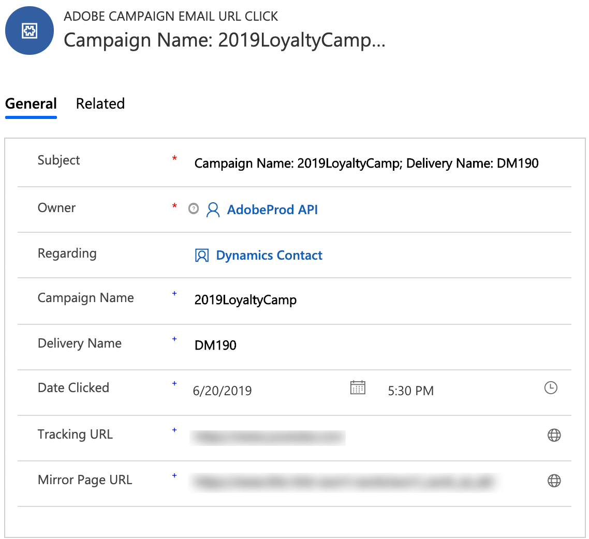

# Verwenden der Microsoft Dynamics 365-Integration

Diese Integration kann verschiedene Aufgaben ausführen:

* **Kontaktsynchronisierung**: Kontakte werden von Dynamics 365 zur Kampagne gesendet (Hinweis: einseitige Synchronisierung).
* **Benutzerdefinierte Entitätssynchronisierung**: Benutzerdefinierte Entitätsdatensätze werden von Dynamics 365 zur Kampagne gesendet (One-way-Synchronisierung beachten).  Weitere Informationen finden Sie auf der Seite zu benutzerdefinierten Entitäten.
* **Ereignis anzeigen**: Bestimmte E-Mail-Marketing-Ereignis werden von der Kampagne an Dynamics 365 gesendet. Siehe Hinweis unten.
* **Kontaktlöschung**: Kampagne-Profil wird zu datenschutzbezogenen Löschwarteschlangen hinzugefügt, wenn der entsprechende Kontakt in Dynamics 365 gelöscht wird.
* **Abmeldesynchronisierung**: Ausschlussmöglichkeiten werden abhängig von der Konfiguration, die der Kunde während des Einbogens wählt (d. h. Dynamik 365 zur Synchronisierung der Kampagne, Kampagne zu Dynamics 365-Synchronisierung oder bidirektionale Synchronisierung), zwischen Dynamics 365 und der Kampagne synchronisiert.
* **Single-Sign-On (SSO)**: Ihre Integrationsdetails in Unifi können Sie mit Ihrer Adobe IMS-Authentifizierung direkt von der Kampagne aus aufrufen.

>[!NOTE]
>
>Für die **Ereignis-Anzeige** werden bei jeder Ausführung des Regressauftrags in Unifi maximal 10.000 Ereignis abgerufen.

## Adobe Campaign Standard-Benutzererlebnis

Wenn ein Kontakt in Dynamics 365 neu erstellt oder geändert wird, wird er nach der Synchronisierung der Kontakte auf die Kampagne synchronisiert.  Diese Kontakte werden im Bildschirm &quot;Profile&quot;in der Kampagne angezeigt und können in Marketing-Kampagnen gezielt ausgewählt werden.  Siehe Profile unten.

Wenn ein Kontakt in Dynamics 365 gelöscht wird, wird das entsprechende Profil in der Kampagne zur Löschwarteschlange des Datenschutzdienstes im Bildschirm &quot;Datenschutzanforderung&quot;in der Kampagne hinzugefügt.  Weitere Informationen zur Ausführung von Datenanforderungen zum Löschen von Anforderungen, die zur Einhaltung der geltenden Datenschutzgesetze in der Kampagne erforderlich sind, finden Sie unter So führen Sie gesetzlich vorgeschriebene Löschungsanfragen in Adobe Campaign Standard aus.

Beachten Sie, dass Sie, wenn Sie den zweistufigen Prozess im Eigenschaftenbildschirm aktiviert haben, die Löschung jedes Datensatzes manuell im Datenschutzbildschirm bestätigen müssen, bevor sie endgültig gelöscht werden.  Siehe den 2-Schritt-Prozessbildschirm unten:

Wenn ein Attribut für Ausschluss/Blacklist in der Kampagne geändert wird, wird es in Dynamics 365 angezeigt, wenn Sie die Kampagne-zu-Dynamik 365- oder bidirektionale Opt-out-Konfiguration ausgewählt haben und wenn Sie dieses Attribut korrekt zugeordnet haben.

Um Ihre Integrationsdetails über Single Sign-On aufzurufen, wählen Sie im Navigationsmenü der Kampagne Administration > Microsoft Dynamics 365 Integration.

Diese Seite enthält Links zur Dokumentation zur Integration und Richtlinien zur Verwendung der Funktionen gemäß Ihren potenziellen rechtlichen Verpflichtungen. Klicken Sie auf das Globussymbol, das Sie automatisch weiterleitet und bei Ihrer Unifi-Instanz anmeldet, wo Sie Ihre Integrationsdetails verwalten können.

Im folgenden Video sehen Sie ein Video dieser Funktion.

>[!VIDEO](https://video.tv.adobe.com/v/29254)

>[!NOTE]
>
>Sie müssen ein Ticket an den Adobe-Kundendienst senden (entweder direkt oder über Ihren Adobe-Kontakt), damit das Flag für die Funktion zur einmaligen Anmeldung in Ihrer Kampagne aktiviert wird.

>[!NOTE]
>
>Das Symbol für die Integration von Microsoft Dynamics 365 wird nicht sofort in Ihrem Admin-Bedienfeld angezeigt.  Sie (oder Ihr Adobe-Kontakt) müssen ein Ticket senden, um dieses Feature-Flag für Ihre Kampagne-Instanz aktivieren zu lassen.
>
>Darüber hinaus muss Unifi Benutzern den Zugriff auf die SSO ermöglichen, bevor sie sich erfolgreich über die einmalige Anmeldung von der Kampagne aus anmelden können.

## Microsoft Dynamics 365 - Benutzererfahrung

Für die Anzeige von Ereignissen werden die folgenden E-Mail-Marketing-Ereignis von Kampagne zu Dynamics 365 gesendet und in der Dynamics 365-Zeitschiene-Ansicht als benutzerdefinierte Aktivitäten angezeigt:

* Adobe Campaign-E-Mail-Senden

* Adobe Campaign-E-Mail öffnen

* Adobe Campaign-E-Mail-URL-Klick

* Adobe Campaign-E-Mail-Absprung

Um die Zeitschiene eines Kontakts Ansicht, navigieren Sie zur Liste Kontakte, indem Sie im Dropdown-Menü Dynamics 365 auf Sales Hub klicken.  Klicken Sie dann auf Kontakte in der linken Menüleiste und wählen Sie einen Kontakt aus.

>[!NOTE]
>
>Das Adobe Campaign für Dynamics 365 App in AppSource muss in Ihrer Dynamics 365-Instanz installiert werden, um diese Ereignis Ansicht.

Unten sehen Sie eine Momentaufnahme des Kontaktbildschirms für &quot;Dynamics User&quot;.  In der Timeline-Ansicht werden Sie feststellen, dass Dynamics User eine E-Mail mit dem Namen der Kampagne &quot;2019LoyaltyCamp&quot;und dem Namen des Versands &quot;DM190&quot;gesendet wurde.  Dynamics User öffnete die E-Mail und klickte auch auf eine URL in der E-Mail. Beide Aktionen haben Ereignis erstellt, die auch unten angezeigt werden.  Wenn Sie die rechte Ecke sehen, sehen Sie die Karte des Assistenten für Beziehungen (RA); Derzeit enthält es eine Aufgabe, die auf die angeklickte URL folgt.

Eine Nahaufnahme der Timeline-Ansicht für Dynamics User finden Sie unten.

Nachfolgend finden Sie eine Nahaufnahme der Karte des Assistenten für Beziehungen (RA).  Die AppSource-App enthält einen Workflow, der nach einem Adobe E-Mail-URL-Klick-Ereignis sucht.  Wenn dieses Ereignis eintritt, wird eine Aufgabe erstellt und ein Fälligkeitsdatum festgelegt.  Dadurch kann die Aufgabe in der RA-Karte angezeigt werden, was eine zusätzliche Sichtbarkeit ermöglicht.  Es gibt einen ähnlichen Arbeitsablauf für Adobe E-Mail-Absprung-Ereignis, bei dem eine Aufgabe hinzugefügt wird, um die ungültige E-Mail-Adresse miteinander in Einklang zu bringen.  Diese Workflows können in der Lösung deaktiviert werden.

Wenn Sie auf den Betreff des Ereignisses &quot;Senden&quot;klicken, sehen Sie ein Formular, das dem unten stehenden ähnelt.  Die Formulare für Ereignisse zum Öffnen und Absprung sind ähnlich.

Das Formular für Ereignisse zum Klicken auf die E-Mail-URL fügt ein zusätzliches Attribut für die URL hinzu, auf die geklickt wurde:

Im Folgenden finden Sie eine Liste der Attribute und eine Beschreibung:

* Betrifft: Gegenstand des Ereignisses; bestehend aus Kampagnen-ID und Versand-ID des E-Mail-Versands

* Inhaber: Der in den Schritten nach der Bereitstellung erstellte Anwendungsbenutzer

* Zu: Name des Ansprechpartners

* Name der Kampagne: Die Kampagnen-ID in Campaign Standard

* Name des Versands: Die Versand-ID in Campaign Standard

* Datum gesendet/geöffnet/angeklickt/gepunktet: Datum/Uhrzeit der Erstellung des Ereignisses

* Tracking-URL: URL, auf die geklickt wurde

* Mirrorseiten-URL: Die URL zur Mirrorseite der E-Mail, die gesendet/geöffnet/angeklickt/angeklickt/abgeschnitten wurde

Im folgenden Video sehen Sie ein Video zur URL der Mirrorseite.

>[!VIDEO](https://video.tv.adobe.com/v/29253)

>[!NOTE]
>
>Wenn ein Opt-out-Attribut in Dynamics 365 geändert wird, wird es in der Kampagne angezeigt, wenn Sie die Option Dynamics 365-Kampagne oder bidirektionale Opt-out-Konfiguration ausgewählt haben und wenn Sie dieses Attribut korrekt zugeordnet haben.

**Verwandte Themen**

* Kampagne für Kampagne/Dynamics 365-Integration konfigurieren
* Konfiguration von Dynamik für Kampagne/Dynamics 365-Integration
* Unifi für Kampagne/Dynamics 365-Integration konfigurieren
* Erfahren Sie, wie Sie benutzerdefinierte Ressourcen und benutzerdefinierte Entitäten zuordnen