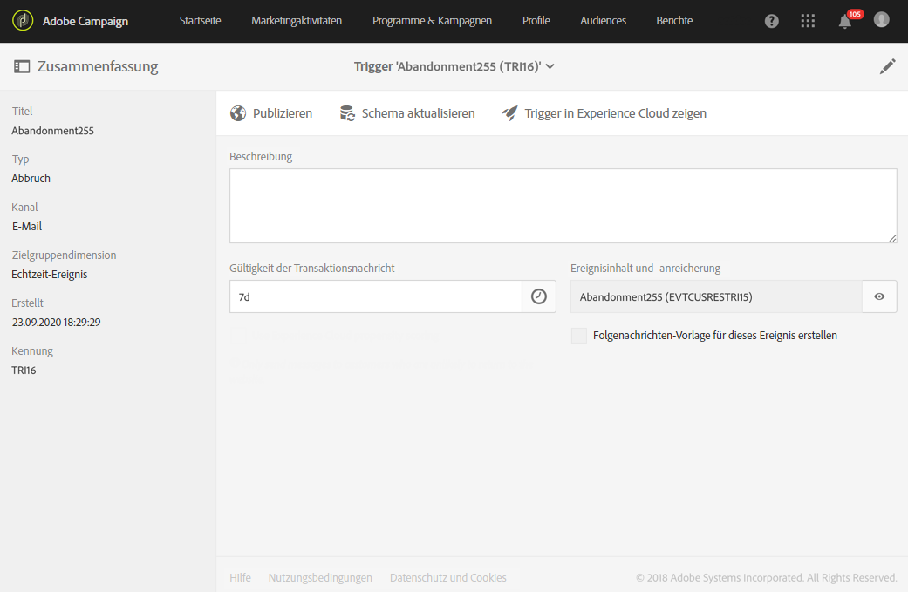
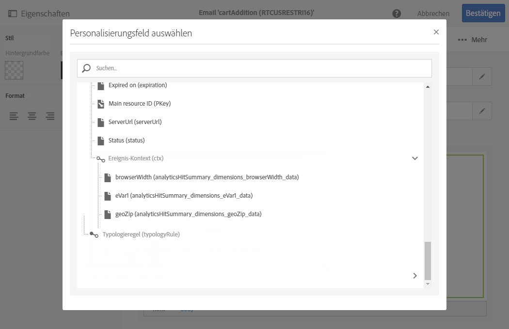

# Triggers in Campaign verwenden{#using-triggers-in-campaign}

## In Campaign einen zugeordneten Trigger erstellen {#creating-a-mapped-trigger-in-campaign}

>[!NOTE]
>
>Zum Erstellen von Triggern benötigen Sie die Rolle **[!UICONTROL Administration]** oder müssen der Sicherheitsgruppe der **[!UICONTROL Administratoren]** angehören. Weiterführende Informationen dazu finden Sie auf dieser [Seite](../../administration/using/list-of-roles.md).

Stellen Sie sicher, dass die Verhaltensweisen, die Sie verfolgen möchten, im Vorhinein in Adobe Experience Cloud (Core Service **[!UICONTROL Triggers]**) definiert wurden. Weiterführende Informationen finden Sie in der [Dokumentation zur Adobe Experience Cloud](https://experienceleague.adobe.com/docs/experience-cloud/triggers/create.html?lang=de). Beachten Sie, dass bei der Definition von Triggern die Alias aktiviert werden müssen. In Adobe Experience Cloud muss für jedes Verhalten (abgebrochener Webseitenbesuch/Formularabbruch, hinzugefügter/entfernter Artikel, abgelaufene Sitzung etc.) ein neuer Trigger hinzugefügt werden.

In Adobe Campaign ist nun ein auf einem bereits vorhandenen Trigger der Adobe Experience Cloud basierendes Trigger-Ereignis zu erstellen.

Gehen Sie hierzu wie folgt vor:

1. Klicken Sie auf das **Adobe**-Logo oben links im Bildschirm und anschließend auf **[!UICONTROL Marketing-Pläne]** > **[!UICONTROL Transaktionsnachrichten]** > **[!UICONTROL Experience Cloud Triggers]**.

   

1. Wählen Sie die **[!UICONTROL Erstellen]**-Schaltfläche aus. Im sich öffnenden Assistenten wird die Liste aller in Adobe Experience Cloud definierten Trigger angezeigt. In der Spalte **[!UICONTROL Anzahl an Übermittlungen von Analytics]** wird die Anzahl an Ereignissen angezeigt, die vom Trigger in Adobe Experience Cloud an Adobe Campaign gesendet wurden. Hierbei handelt es sich um ein Mapping der in der Experience Cloud-Benutzeroberfläche erstellten Trigger.

   

1. Wählen Sie den Trigger in Adobe Experience Cloud aus, den Sie verwenden möchten, und danach **[!UICONTROL Weiter]**.
1. Konfigurieren Sie die allgemeinen Eigenschaften des Triggers. Geben Sie bei diesem Schritt des Assistenten auch den Kanal und die Zielgruppendimension an, die vom Trigger verwendet werden sollen (siehe [Zielgruppendimensionen und Ressourcen](../../automating/using/query.md#targeting-dimensions-and-resources)). Bestätigen Sie dann die Trigger-Erstellung.
1. Verwenden Sie die Schaltfläche rechts vom Feld **[!UICONTROL Ereignisinhalt und -anreicherung]**, um den Payload-Inhalt angezeigt zu bekommen. Innerhalb dieses Bildschirms können Sie außerdem die Ereignisdaten mittels in der Adobe-Campaign-Datenbank gespeicherten Profildaten anreichern. Die Anreicherung erfolgt auf die gleiche Weise wie bei Standard-Transaktionsnachrichten.

   

1. Definieren Sie im Feld **[!UICONTROL Gültigkeitsdauer der Transaktionsnachricht]** die Dauer, für welche die Nachricht nach dem Versand des Ereignisses durch Analytics gültig sein soll. Bei einer definierten Dauer von 2 Tagen wird die Nachricht nach Ablauf dieses Zeitraums nicht länger gesendet. Dies stellt sicher, dass Nachrichten, deren Versand ausgesetzt wurde, nach Ablauf der festgesetzten Dauer nicht mehr gesendet werden, auch wenn der Versand wieder aufgenommen wird.

   

1. Sie können Ihre Triggers jetzt veröffentlichen. Weitere Informationen dazu finden Sie unter [Trigger in Campaign veröffentlichen](../../integrating/using/using-triggers-in-campaign.md#publishing-trigger-in-campaign).

## Trigger in Campaign veröffentlichen {#publishing-trigger-in-campaign}

Nachdem Sie in Adobe Campaign ein Trigger-Ereignis basierend auf einem vorhandenen Adobe Experience Cloud-Trigger erstellt haben, müssen Sie es jetzt veröffentlichen.

1. Klicken Sie in Ihrem zuvor erstellten Trigger auf die Schaltfläche **[!UICONTROL Veröffentlichen]**, um mit dem Veröffentlichen des Trigger-Ereignisses zu beginnen.

   

1. Sie können den Fortschritt Ihrer Trigger-Veröffentlichung unter **[!UICONTROL Veröffentlichung]** überprüfen.

   

1. Wenn die Veröffentlichung abgeschlossen ist, wird die folgende Meldung unter **[!UICONTROL Veröffentlichung]** angezeigt.

   

1. Wenn Sie nach dem Veröffentlichen Ihres Trigger-Ereignisses das Trigger-Schema verändern müssen, wählen Sie die Schaltfläche **[!UICONTROL Schema aktualisieren]** aus, um die letzten Änderungen abzurufen.

   Bitte beachten Sie, dass durch diese Aktion die Veröffentlichung Ihres Triggers und Ihrer Transaktionsnachricht aufgehoben werden und Sie diese danach wieder veröffentlichen müssen.

   

1. Klicken Sie auf die Schaltfläche **[!UICONTROL Trigger in Experience Cloud zeigen]**, um die Trigger-Definition in Adobe Experience Cloud einzusehen.

Mit Ausführung der Veröffentlichung wird automatisch eine dem neuen Ereignis entsprechende Transaktionsvorlage erzeugt. Diese Vorlage muss nun bearbeitet und veröffentlicht werden. Lesen Sie diesbezüglich auch den Abschnitt [Vorlagen bearbeiten](../../start/using/marketing-activity-templates.md).

## Transaktionsnachrichtenvorlage bearbeiten           {#editing-the-transactional-message-template}

Im Zuge der Erstellung und Veröffentlichung des Trigger-Ereignisses wird die entsprechende Transaktionsvorlage automatisch erstellt. Lesen Sie diesbezüglich auch den Abschnitt [In Campaign einen gemappten Trigger erstellen](#creating-a-mapped-trigger-in-campaign).

Damit das Ereignis mit dem Versand einer Transaktionsnachricht einhergeht, muss diese Vorlage personalisiert, getestet und dann veröffentlicht werden. Hierbei gilt das gleiche Prinzip wie für standardmäßige Transaktionsnachrichten. Weitere Informationen hierzu finden Sie unter [Transaktionsnachrichten bearbeiten](../../channels/using/editing-transactional-message.md).

>[!NOTE]
>
>Bei der Aufhebung der Veröffentlichung der Vorlage wird automatisch auch die Veröffentlichung des Trigger-Ereignisses aufgehoben.

Im Zuge der Erstellung von Nachrichteninhalten haben Sie nun die Möglichkeit, Personalisierungsfelder zu verwenden, die auf vom Analytics-Trigger gesendeten Informationen beruhen. Wenn Sie die Ereignisdaten mit Profildaten aus Adobe Campaign anreichern, können Sie die Nachricht mittels dieser Informationen personalisieren. Um Ihre Nachricht zu personalisieren, wählen Sie im Knoten **[!UICONTROL Transaktionsereignis]** > **[!UICONTROL Ereignis-Kontext]** das gewünschte Feld aus.

## Zugriff auf Berichte {#accessing-the-reports}

Öffnen Sie zur Anzeige des dedizierten Trigger-Berichts in Adobe Campaign das Trigger-Ereignis, das Sie zuvor erstellt haben, und verwenden Sie die Schaltfläche **[!UICONTROL Trigger-Bericht anzeigen]**.

In dem Bericht werden die Anzahl verarbeiteter Ereignisse im Vergleich zur Anzahl der von Analytics gesendeten Ereignisse angezeigt. Außerdem werden darin alle aktuellen Trigger angezeigt.

