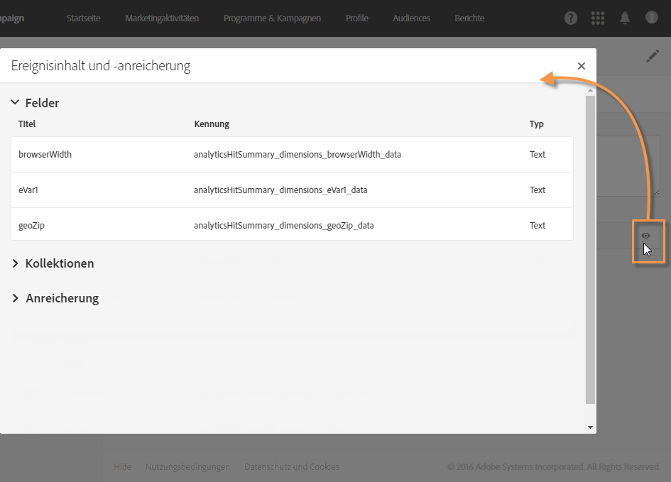
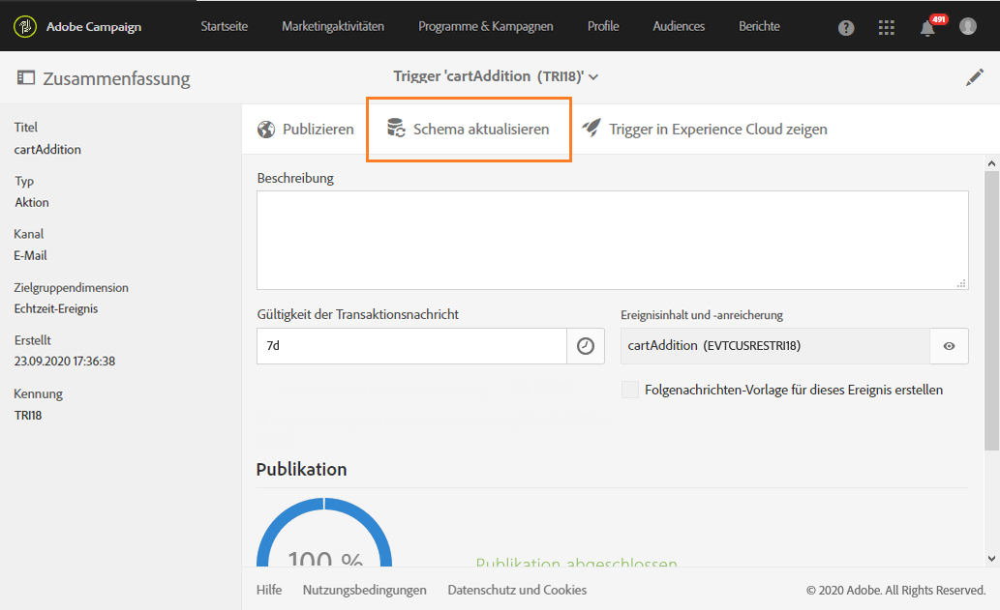

# Triggers in Campaign verwenden{#using-triggers-in-campaign}

## In Campaign einen gemappten Trigger erstellen {#creating-a-mapped-trigger-in-campaign}

Stellen Sie sicher, dass die Verhaltensweisen, die Sie verfolgen möchten, im Vorhinein in Adobe Experience Cloud (**[!UICONTROL Triggers]Core Service) definiert wurden.** Weiterführende Informationen finden Sie in der [Dokumentation zur Adobe Experience Cloud](https://marketing.adobe.com/resources/help/en_US/mcloud/triggers.html). Beachten Sie, dass bei der Definition von Triggern die Alias aktiviert werden müssen. In Adobe Experience Cloud muss für jedes Verhalten (abgebrochener Webseitenbesuch/Formularabbruch, hinzugefügter/entfernter Artikel, abgelaufene Sitzung etc.) ein neuer Trigger hinzugefügt werden.

In Adobe Campaign ist nun ein auf einem bereits vorhandenen Trigger der Adobe Experience Cloud basierendes Trigger-Ereignis zu erstellen.

In diesem [Video](https://helpx.adobe.com/marketing-cloud/how-to/email-marketing.html#step-two) wird die Einrichtung von Triggern in Adobe Campaign beschrieben.

Gehen Sie hierzu wie folgt vor:

1. Click the **[!UICONTROL Adobe Campaign]** logo, in the top left corner, then select **[!UICONTROL Marketing plans]** &gt; **[!UICONTROL Transactional messages]** &gt; **[!UICONTROL Experience Cloud Triggers]**.

   

1. Wählen Sie die **[!UICONTROL Erstellen]-Schaltfläche aus.** Im sich öffnenden Assistenten wird die Liste aller in Adobe Experience Cloud definierten Trigger angezeigt. In der Spalte **[!UICONTROL Anzahl an Übermittlungen von Analytics]wird die Anzahl an Ereignissen angezeigt, die vom Trigger in Adobe Experience Cloud an Adobe Campaign gesendet wurden.** Hierbei handelt es sich um ein Mapping der in der Experience Cloud-Benutzeroberfläche erstellten Trigger.

   

1. Wählen Sie den Trigger in Adobe Experience Cloud aus, den Sie verwenden möchten, und danach **[!UICONTROL Weiter]**.
1. Konfigurieren Sie die allgemeinen Eigenschaften des Triggers. Geben Sie bei diesem Schritt des Assistenten auch den Kanal und die Zielgruppendimension an, die vom Trigger verwendet werden sollen (siehe [Zielgruppendimensionen und Ressourcen](../../automating/using/query.md#targeting-dimensions-and-resources)). Bestätigen Sie dann die Trigger-Erstellung.
1. Verwenden Sie die Schaltfläche rechts vom Feld **[!UICONTROL Ereignisinhalt und -anreicherung], um den Payload-Inhalt angezeigt zu bekommen.** Innerhalb dieses Bildschirms können Sie außerdem die Ereignisdaten mittels in der Adobe-Campaign-Datenbank gespeicherten Profildaten anreichern. Die Anreicherung erfolgt auf die gleiche Weise wie bei Standard-Transaktionsnachrichten.

   

1. Definieren Sie im Feld **[!UICONTROL Gültigkeitsdauer der Transaktionsnachricht]die Dauer, für welche die Nachricht nach dem Versand des Ereignisses durch Analytics gültig sein soll.** Bei einer definierten Dauer von 2 Tagen wird die Nachricht nach Ablauf dieses Zeitraums nicht länger gesendet. Dies stellt sicher, dass Nachrichten, deren Versand ausgesetzt wurde, nach Ablauf der festgesetzten Dauer nicht mehr gesendet werden, auch wenn der Versand wieder aufgenommen wird.

   

1. Wenn in Analytics eine Konversionsrate (bzw. Tendenzauswertung) definiert wurde (siehe [Produktdokumentation zur Experience Cloud](https://marketing.adobe.com/resources/help/en_US/insight/client/c_visitor_propensity.html)), können Sie entscheiden, die Nachricht nicht zu senden, wenn eine hohe Wahrscheinlichkeit besteht, dass der Kunde in naher Zukunft auf die Webseite zurückkehren wird. Die Raten- und Schwellenwerte sind im Payload-Inhalt verfügbar, sodass Sie diese zur Nachrichtenpersonalisierung verwenden können. Aktivieren Sie zur Verwendung dieser Option die entsprechende Checkbox im unteren Teil des Bildschirms. Kunden, bei denen eine hohe Wahrscheinlichkeit besteht, dass sie in naher Zukunft auf die Webseite zurückkehren, werden keine Nachricht erhalten.
1. Verwenden Sie die **[!UICONTROL Publizieren]-Schaltfläche, um die Publikation des Trigger-Ereignisses zu starten.**
1. Wenn Sie nach dem Publizieren Ihres Trigger-Ereignisses das Trigger-Schema verändern müssen, wählen Sie die Schaltfläche **[!UICONTROL Schema aktualisieren]aus, um die letzten Änderungen abzurufen.**

   Bitte beachten Sie, dass durch diese Aktion Ihr Trigger und Ihre Transaktionsnachricht depubliziert werden und Sie diese danach wieder publizieren müssen.

   

Mithilfe der Schaltfläche **[!UICONTROL Trigger in Experience Cloud anzeigen]können Sie die Trigger-Definition in Adobe Experience Cloud einsehen.**

Mit Ausführung der Publikation wird automatisch eine dem neuen Ereignis entsprechende Transaktionsvorlage erzeugt. Diese Vorlage muss nun bearbeitet und publiziert werden. Lesen Sie diesbezüglich auch den Abschnitt [Vorlagen bearbeiten](../../start/using/about-templates.md).

## Transaktionsnachrichtenvorlage bearbeiten {#editing-the-transactional-message-template}

Im Zuge der Erstellung und Publikation des Trigger-Ereignisses wird die entsprechende Transaktionsvorlage automatisch erstellt. Lesen Sie diesbezüglich auch den Abschnitt [In Campaign einen gemappten Trigger erstellen](../../integrating/using/using-triggers-in-campaign.md#creating-a-mapped-trigger-in-campaign).

Damit das Ereignis mit dem Versand einer Transaktionsnachricht einhergeht, muss diese Vorlage personalisiert, getestet und dann publiziert werden. Hierbei gilt das gleiche Prinzip wie für standardmäßige Transaktionsnachrichten. Lesen Sie diesbezüglich auch den Abschnitt [Transaktionsvorlagen verwalten](../../channels/using/event-transactional-messages.md#personalizing-a-transactional-message).

>[!NOTE]
>
>Bei der Depublikation der Vorlage wird automatisch auch das Trigger-Ereignis depubliziert.

Im Zuge der Erstellung von Nachrichteninhalten haben Sie nun die Möglichkeit, Personalisierungsfelder zu verwenden, die auf vom Analytics-Trigger gesendeten Informationen beruhen. Wenn Sie die Ereignisdaten mit Profildaten aus Adobe Campaign anreichern, können Sie die Nachricht mittels dieser Informationen personalisieren. To personalize your message, select **[!UICONTROL Transactional event]** &gt; **[!UICONTROL Event context]** and select a field.

## Zugriff auf Berichte {#accessing-the-reports}

Öffnen Sie zur Anzeige des dedizierten Trigger-Berichts in Adobe Campaign das Trigger-Ereignis, das Sie zuvor erstellt haben, und verwenden Sie die Schaltfläche **[!UICONTROL Trigger-Bericht anzeigen]**.

In dem Bericht werden die Anzahl verarbeiteter Ereignisse im Vergleich zur Anzahl der von Analytics gesendeten Ereignisse angezeigt. Außerdem werden darin alle aktuellen Trigger angezeigt.

