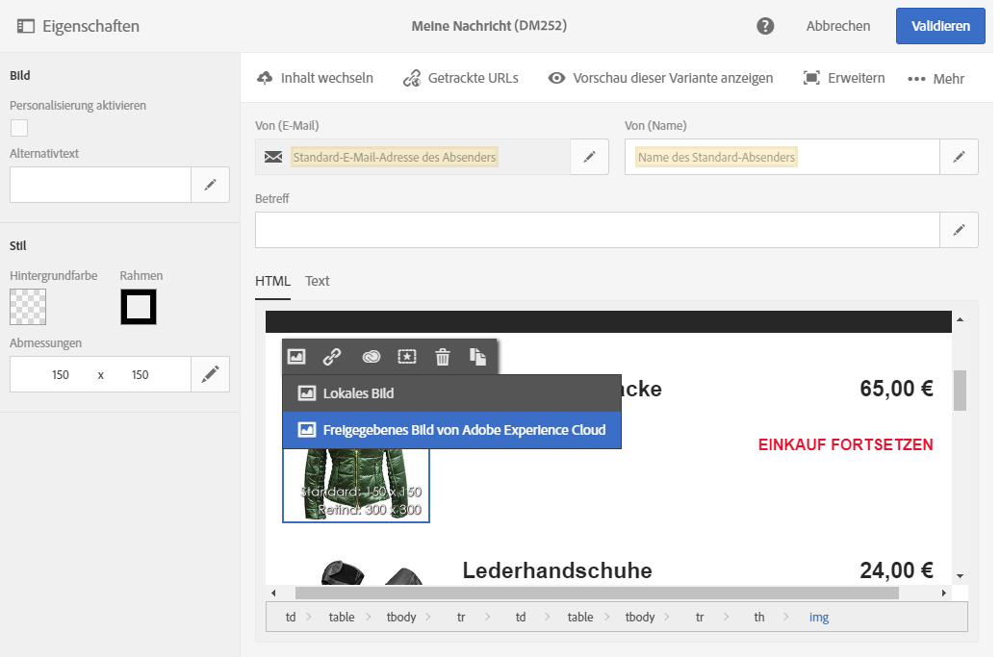
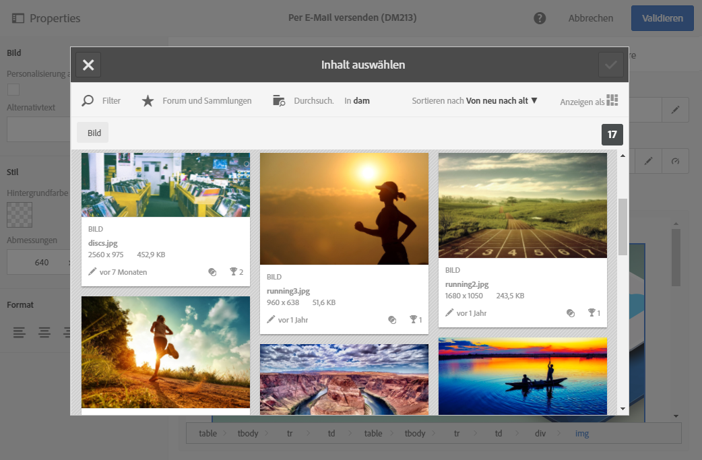

# Campaign und Assets Core Service verwenden{#working-with-campaign-and-assets-core-service}

Die Integration von Assets Core Service bzw. Assets On Demand (je nach Konfiguration Ihrer Experience-Cloud-Umgebung) und Adobe Campaign ermöglicht die Verwendung von in Adobe Experience Cloud freigegebenen Assets in Adobe-Campaign-E-Mails und -Landingpages.

Freigegebene Assets der Adobe Experience Cloud können in E-Mails und Landingpages wie nachfolgend beschrieben eingesetzt werden:

1. Markieren Sie im Inhaltseditor einer E-Mail oder einer Landingpage einen Bild-Block und wählen Sie über das Kontextmenü die Option **[!UICONTROL Freigegebenes Bild aus Adobe Experience Cloud]** aus.

   

1. Wählen Sie im sich öffnenden Fenster das gewünschte Bild aus und bestätigen Sie Ihre Auswahl.

   

Das entsprechende Bild wird nun eingefügt. Der Versand kann nach Bedarf personalisiert und dann durchgeführt werden.

**Verwandte Themen:**

* [Assets und Freigabe](https://docs.adobe.com/content/help/de-DE/core-services/interface/assets/experience-cloud-assets.html)
* [Inhaltseditor](../../designing/using/personalization.md#example-email-personalization)

