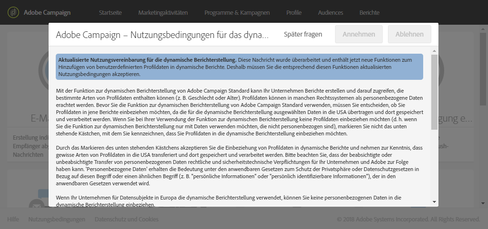

# Über dynamische Berichte{#about-dynamic-reports}

>[!NOTE]
>
>Nur Benutzer, die Administratorrechte besitzen oder deren Organisationseinheiten mit **Alle** festgelegt sind, können einen neuen Bericht erstellen oder speichern. Weiterführende Informationen hierzu finden Sie in diesem [Abschnitt](../../administration/using/types-of-users.md).

Die dynamische Berichterstellung bietet vollständig anpassbare und Echtzeitberichte. Er fügt Zugriff auf Profildaten hinzu, wodurch demografische Analysen nach Profildimensionen wie Geschlecht, Ort und Alter zusätzlich zu den Funktionsdaten der Funktion "Geöffnet" und" Klicks" aktiviert werden können. Mit der Drag &amp; Drop-Oberfläche können Sie Daten untersuchen, bestimmen, wie Ihre E-Mail-Kampagnen gegenüber Ihren wichtigsten Kundensegmenten durchgeführt wurden, und ihre Auswirkungen auf die Empfänger messen.

Dank dem Drag &amp; Drop-Menü und den anpassbaren Grafiken können Sie mit dieser Funktion Dimensionen, Messwerte und Zeitspannen beliebig kombinieren und so dynamische Berichte mit unbegrenzten Verteilungs- und Vergleichsmöglichkeiten erstellen.

**Verwandte Themen:**

* [Verfügbare Berichte](../../reporting/using/defining-the-report-period.md)
* [Organisationseinheiten](../../administration/using/organizational-units.md)
* Video [Dynamic reports](https://helpx.adobe.com/campaign/kt/acs/using/acs-creating-a-dynamic-report-feature-video-use.html)

## Zugriff auf dynamische Berichte {#accessing-dynamic-reports}

Der Zugriff auf Berichte erfolgt:

* Über die Startseite durch die Auswahl des Tabs **[!UICONTROL Berichte]** in der Symbolleiste am oberen Bildschirmrand oder die Karte **Berichte], um Berichte zu allen Sendungen anzuzeigen.[!UICONTROL **

   

* In allen Programmen, Kampagnen und Nachrichten über die Schaltfläche **Berichte** durch Anklicken von **Dynamische Berichte**, um nur die Berichte für diesen Versand anzuzeigen.

   

Gewisse Berichte stehen mitunter nicht unmittelbar nach einem Versand zur Verfügung, was von der Dauer der Datenerhebung und Informationsverarbeitung abhängt.

Es gibt zwei Kategorien von dynamischen Berichten:

* **Vorlagen** können geändert werden, indem sie ausgehend von der Vorlage mit der Option **Speichern als** (**Projekt &gt; Speichern als...**) kopiert werden.
* **Benutzerdefinierte Berichte** (blau) können direkt durch die Auswahl der Schaltfläche **Neues Projekt erstellen** auf der **Berichte**-Startseite erstellt werden.

>[!NOTE]
>
>Die Daten werden entsprechend Ihrer Organisationseinheit gefiltert.

## Nutzungsvereinbarung zur dynamischen Berichterstattung {#dynamic-reporting-usage-agreement}

Mithilfe dynamischer Berichte können Sie auf Profildaten basierende Berichte nach Profildimensionen filtern.

Sie müssen erst die Nutzungsvereinbarung zur dynamischen Berichterstattung akzeptieren, bevor Sie die Profildimensionen in Ihren Berichten anzeigen und verwenden können. Standardmäßig kann diese Vereinbarung nur durch Benutzer mit Administratorrechten sichtbar gemacht und akzeptiert oder abgelehnt werden.

Diese Vereinbarung ermöglicht den Transfer und die Speicherung folgender Profildaten in den USA: Stadt, Land/Region, Bundesland, Geschlecht und Alterssegmente.

Wenn Sie diese Vereinbarung akzeptieren, werden alle europäischen und nicht-europäischen Daten in die USA übertragen.

Drei Optionen sind verfügbar:

* **[!UICONTROL Später fragen]**: Mit dieser Auswahl wird die Nutzervereinbarung erst wieder in 24 Stunden angezeigt.
* **[!UICONTROL Annehmen]**: Wenn Sie die Nutzervereinbarung akzeptieren, gestatten Sie Adobe Campaign, die personenbezogenen Daten Ihres Kunden zu erfassen und in die USA zu transferieren.
* **[!UICONTROL Ablehnen]**: Wenn Sie die Nutzervereinbarung ablehnen, erscheinen die Profildimensionen nicht in Ihren Berichten und die personenbezogenen Daten Ihrer Kunden werden weder erfasst noch transferiert.

This choice is not final, you can always change it by selecting **[!UICONTROL Enable PII data to be transferred to US region to use reporting on Profile data]** in **[!UICONTROL Administration]** &gt; **[!UICONTROL Application Settings]** &gt; **[!UICONTROL Options]**.

Der Wert kann jederzeit geändert werden. The value -1 corresponds to **[!UICONTROL Ask me later]**, 1 **[!UICONTROL Accept]** and 0 **[!UICONTROL Decline]**.

