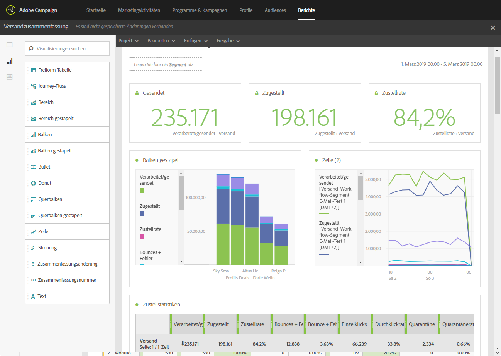

# Über dynamische Berichte{#about-dynamic-reports}

>[!NOTE]
>
>Nur Benutzer, die Administratorrechte besitzen oder deren Organisationseinheiten mit **Alle** festgelegt sind, können einen neuen Bericht erstellen oder speichern. Weiterführende Informationen hierzu finden Sie in diesem [Abschnitt](../../administration/using/users-management.md).

Die dynamische Berichterstellung ermöglicht vollständig anpassbare und in Echtzeit aktualisierte Berichte. Durch sie kann auf Profildaten zugegriffen werden, was die demografische Analyse nach Profildimensionen wie Geschlecht, Stadt und Alter sowie nach Daten von E-Mail-Kampagnen wie Öffnungen und Klicks ermöglicht. Mit der Drag &amp; Drop-Funktion können Sie Daten analysieren sowie feststellen, wie Ihre E-Mail-Kampagnen bei Ihren wichtigsten Kundensegmenten angekommen sind, und ihre Wirkung auf die Empfänger messen.

Dank dem Drag &amp; Drop-Menü und den anpassbaren Grafiken können Sie mit dieser Funktion Dimensionen, Messwerte und Zeitspannen beliebig kombinieren und so dynamische Berichte mit unbegrenzten Verteilungs- und Vergleichsmöglichkeiten erstellen.

**Verwandte Themen:**

* [Verfügbare Berichte](../../reporting/using/defining-the-report-period.md)
* [Organisationseinheiten](../../administration/using/organizational-units.md)
* Video [Dynamic reports](https://docs.adobe.com/content/help/en/campaign-learn/campaign-standard-tutorials/reporting/creating-a-dynamic-report.html)

## Zugriff auf dynamische Berichte {#accessing-dynamic-reports}

Der Zugriff auf Berichte erfolgt:

* From the home page by selecting **[!UICONTROL Reports]** tab in the top bar or the **[!UICONTROL Reports]** card to access reports for all deliveries.

   

* In allen Programmen, Kampagnen und Nachrichten über die Schaltfläche **Berichte** durch Anklicken von **Dynamische Berichte**, um nur die Berichte für diesen Versand anzuzeigen.

   

Gewisse Berichte stehen mitunter nicht unmittelbar nach einem Versand zur Verfügung, was von der Dauer der Datenerhebung und Informationsverarbeitung abhängt.

Es gibt zwei Kategorien von dynamischen Berichten:

* **Vorlagen** können geändert werden, indem sie ausgehend von der Vorlage mit der Option **Speichern als** (**Projekt > Speichern als...**) kopiert werden.
* **Benutzerdefinierte Berichte** (blau) können direkt durch die Auswahl der Schaltfläche **Neues Projekt erstellen** auf der **Berichte**-Startseite erstellt werden.

>[!NOTE]
>
>Die Daten werden entsprechend Ihrer Organisationseinheit gefiltert.

## Nutzungsvereinbarung zur dynamischen Berichterstattung {#dynamic-reporting-usage-agreement}

Die Nutzungsvereinbarung zur dynamischen Berichterstattung wird als Popup angezeigt und ermöglicht die Zustimmung zur Datenverarbeitung. Standardmäßig ist diese Vereinbarung nur für Benutzer mit Administratorrechten sichtbar und kann auch nur durch diese akzeptiert oder abgelehnt werden.

Drei Optionen stehen zur Wahl:

* **[!UICONTROL Ask me later]**: Wenn Sie später **auf** Fragen klicken, wird das Fenster 24 Stunden lang nicht mehr angezeigt. Die Profildimensionen werden dann nicht in den Berichten aufgeführt und die personenbezogenen Daten Ihrer Kunden werden weder erfasst noch transferiert. Dies geschieht erst, wenn Sie der Nutzungsvereinbarung zustimmen.
* **[!UICONTROL Accept]**: Indem Sie diese Vereinbarung akzeptieren, autorisieren Sie Adobe Campaign, die persönlichen ID-Informationen Ihrer Kunden zu erfassen und sie an den Berichte oder das Rechenzentrum zu übertragen.
* **[!UICONTROL Decline]**: Wenn Sie den Vertrag ablehnen, erscheinen die Profil-Dimensionen nicht in Ihren Berichten, und die personenbezogenen Daten Ihrer Kunden werden nicht erfasst oder gesendet. Beachten Sie, dass in diesem Fall die externe Kennung dennoch erfasst und zur Identifizierung der Endbenutzer verwendet wird.

Die nachstehende Tabelle zeigt, was nach der Annahme dieser Vereinbarung je nach Region geschieht.

|  | Dynamische Berichterstellung | Microsoft Dynamics 365 Connector |
|---|---|---|
| Amerika und APAC (Asien/Pazifik) | **Funktion verfügbar**  Alle nativen Profildaten (d. h. Stadt, Land/Region, Bundesland, Geschlecht und Segmente auf der Grundlage des Alters) sowie benutzerspezifische Profildaten werden zum Reporting-Zentrum in den USA gesendet. Weiterführende Informationen zu Profildimensionen finden Sie auf dieser [Seite](../../reporting/using/list-of-components-.md) | **Funktion verfügbar**  Alle nativen und benutzerdefinierten Profilfelder sowie Ereignisfelder von Adobe Campaign Standard werden im US-Rechenzentrum verarbeitet. |
| EMEA (Europa, Naher Osten und Afrika) | **Funktion verfügbar**  Alle nativen Profildaten (d. h. Stadt, Land/Region, Bundesland, Geschlecht und Segmente auf der Grundlage des Alters) sowie benutzerspezifische Profildaten werden an das EMEA-Reporting-Zentrum gesendet. Weiterführende Informationen zu Profildimensionen finden Sie auf dieser [Seite](../../reporting/using/list-of-components-.md) | **Funktion verfügbar**  Alle nativen und benutzerdefinierten Profilfelder sowie Ereignisfelder von Adobe Campaign Standard werden im EMEA-Rechenzentrum verarbeitet.  **[!UICONTROL Control data]** , die Adobe-I/O-Registrierungsdaten und -IDs von im US-Rechenzentrum gesendeten und gespeicherten Kundenendbenutzerdaten enthält. |

Die nachstehende Tabelle zeigt, was nach der Ablehnung dieser Vereinbarung je nach Region geschieht. Beachten Sie, dass auch dann Berichte zu Sendungen und der Microsoft Dynamics 365-Integration verfügbar sind, wenn Sie diese Vereinbarung ablehnen.

| Region | Dynamische Berichterstellung | Microsoft Dynamics 365 Connector |
|---|---|---|
| Amerika und APAC (Asien/Pazifik) | **Funktion verfügbar**  Es werden keine nativen und benutzerdefinierten Profildaten an das Reporting-Zentrum in den USA gesendet, mit Ausnahme der externen Kennung. | **Funktion verfügbar**  Es werden keine nativen und benutzerdefinierten Profilfelder an das US-Rechenzentrum gesendet, mit Ausnahme der externen Kennung und der Empfänger-ID.  Alle Ereignisfelder in Adobe Campaign Standard werden im US-Rechenzentrum verarbeitet, mit Ausnahme der Mirrorseiten-ID.  Weiterführende Informationen zur Microsoft Dynamics 365-Integration finden Sie auf dieser [Seite](../../integrating/using/working-with-campaign-standard-and-microsoft-dynamics-365.md). |
| EMEA (Europa, Naher Osten und Afrika) | **Funktion verfügbar**  Es werden keine nativen und benutzerdefinierten Profildaten an das Reporting-Zentrum in EMEA gesendet, mit Ausnahme der externen Kennung. | **Funktion verfügbar**  Es werden keine nativen und benutzerdefinierten Profilfelder an das EMEA-Rechenzentrum gesendet, mit Ausnahme der externen Kennung und der Empfänger-ID.  Alle Ereignisfelder in Adobe Campaign Standard werden im EMEA-Rechenzentrum verarbeitet, mit Ausnahme der Mirrorseiten-ID.   **[!UICONTROL Control data]** , die Adobe-I/O-Registrierungsdaten und -IDs von im US-Rechenzentrum gesendeten und gespeicherten Kundenendbenutzerdaten enthält. Weiterführende Informationen zur Integration mit Microsoft Dynamics 365 finden Sie auf dieser [Seite](../../integrating/using/working-with-campaign-standard-and-microsoft-dynamics-365.md). |

Diese Auswahl ist nicht endgültig. Sie können sie jederzeit ändern, indem Sie **[!UICONTROL Enable PII data to be transferred to US region to use reporting on Profile data]** unter **[!UICONTROL Administration]** > **[!UICONTROL Application Settings]** > **[!UICONTROL Options]**.

Der Wert kann jederzeit geändert werden. Der Wert 1 entspricht **[!UICONTROL Ask me later]**, 2 **[!UICONTROL Decline]** und 3 **[!UICONTROL Accept]**.

