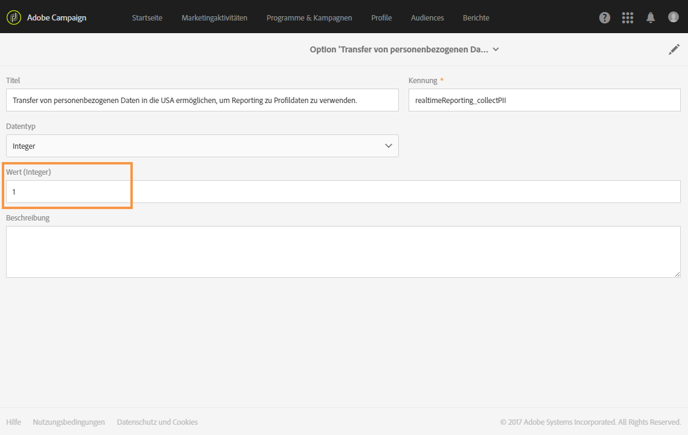

# Erste Schritte mit dynamischen Berichten {#about-dynamic-reports}

Die dynamische Berichterstellung ermöglicht vollständig anpassbare und in Echtzeit aktualisierte Berichte. Dadurch kann auf Profildaten zugegriffen werden, was die demografische Analyse nach Profildimensionen wie Geschlecht, Ort und Alter ermöglicht, zusätzlich zur Analyse basierend auf Daten von E-Mail-Kampagnen wie Öffnungen und Klicks. Mit der Drag &amp; Drop-Funktion können Sie Daten analysieren sowie feststellen, wie Ihre E-Mail-Kampagnen bei Ihren wichtigsten Kundensegmenten angekommen sind, und ihre Wirkung auf die Empfänger messen.

>[!NOTE]
>
>Nur Benutzer, die Administratorrechte besitzen oder deren Organisationseinheiten mit **Alle** festgelegt sind, können einen neuen Bericht erstellen oder speichern. Weiterführende Informationen hierzu finden Sie in diesem [Abschnitt](../../administration/using/users-management.md).

## Zugriff auf dynamische Berichte {#accessing-dynamic-reports}

Der Zugriff auf Berichte erfolgt:

* Über die Startseite durch Auswahl des Tabs **[!UICONTROL Berichte]** in der Symbolleiste am oberen Bildschirmrand oder über die Karte **[!UICONTROL Berichte]**, um Berichte zu allen Sendungen anzuzeigen.

  

* In allen Programmen, Kampagnen und Nachrichten über die Schaltfläche **Berichte** durch Anklicken von **Dynamische Berichte**, um nur die Berichte für diesen Versand anzuzeigen.

  

Gewisse Berichte stehen mitunter nicht unmittelbar nach einem Versand zur Verfügung, was von der Dauer der Datenerhebung und Informationsverarbeitung abhängt.

Es gibt zwei Kategorien von dynamischen Berichten:

* **Vorlagen** können geändert werden, indem sie ausgehend von der Vorlage mit der Option **Speichern als** (**Projekt > Speichern als…**) kopiert werden.
* **Benutzerdefinierte Berichte** (blau) können direkt durch die Auswahl der Schaltfläche **Neues Projekt erstellen** auf der Startseite **Berichte** erstellt werden.

>[!NOTE]
>
>Die Daten werden entsprechend Ihrer Organisationseinheit gefiltert.

## Nutzungsvereinbarung zur dynamischen Berichterstattung {#dynamic-reporting-usage-agreement}

Die Nutzungsvereinbarung zur dynamischen Berichterstattung wird als Popup angezeigt und ermöglicht die Zustimmung zur Datenverarbeitung. Standardmäßig ist diese Vereinbarung nur für Benutzer mit Administratorrechten sichtbar und kann auch nur durch diese akzeptiert oder abgelehnt werden.

Drei Optionen stehen zur Wahl:

* **[!UICONTROL Später fragen]**: Bei Auswahl von **Später fragen** wird die Nutzungsvereinbarung erst wieder in 24 Stunden angezeigt. Die Profildimensionen werden dann nicht in den Berichten aufgeführt und die personenbezogenen Daten Ihrer Kunden werden weder erfasst noch transferiert. Dies geschieht erst, wenn Sie der Nutzungsvereinbarung zustimmen.
* **[!UICONTROL Annehmen]**: Wenn Sie die Nutzungsvereinbarung akzeptieren, gestatten Sie Adobe Campaign, personenbezogene Daten Ihrer Kunden zu erfassen und zum Reporting- oder Rechenzentrum zu übertragen.
* **[!UICONTROL Ablehnen]**: Wenn Sie die Nutzungsvereinbarung ablehnen, erscheinen die Profildimensionen nicht in Ihren Berichten und personenbezogene Daten Ihrer Kunden werden weder erfasst noch übertragen. Beachten Sie, dass in diesem Fall die externe Kennung dennoch erfasst und zur Identifizierung der Endbenutzer verwendet wird.

Die nachstehende Tabelle zeigt, was nach der Annahme dieser Vereinbarung je nach Region geschieht.

|  | Dynamisches Reporting | Microsoft Dynamics 365 Connector |
|---|---|---|
| Amerika und APAC (Asien/Pazifik) | **Funktion verfügbar**  Alle nativen Profildaten (d. h. Stadt, Land/Region, Bundesland, Geschlecht und Segmente auf der Grundlage des Alters) sowie benutzerspezifische Profildaten werden zum Reporting-Zentrum in den USA gesendet. Weiterführende Informationen zu Profildimensionen finden Sie auf dieser [Seite](../../reporting/using/list-of-components.md) | **Funktion verfügbar**  Alle nativen und benutzerdefinierten Profilfelder sowie Ereignisfelder von Adobe Campaign Standard werden im US-Rechenzentrum verarbeitet. |
| EMEA (Europa, Naher Osten und Afrika) | **Funktion verfügbar**  Alle nativen Profildaten (d. h. Stadt, Land/Region, Bundesland, Geschlecht und Segmente auf der Grundlage des Alters) sowie benutzerspezifische Profildaten werden an das EMEA-Reporting-Zentrum gesendet. Weiterführende Informationen zu Profildimensionen finden Sie auf dieser [Seite](../../reporting/using/list-of-components.md) | **Funktion verfügbar**  Alle nativen und benutzerdefinierten Profilfelder sowie Ereignisfelder von Adobe Campaign Standard werden im EMEA-Rechenzentrum verarbeitet.  **[!UICONTROL Kontrolldaten ]**, in denen Adobe I/O-Registrierungsdaten und Kennungen von Endbenutzerereignissen enthalten sind, werden zum US-Rechenzentrum gesendet und dort gespeichert. |

Die nachstehende Tabelle zeigt, was nach der Ablehnung dieser Vereinbarung je nach Region geschieht. Beachten Sie, dass auch dann Berichte zu Sendungen und der Microsoft Dynamics 365-Integration verfügbar sind, wenn Sie diese Vereinbarung ablehnen.

| Region | Dynamisches Reporting | Microsoft Dynamics 365 Connector |
|---|---|---|
| Amerika und APAC (Asien/Pazifik) | **Funktion verfügbar**  Es werden keine nativen und benutzerdefinierten Profildaten an das Reporting-Zentrum in den USA gesendet, mit Ausnahme der externen Kennung. | **Funktion verfügbar**  Es werden keine nativen und benutzerdefinierten Profilfelder an das US-Rechenzentrum gesendet, mit Ausnahme der externen Kennung und der Empfänger-ID.  Alle Ereignisfelder in Adobe Campaign Standard werden im US-Rechenzentrum verarbeitet, mit Ausnahme der Mirrorseiten-ID.  Weiterführende Informationen zur Microsoft Dynamics 365-Integration finden Sie auf dieser [Seite](../../integrating/using/d365-acs-get-started.md). |
| EMEA (Europa, Naher Osten und Afrika) | **Funktion verfügbar**  Es werden keine nativen und benutzerdefinierten Profildaten an das Reporting-Zentrum in EMEA gesendet, mit Ausnahme der externen Kennung. | **Funktion verfügbar**  Es werden keine nativen und benutzerdefinierten Profilfelder an das EMEA-Rechenzentrum gesendet, mit Ausnahme der externen Kennung und der Empfänger-ID.  Alle Ereignisfelder in Adobe Campaign Standard werden im EMEA-Rechenzentrum verarbeitet, mit Ausnahme der Mirrorseiten-ID.   **[!UICONTROL Kontrolldaten ]**, in denen Adobe I/O-Registrierungsdaten und Kennungen von Endbenutzerereignissen enthalten sind, werden zum US-Rechenzentrum gesendet und dort gespeichert. Weiterführende Informationen zur Integration mit Microsoft Dynamics 365 finden Sie auf dieser [Seite](../../integrating/using/d365-acs-get-started.md). |

Diese Entscheidung ist nicht endgültig. Sie können sie jederzeit ändern durch die Auswahl von **[!UICONTROL Transfer von personenbezogenen Daten in die USA ermöglichen, um Reporting zu Profildaten zu verwenden]** in **[!UICONTROL Administration]** > **[!UICONTROL Anwendungskonfiguration]** > **[!UICONTROL Optionen]**.

Der Wert kann jederzeit geändert werden. Der Wert 1 bedeutet **[!UICONTROL Später fragen]**, 2 bedeutet **[!UICONTROL Ablehnen]** und 3 bedeutet **[!UICONTROL Annehmen]**.

