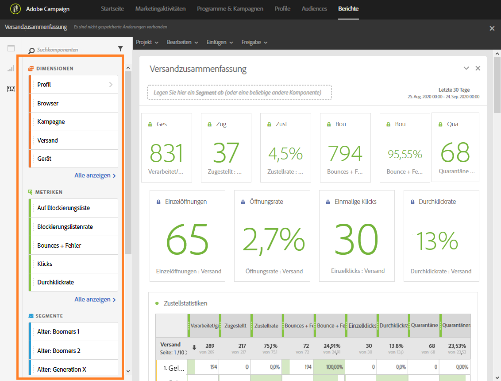

# Komponenten hinzufügen{#adding-components}

Mit Komponenten können Sie Ihren Berichten unterschiedliche Dimensionen, Messwerte und Zeiträume hinzufügen.

1. Klicken Sie auf den Tab **[!UICONTROL Komponenten]**, um auf die Liste mit Komponenten zuzugreifen.

   

1. Jede im Tab **[!UICONTROL Komponenten]** angezeigt Kategorie enthält die fünf am häufigsten verwendeten Elemente. Klicken Sie auf den Namen einer Kategorie, um die gesamte Liste mit Komponenten zu öffnen.

   Der Komponentenbereich ist in vier Kategorien unterteilt:

   * **Dimensionen**: Hier erhalten Sie Informationen vom Versandlog, wie Details zum Browser oder zur Domain des Benutzers oder darüber, wie erfolgreich ein Versand war.
   * **Metriken**: Hier erhalten Sie Details zum Status einer Nachricht, z. B. ob eine Nachricht zugestellt und von einem Benutzer geöffnet wurde.
   * **[!UICONTROL Segmente]**: Hiermit können Daten nach der Altersgruppe des Empfängers gefiltert werden. **[!UICONTROL Segmente]** können per Drag-and-Drop direkt in eine Freiformtabelle oder in die Symbolleiste des Bedienfelds verschoben werden. Ab der Campaign-Version 19.4 ist die Option **[!UICONTROL Testversand ausschließen]** standardmäßig ausgewählt, kann aber bei Bedarf geändert werden.

      Diese Kategorie ist erst verfügbar, nachdem der Administrator die Nutzungsbedingungen der auf dem Bildschirm angezeigten Nutzungsvereinbarung zur dynamischen Berichterstattung (Dynamic Reporting Usage Agreement) bestätigt hat. Wenn der Administrator die Vereinbarung ablehnt, sind die Segmente im Tab **[!UICONTROL Komponenten]** nicht sichtbar und die entsprechenden Daten werden nicht erfasst.

   * **Zeitraum**: Hier können Sie für Ihre Tabelle einen Zeitraum festlegen.

1. Verschieben Sie Komponenten per Drag &amp; Drop in ein Bedienfeld, um Ihre Daten zu filtern.

Sie können beliebig viele Komponenten verschieben und miteinander vergleichen.

**Verwandte Themen:**

* [Liste von Komponenten](../../reporting/using/list-of-components-.md)
* [Liste von Berichten](../../reporting/using/defining-the-report-period.md)

