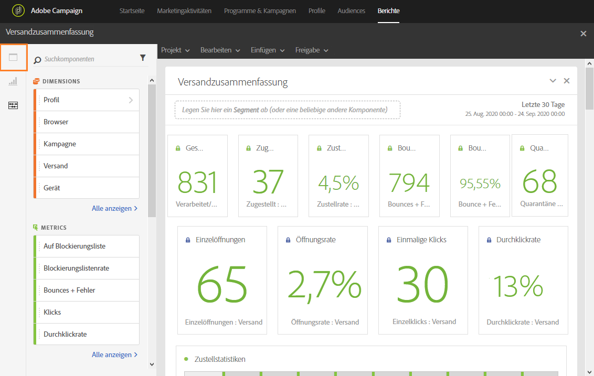
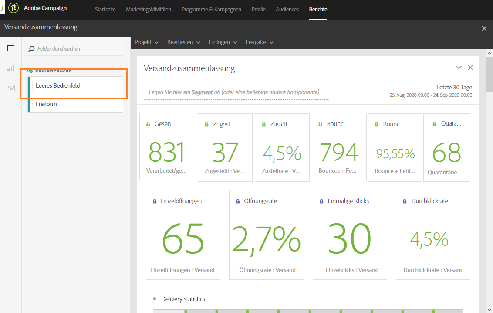
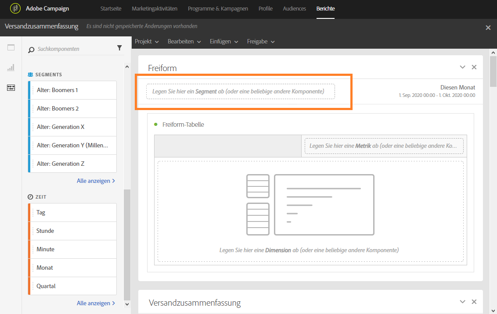

# Bedienfelder hinzufügen{#adding-panels}

## Leeres Bedienfeld hinzufügen {#adding-a-blank-panel}

Um mit der Berichterstellung zu beginnen, fügen Sie einem vordefinierten oder benutzerdefinierten Bericht Bedienfelder hinzu. Jedes Bedienfeld enthält unterschiedliche Datensätze und besteht aus Freiformtabellen und Visualisierungen.

In diesen Bedienfeldern können Sie nach Bedarf Ihre Berichte erstellen. Sie können beliebig viele Bedienfelder in Ihre Berichte einfügen, um Ihre Daten nach unterschiedlichen Zeiträumen zu filtern.

1. Klicken Sie auf das **Bedienfeldsymbol.** Sie können auch ein Bedienfeld hinzufügen, indem Sie das **Einfügen-Tab** und **Neues leeres Bedienfeld** auswählen.

   

1. Ziehen Sie das **leere Bedienfeld** in Ihr Dashboard.

   

Dann können Sie eine Freiformtabelle in Ihr Bedienfeld einfügen, um mit der Datensuche zu beginnen.

## Freiformtabelle hinzufügen       {#adding-a-freeform-table}

Mit Freiformtabellen kann eine Tabelle erstellt werden, in der Daten unter Verwendung der unterschiedlichen Messwerte und Dimensionen im Bereich **Komponente** analysiert werden.

Die Größe jeder Tabelle und Grafik kann entsprechend Ihrem Bericht geändert und verschoben werden.

1. Klicken Sie auf das **Bedienfeldsymbol**.

   

1. Ziehen Sie das **Freiformfeld** in Ihr Dashboard.

   Sie können auch eine Tabelle hinzufügen, indem Sie in einem leeren Bedienfeld den Tab **Einfügen** und anschließend **Neue Freiform** oder **Neue Freiform-Tabelle** auswählen.

   

1. Das Segment **[!UICONTROL Testversand ausschließen]** ist standardmäßig bereits ausgewählt. Bei Bedarf können Sie diese Auswahl ändern, indem Sie eines der **[!UICONTROL Segmente]** aus dem Tab **[!UICONTROL Komponenten]** in die Symbolleiste ziehen.

   

1. Ziehen Sie Elemente aus dem Tab **Komponenten** in die Spalten und Zeilen, um Ihre Tabelle zu erstellen.

   

1. Klicken Sie auf das Symbol **Einstellungen**, um die Darstellung der Daten in den Spalten zu ändern.

   

   Die **[!UICONTROL Spalteneinstellungen]** beinhalten folgende Optionen:

   * **[!UICONTROL Anzahl]**: Ermöglicht das Anzeigen oder Verbergen der Anzahl der Zusammenfassungen in der Spalte
   * **[!UICONTROL Prozent]**: Ermöglicht das Anzeigen oder Verbergen der Prozente in der Spalte
   * **[!UICONTROL Null als keinen Wert auffassen]**: Ermöglicht es, den Wert Null anzuzeigen oder zu verbergen.
   * **[!UICONTROL Hintergrund]**: Ermöglicht das Anzeigen oder Verbergen des Fortschrittsbalkens in Zellen.
   * **[!UICONTROL Wiederholungsversuche einbeziehen]**: Ermöglicht das Einbeziehen von weiteren Zustellversuchen in das Ergebnis. Diese Option ist nur bei **[!UICONTROL Gesendet]** und **[!UICONTROL Bounces + Fehler]** verfügbar.

1. Wählen Sie eine oder mehrere Zeilen aus und danach das Symbol **Visualisieren**. Die ausgewählten Zeilen werden daraufhin grafisch dargestellt.

   

Jetzt können Sie beliebig viele Komponenten und Visualisierungen hinzufügen, um Ihre Daten grafisch darzustellen.
