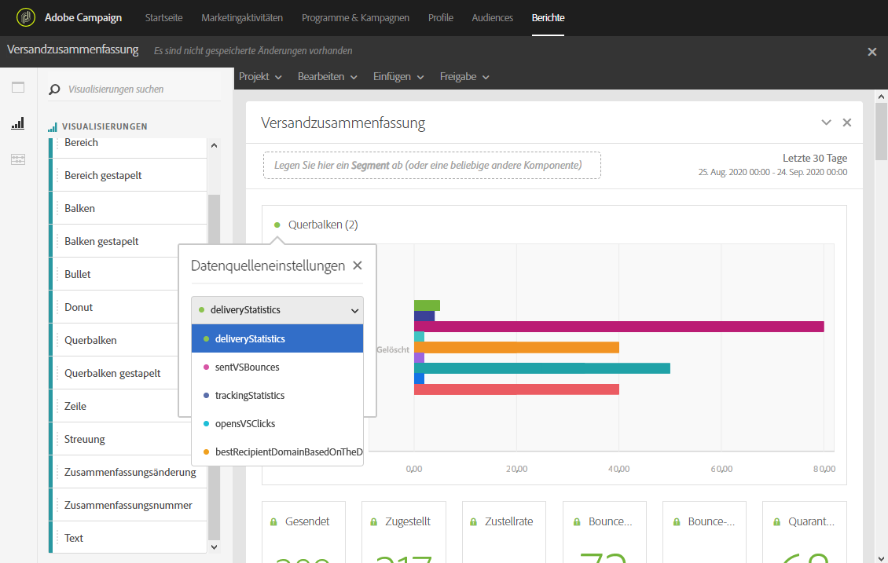
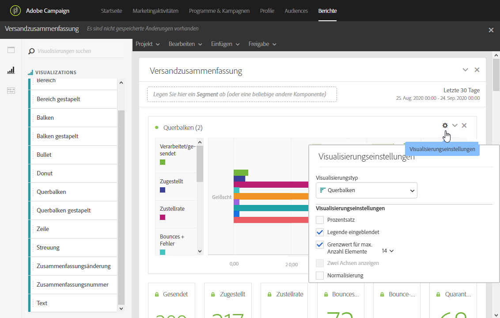

# Visualisierungen hinzufügen{#adding-visualizations}

Im Tab **Visualisierungen** können Sie per Drag &amp; Drop Visualisierungselemente wie Bereich, Kreis und Diagramm auswählen. Durch diese Elemente können Sie Ihre Daten unterschiedlich grafisch darstellen.

1. Ziehen Sie im Tab **[!UICONTROL Visualisierungen]ein Visualisierungselement in ein Bedienfeld.**

   

1. Nachdem Sie eine Visualisierung zu Ihrem Bedienfeld hinzugefügt haben, erkennt die dynamische Berichtsfunktion automatisch die Daten in Ihrer Freiformtabelle. Wählen Sie die Visualisierungseinstellungen aus.
1. Wenn mehr als eine Freiformtabelle vorhanden ist, wählen Sie im Fenster **Datenquelleneinstellungen** die verfügbare Datenquelle, die Ihrem Diagramm hinzugefügt werden soll. Dieses Fenster können Sie auch öffnen, indem Sie den Farbpunkt neben dem Darstellungstitel auswählen.

   

1. Mit der Schaltfläche für die **[!UICONTROL Darstellungseinstellungen]können Sie die Art des Diagramms oder dessen Inhalt ändern, z. B.:**

   * **Prozentsatz**: Zeigt die Werte in Prozenten an.
   * **Y-Achse bei null verankern**: Erzwingt für die y-Achse den Wert null, selbst wenn deren Werte über null liegen.
   * **Legende eingeblendet**: Ermöglicht das Verbergen der Legende.
   * **Normalisierung**: Erzwingt die Übereinstimmung von Werten.
   * **Zwei Achsen anzeigen**: Fügt Ihrem Diagramm eine weitere Achse hinzu.
   * **Grenzwert für max. Anzahl Elemente**: Beschränkt die Anzahl der dargestellten Diagramme.
   * **Schwelle**: Ermöglicht das Festlegen einer Schwelle für Ihr Diagramm. Sie wird als schwarz gepunktete Linie dargestellt.
   

Mit dieser Visualisierung können die Daten in Ihren Berichte übersichtlicher dargestellt werden.
