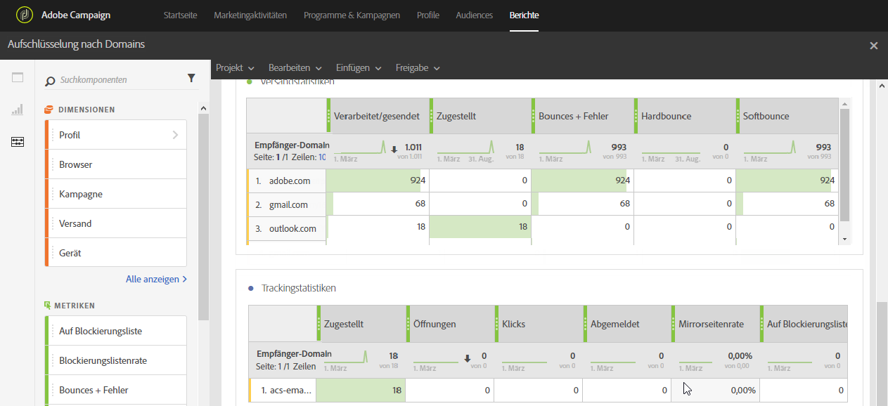

# Verteilung nach Domain{#breakdown-by-domains}

Dieser Bericht enthält die Leistungsdaten für jede in einer Audience eines E-Mail-Versands vertretenen Domain. Wenn es sich um einen Kampagnen- oder Programmbericht handelt, sind die Leistungsdaten für mehrere Audiences verfügbar. Diese Daten ermöglichen insbesondere eine nach Domain durchgeführte Analyse in Bezug auf spezifische Ereignisse, Beispielsweise Link-Anzeige, URL auf Blockierungsliste usw.

Die Tabelle **Versandstatistiken** enthält die verfügbaren Daten zu Fehlern, die bei jeder Domain aufgetreten sind, z. B.:

* **Verarbeitet/gesendet**: die Anzahl an gesendeten E-Mails.
* **Zugestellt**: die Anzahl an zugestellten E-Mails.
* **Bounces + Fehler**: die Anzahl an Nachrichten, die nicht zugestellt werden konnten.
* **Hardbounce**: die Gesamtzahl der permanenten Fehler, wie eine falsche E-Mail-Adresse.
* **Softbounce**: die Gesamtzahl der temporären Fehler, wie eine volle Inbox.

Die zweite Tabelle **Trackingstatistiken** enthält die verfügbaren Daten bezüglich der Empfängerreaktionen auf den Versand, wie beispielsweise:

* **Zugestellt**: die Anzahl an zugestellten E-Mails.
* **Öffnungen**: Die Anzahl der Öffnungen einer Nachricht in einem Versand.
* **Klicken**: Die Anzahl der Klicks auf einen Inhalt in einem Versand.
* **Abgemeldet**: Gesamtanzahl der Klicks auf den Abmelde-Link.
* **Mirrorseite**: Die Anzahl der Klicks auf die Mirrorseite.
* **Auf Blockierungsliste**: Zahl der Empfänger, die eine E-Mail als Spam oder Junk gekennzeichnet haben – [mehr dazu](../../audiences/using/about-opt-in-and-opt-out-in-campaign.md)

