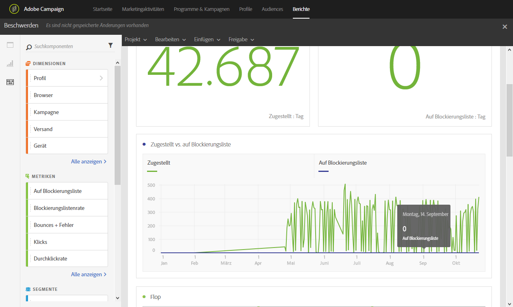

# Beschwerden{#complaints}

Der Bericht **[!UICONTROL Beschwerden]** ermöglicht es, die Sendungen zu identifizieren, die am häufigsten als Spam gekennzeichnet wurden.

Die **Flop**-Tabelle ist nach Empfänger-Domain geordnet und enthält die Anzahl der Empfänger, die eine E-Mail als Junk gekennzeichnet haben Die Ergebnisse der Tabelle sind auch als Grafik und Zusammenfassungen verfügbar.

Die Tabelle **Zugestellt vs. auf Blockierungsliste** enthält die Anzahl der Empfänger, die eine E-Mail als Spam oder Junk gekennzeichnet haben. Die Tabelle ist nach Versand sortiert.
