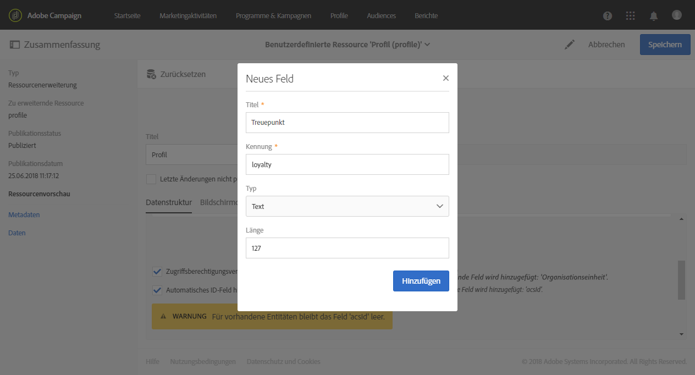
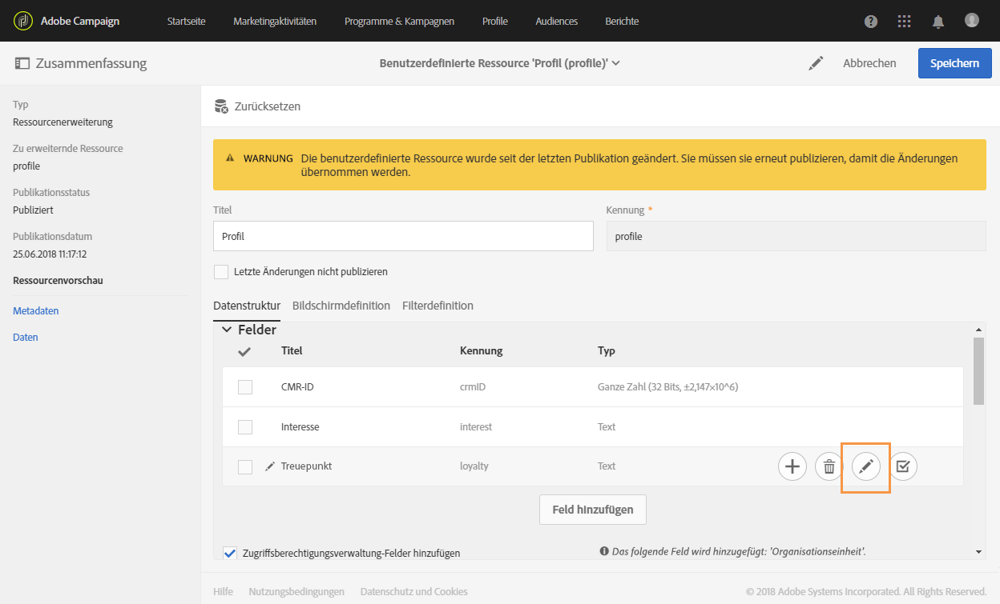
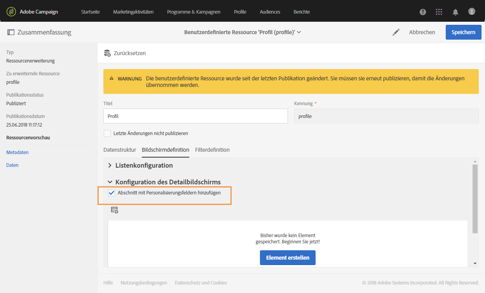
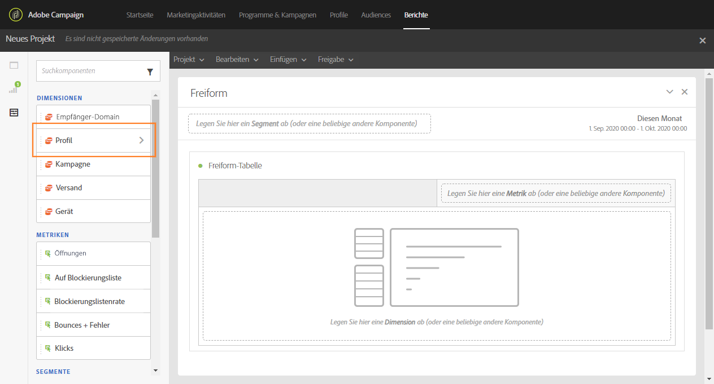

# Benutzerdefinierte Profildimension erstellen{#creating-a-custom-profile-dimension}

Berichte können auch auf der Basis von benutzerdefinierten Profildaten erstellt und verwaltet werden, die während der Erweiterung der benutzerdefinierten Ressource &quot;Profil&quot; erzeugt werden.

In diesem Beispiel erstellen wir das benutzerdefinierte Profilfeld **Treueprogramme**, das in drei Stufen unterteilt ist: Gold, Silber und Bronze. Dieses benutzerdefinierte Profil wird dann erweitert, damit es als eine benutzerdefinierte Profildimension in dynamischen Berichten verwendet werden kann.

* [Schritt 1: Erstellen Sie ein neues Profilfeld.](#step-1--create-a-new-profile-field)
* [Schritt 2: Erweitern Sie die Versandlogs mit dem Profilfeld.](#step-2--extend-the-sending-logs-with-the-profile-field)
* [Schritt 3: Erstellen Sie einen Versand an Empfänger, die am Treueprogramm teilnehmen.](#step-3--create-a-delivery-targeting-recipients-enrolled-in-the-loyalty-program)
* [Schritt 4: Erstellen Sie einen dynamischen Bersicht, um Empfänger mithilfe der benutzerdefinierten Profildimension zu filtern.](#step-4--create-a-dynamic-report-to-filter-recipients-with-the-custom-profile-dimension)

## Schritt 1: Erstellen Sie ein neues Profilfeld. {#step-1--create-a-new-profile-field}

Zunächst muss das neue Profilfeld **Treueprogramm** erstellt werden, mit dem unseren Empfängern eine Treuestufe zugewiesen wird: Gold, Silber oder Bronze.

>[!NOTE]
>
>Die Verwaltung benutzerdefinierter Ressourcen muss durch einen Administrator erfolgen.

Gehen Sie dabei folgendermaßen vor:

1. Wählen Sie im erweiterten Menü **[!UICONTROL Administration]** > **[!UICONTROL Entwicklung]** > **[!UICONTROL Benutzerdefinierte Ressourcen]** und dann die benutzerdefinierte Ressource **[!UICONTROL Profil (profile)]** aus.

   

1. Wählen Sie im Tab **[!UICONTROL Datenstruktur]** in der Kategorie **[!UICONTROL Felder]** die Schaltfläche **[!UICONTROL Feld hinzufügen]** aus.

   

1. Geben Sie den **[!UICONTROL Titel]** und die **[!UICONTROL Kennung]** ein und wählen Sie die benutzerdefinierte Ressource **[!UICONTROL Typ]** aus. In unserem Beispiel haben wir **[!UICONTROL Text]** ausgewählt, da die Empfänger die Wahl zwischen Gold, Silber und Bronze haben werden.

   

1. Wählen Sie das Symbol  aus, um Ihr Feld zu definieren.

   

1. Hier müssen die zulässigen Werte spezifiziert werden. Wählen Sie dazu die Option **[!UICONTROL Liste zulässiger Werte definieren]** aus und erstellen Sie die einzelnen Werte durch Auswahl von **[!UICONTROL Element erstellen]**.

   

1. Geben Sie **[!UICONTROL Titel]** und **[!UICONTROL Wert]** ein und wählen Sie dann **[!UICONTROL Hinzufügen]** aus. Für unser Beispiel müssen die Werte &quot;Gold&quot;, &quot;Silber&quot; und &quot;Bronze&quot; erstellt werden. Wählen Sie zum Abschluss **[!UICONTROL Bestätigen]** aus.

   

1. Wählen Sie den Tab **[!UICONTROL Bildschirmdefinition]** aus. Aktivieren Sie in der Dropdown-Liste **[!UICONTROL Konfiguration des Detailbildschirms]** die Option **[!UICONTROL Abschnitt mit Personalisierungsfeldern hinzufügen]**, um in unserem Profil einen neuen Bereich zu erstellen.

   

1. Wählen Sie die Schaltfläche **[!UICONTROL Element hinzufügen]** aus, um den neuen Bereich zu erstellen. Wählen Sie den **[!UICONTROL Typ]** aus: **[!UICONTROL Eingabefeld]**, **[!UICONTROL Wert]** oder **[!UICONTROL Liste]** und danach das in diesem neuen Bereich hinzuzufügende Feld.

   

1. Sie können auch einen Titel zu Ihrem Bereich hinzufügen, indem Sie ihn im Feld **[!UICONTROL Titel des Abschnitts anpassen, in dem die Felder angezeigt werden]** eingeben.

   Wählen Sie **[!UICONTROL Speichern]**, wenn die Konfiguration abgeschlossen ist.

   

1. Wählen Sie im erweiterten Menü **[!UICONTROL Administration]** > **[!UICONTROL Entwicklung]** > **[!UICONTROL Veröffentlichung]**, um Ihre benutzerdefinierte Ressource zu veröffentlichen.
1. Wählen Sie **[!UICONTROL Veröffentlichung vorbereiten]** und nach Abschluss der Vorbereitung die Schaltfläche **[!UICONTROL Veröffentlichen]** aus.

   

Ihr neues Profilfeld kann jetzt verwendet und von Empfängern ausgewählt werden.

## Schritt 2: Erweitern Sie die Versandlogs mit dem Profilfeld.       {#step-2--extend-the-sending-logs-with-the-profile-field}

Nach der Erstellung des Profilfeldes müssen die Versandlogs mit unserem Profilfeld erweitert werden, um die zugehörige benutzerdefinierte Profildimension in dynamischen Berichten zu verwenden.

Bevor das Log mit unserem Profilfeld erweitert werden kann, muss das PII-Fenster akzeptiert werden, um Zugriff auf den Tab **[!UICONTROL Erweiterung der Versandlogs]** zu erhalten. Weiterführende Informationen hierzu finden Sie auf dieser [Seite](../../reporting/using/about-dynamic-reports.md#dynamic-reporting-usage-agreement).

>[!NOTE]
>
>Die Erweiterung von Logs mit Profilfeldern muss durch einen Administrator erfolgen.

1. Wählen Sie im erweiterten Menü **[!UICONTROL Administration]** > **[!UICONTROL Entwicklung]** > **[!UICONTROL Benutzerdefinierte Ressourcen]** und dann die benutzerdefinierte Ressource **[!UICONTROL Profil (profile)]** aus.
1. Öffnen Sie die Dropdown-Liste **[!UICONTROL Erweiterung der Versandlogs]**.
1. Wählen Sie die Schaltfläche **[!UICONTROL Element erstellen]** aus.

   

1. Wählen Sie das zuvor von Ihnen erstellte Feld und danach **[!UICONTROL Bestätigen]** aus.
1. Aktivieren Sie die Option **[!UICONTROL Dieses Feld in dynamischen Berichten als neue Dimension hinzufügen]**, um Ihre benutzerdefinierte Profildimension zu erstellen.

   

   Diese Option ist nur verfügbar, wenn zuvor das PII-Fenster akzeptiert wurde. Weiterführende Informationen hierzu finden Sie auf dieser [Seite](../../reporting/using/about-dynamic-reports.md#dynamic-reporting-usage-agreement).

1. Wählen Sie **[!UICONTROL Hinzufügen]** aus und speichern Sie danach Ihre benutzerdefinierte Ressource.
1. Da die benutzerdefinierte Ressource verändert wurde, müssen wir sie veröffentlichen, um die neuen Änderungen zu implementieren.

   Wählen Sie im erweiterten Menü **[!UICONTROL Administration]** > **[!UICONTROL Entwicklung]** > **[!UICONTROL Veröffentlichung]**, um Ihre benutzerdefinierte Ressource zu veröffentlichen.

1. Wählen Sie **[!UICONTROL Verffentlichung vorbereiten]** und nach Abschluss der Vorbereitung die Schaltfläche **[!UICONTROL Veröffentlichen]** aus.

   

Ihr benutzerdefiniertes Profil ist jetzt als benutzerdefinierte Profildimension in Ihren Berichten verfügbar.

Nachdem Ihr Profilfeld erstellt und die Versandlogs damit erweitert wurden, können Sie für Ihre Nachrichten Zielgruppen auswählen.

## Schritt 3: Erstellen Sie einen Versand an Empfänger, die am Treueprogramm teilnehmen.       {#step-3--create-a-delivery-targeting-recipients-enrolled-in-the-loyalty-program}

Nachdem Ihr Profilfeld veröffentlicht wurde, können Sie den Versand starten. In diesem Beispiel möchten wir jeden Empfänger, der am Treueprogramm teilnimmt, eine Nachricht senden.

1. Wählen Sie im Tab **[!UICONTROL Marketing-Aktivitäten]** die Option **[!UICONTROL Erstellen]** und dann **[!UICONTROL E-Mail]** aus.
1. Wählen Sie einen **[!UICONTROL E-Mail-Typ]** aus und geben Sie dann die Eigenschaften Ihrer E-Mail ein.
1. Um Teilnehmer am Treueprogramm auszuwählen, ziehen Sie die Aktivität **[!UICONTROL Profile (Attribute)]** in den Arbeitsbereich.
1. Wählen Sie das zuvor von Ihnen erstellte Feld aus der Dropdown-Liste **[!UICONTROL Feld]** aus.

   

1. Wählen Sie die gewünschten **[!UICONTROL Filterbedingungen]** aus. Hier möchten wir Empfänger ansprechen, die an einer der drei Stufen des Treueprogramms teilnehmen.

   

1. Wählen Sie nach der Definition des Filters **[!UICONTROL Bestätigen]** und anschließend **[!UICONTROL Weiter]** aus.
1. Definieren und personalisieren Sie den Nachrichteninhalt, den Absendernamen und den Betreff. Weiterführende Informationen zur Erstellung von E-Mails finden Sie auf dieser [Seite](../../designing/using/designing-content-in-adobe-campaign.md).

   Wählen Sie dann **[!UICONTROL Erstellen]** aus.

1. Danach können Sie sich Ihre Nachricht in der Vorschau ansehen und diese senden. Weiterführende Informationen zum Vorbereiten und Senden einer Nachricht finden Sie auf [dieser Seite](../../sending/using/preparing-the-send.md).

Nachdem Ihre E-Mail an die ausgewählten Empfänger gesendet wurde, können Sie Ihre Daten filtern und die Wirkung des Versands in Berichten überprüfen.

## Schritt 4: Erstellen Sie einen dynamischen Bericht, um Empfänger mithilfe der benutzerdefinierten Profildimension zu filtern.       {#step-4--create-a-dynamic-report-to-filter-recipients-with-the-custom-profile-dimension}

Nach dem Versand Ihrer Nachricht können Sie die Berichte mithilfe Ihrer benutzerdefinierten Profildimension in der Tabelle **[!UICONTROL Profil]** aufschlüsseln.

1. Wählen Sie im Tab **[!UICONTROL Berichte]** einen vordefinierten Bericht oder die Schaltfläche **[!UICONTROL Erstellen]**, um einen neuen Bericht zu erstellen.

   

1. Wählen Sie in der Kategorie **[!UICONTROL Dimensionen]** die Option **[!UICONTROL Profil]** aus und ziehen Sie die benutzerdefinierte Profildimension **Treueprogramm** in Ihre Freiformtabelle.

   

1. Ziehen Sie die Metriken **[!UICONTROL Verarbeitet/gesendet]** und **[!UICONTROL Öffnungen]** in den Arbeitsbereich, um mit der Filterung Ihrer Daten zu beginnen.

   

1. Ziehen Sie bei Bedarf ein Visualisierungselement in den Arbeitsbereich.

   

**Verwandtes Thema:**

* [Benutzerdefinierte Profildaten zur Erstellung aufschlussreicher Berichte verwenden](https://helpx.adobe.com/de/campaign/kb/simplify-campaign-management.html#Reportandshareinsightswithallstakeholders)
