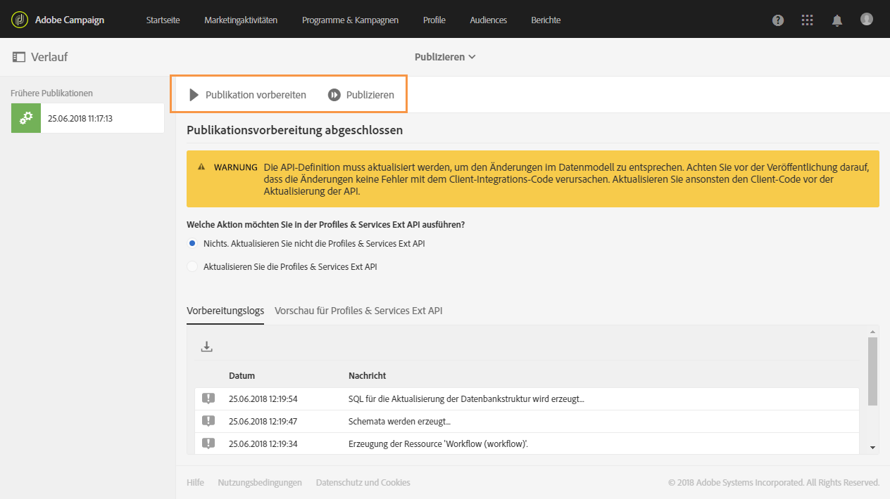
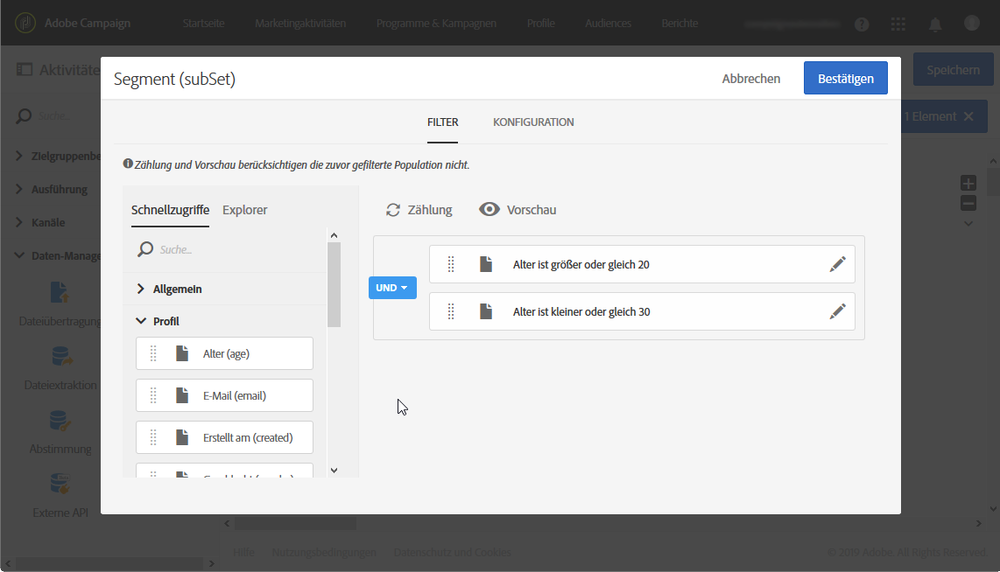

# Erstellen eines Berichts auf der Basis von Workflow-Segmenten{#creating-a-report-workflow-segment}

>[!CAUTION]
> **[!UICONTROL Der Segment-Code]** kann nur E-Mail- und SMS-Sendungen auswählen.

Nachdem Sie einen Workflow erstellt und Ihre Population durch Filterung in unterschiedliche Zielgruppen unterteilt haben, können Sie die Effizienz Ihrer Marketing-Kampagnen anhand von den in diesem Zielgruppen-Workflow definierten Segmenten messen.
So wählen Sie diese Segmente in Ihren Berichten aus:

* [Schritt 1: Aktualisieren der benutzerdefinierten Ressource &quot;Profile&quot; mit den Segmenten](#step-1--update-profiles-custom-resource-segments)
* [Schritt 2: Erstellen eines Workflows mit Segmenten](#step-2--create-a-workflow-segments)
* [Schritt 3: Erstellen eines dynamischen Berichts, um die Segmente zu filtern](#step-3--create-a-dynamic-report-filter-segments)

>[!CAUTION]
>Um diese Daten erfassen zu können, müssen Sie zuerst die Nutzungsvereinbarung zur dynamischen Berichterstattung akzeptieren.
>
>Weiterführende Informationen zu dieser Vereinbarung finden Sie auf dieser [Seite](../../reporting/using/about-dynamic-reports.md#dynamic-reporting-usage-agreement).

## Schritt 1: Aktualisieren der benutzerdefinierten Ressource &quot;Profile&quot; mit den Segmenten{#step-1--update-profiles-custom-resource-segments}

Damit Sie einen Bericht zu Ihrem Segmentcode erstellen können, müssen Sie Ihre benutzerdefinierte Ressource **[!UICONTROL Profile]** aktualisieren, sodass Ihre Segmentcodes gespeichert werden.

1. Wählen Sie über das Adobe Campaign-Logo im erweiterten Menü **[!UICONTROL Administration]** > **[!UICONTROL Entwicklung]** > **[!UICONTROL Benutzerdefinierte Ressourcen]** und danach die Ressource **[!UICONTROL Profil (profile)]** aus.
1. Aktivieren Sie im Menü **[!UICONTROL Erweiterung der Versandlogs]** im Tab **[!UICONTROL Datenstruktur]** die Option **[!UICONTROL Segmentcode hinzufügen]**, um die Speicherung Ihrer aus Zielgruppen-Workflows stammenden Segmentcodes zuzulassen und sie an dynamische Berichte zu senden.

   Der **[!UICONTROL Segmentcode]** steht dann im Dimensionsbereich **[!UICONTROL Profil]** Ihres Berichts zur Verfügung.

   

1. Speichern Sie Ihre benutzerdefinierte Ressource.

1. Danach müssen Sie Ihre benutzerdefinierte Ressource veröffentlichen.
Wählen Sie im erweiterten Menü **[!UICONTROL Administration]** > **[!UICONTROL Entwicklung]** > **[!UICONTROL Veröffentlichen]** aus.

   

1. Wählen Sie **[!UICONTROL Veröffentlichung vorbereiten]** und nach Abschluss der Vorbereitung die Schaltfläche **[!UICONTROL Veröffentlichen]** aus. Weiterführende Informationen zu benutzerdefinierten Ressourcen finden Sie auf dieser [Seite](../../developing/using/updating-the-database-structure.md).

Sie können jetzt damit beginnen, Ihren Workflow mit Segmentcodes zu erstellen.

Beachten Sie, dass Segmentcodes erfasst werden, sobald Sie den Segmentcode in der **[!UICONTROL Erweiterung der Versandlogs]** aktivieren.

## Schritt 2: Erstellen eines Workflows mit Segmenten {#step-2--create-a-workflow-segments}

>[!NOTE]
>Wenn die Eingangstransition des E-Mail-Versands leer ist, wird standardmäßig der Segmentcode von der vorherigen Transition hinzugefügt.

Zunächst müssen Sie einen Workflow mit unterschiedlichen Zielgruppen erstellen. In unserem Beispiel möchten wir eine E-Mail senden, die je nach Alter unserer Zielgruppe personalisiert wird: ein Versand an 20 bis 30 Jahre alte Profile und ein anderer an Profile zwischen 30 und 40 Jahren.

1. Erstellen Sie Ihren Workflow. Weiterführende Informationen zum Erstellen eines Workflows finden Sie auf dieser [Seite](../../automating/using/building-a-workflow.md).

1. Fügen Sie die Aktivität **[!UICONTROL Abfrage]** hinzu, indem Sie sie aus der Palette in den Arbeitsbereich ziehen und dort ablegen.

1. Wählen Sie Profile von 20 bis 40 Jahren aus, um sie später weiter zu segmentieren.

   

1. Fügen Sie die Aktivität **[!UICONTROL Segmentierung]** hinzu, um Ihre Abfrageergebnisse in zwei Zielgruppen zu unterteilen. Weiterführende Informationen zur Segmentierung finden Sie auf dieser [Seite](../../automating/using/segmentation.md).

1. Doppelklicken Sie auf die Aktivität **[!UICONTROL Segmentierung]**, um sie zu konfigurieren. Bearbeiten Sie das erste Segment, indem Sie **[!UICONTROL Eigenschaften bearbeiten]** auswählen.

   

1. Starten Sie eine Abfrage für Profile mit einem Alter von 20 bis 30 Jahren und klicken Sie danach auf **[!UICONTROL Bestätigen]**.

   

1. Klicken Sie auf **[!UICONTROL Element hinzufügen]**, um das zweite Segment zu erstellen und es wie in den obigen Schritten beschrieben zu konfigurieren und Profile zwischen 30 und 40 Jahren auszuwählen.

1. Bearbeiten Sie den **[!UICONTROL Segmentcode]** für jede Population, für die dynamische Berichte erstellt werden sollen.

   >[!NOTE]
   >Dieser Schritt ist obligatorisch. Andernfalls ist nicht ersichtlich, zu welchen Segmenten Berichte erstellt werden sollen.

   

1. Fügen Sie per Drag &amp; Drop die Aktivität **[!UICONTROL E-Mail-Versand]** im Anschluss an Ihre Segmente ein.

   

1. Personalisieren Sie Ihre Sendungen entsprechend den unterschiedlichen Zielgruppen. Weiterführende Informationen zur Erstellung von E-Mails finden Sie auf dieser [Seite](../../designing/using/designing-content-in-adobe-campaign.md).

1. Speichern Sie den Workflow.

1. Klicken Sie auf **[!UICONTROL Starten]**, wenn Ihr Workflow fertig ist.

Sie können jetzt auf Ihre Berichte zugreifen, um Ihre Segment-Codes zu tracken.

## Schritt 3: Erstellen eines dynamischen Berichts, um die Segmente zu filtern {#step-3--create-a-dynamic-report-filter-segments}

Nachdem Sie mit Ihrem Workflow Nachrichten versendet haben, können Sie die Berichte mithilfe Ihrer Segment-Codes von Ihrem Workflow aufschlüsseln.

1. Wählen Sie im Tab **[!UICONTROL Berichte]** einen nativen Bericht oder die Schaltfläche **[!UICONTROL Neues Projekt erstellen]** aus, um einen neuen Bericht zu erstellen.

   
1. Ziehen Sie die Dimension **[!UICONTROL Versand]** in Ihre Freiformtabelle.

   

1. Ziehen Sie verschiedene Metriken in Ihre Tabelle, z. B. die Metriken **[!UICONTROL Öffnungen]** und **[!UICONTROL Klicks]**, um Ihre Daten zu filtern.
1. Klicken Sie in der Kategorie **[!UICONTROL Dimensionen]** auf die Dimension **[!UICONTROL Profil]** und ziehen Sie dann die Dimension **[!UICONTROL Segmentcode]** in den Versand Ihres Workflows, um den Erfolg Ihres E-Mail-Versands aufgeschlüsselt nach Zielgruppen zu messen.

   

1. Ziehen Sie bei Bedarf ein Visualisierungselement in den Arbeitsbereich.

   
