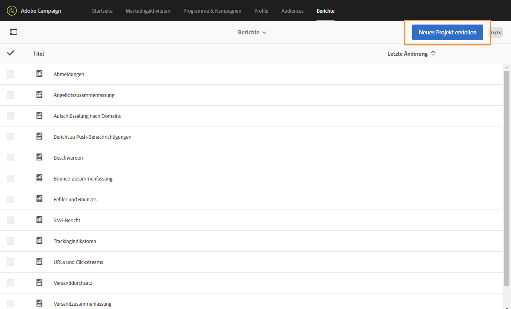
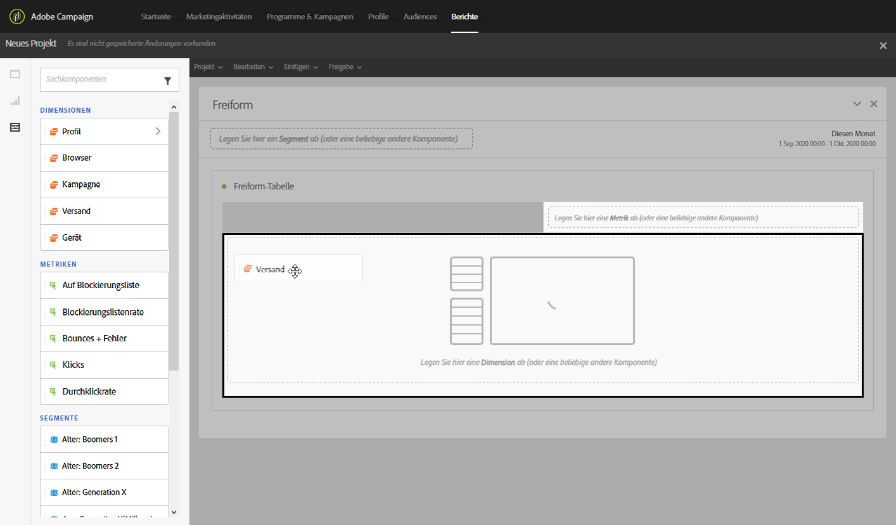
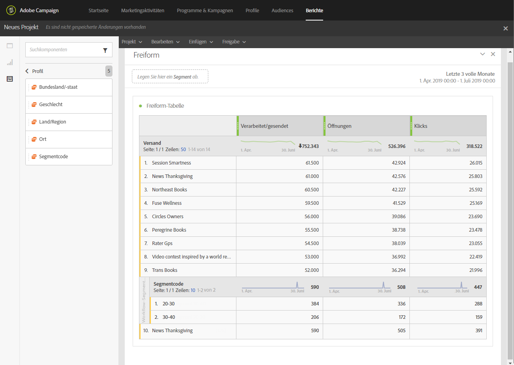

# Creating a report based on workflow segments{#creating-a-report-workflow-segment}

Nachdem Sie einen Workflow erstellt und Ihre Population in unterschiedlichen zielgruppen gefiltert haben, können Sie die Effizienz Ihrer Marketingkampagnen anhand von in diesem Targeting-Arbeitsablauf definierten Segmenten messen.
So zielen Sie auf diese Segmente in Ihren Berichten ab:

* [Schritt 1: Benutzerdefinierte Ressource für Profile mit Segmenten aktualisieren](#step-1--update-profiles-custom-resource-segments)
* [Schritt 2: Erstellen eines Workflows mit Segmenten](#step-2--create-a-workflow-segments)
* [Schritt 3: Erstellen eines dynamischen Berichts zum Filtern von Segmenten](#step-3--create-a-dynamic-report-filter-segments)

>[!CAUTION]
>Die Nutzungsvereinbarung für dynamische Berichte muss akzeptiert werden, damit die Erfassung dieser Daten beginnt.
>For more on this agreement, refer to this [page](../../reporting/using/about-dynamic-reports.md#dynamic-reporting-usage-agreement).

## Step 1: Update Profiles custom resource with segments{#step-1--update-profiles-custom-resource-segments}

Before reporting on your segment code, you need to update your **[!UICONTROL Profiles]** custom resource for your segment codes to be stored.

1. From the advanced menu, via the Adobe Campaign logo, select **[!UICONTROL Administration]** &gt; **[!UICONTROL Development]** &gt; **[!UICONTROL Custom resources]**, then select the **[!UICONTROL Profile (profile)]** resource.
1. In the **[!UICONTROL Sending logs extension]** menu from the **[!UICONTROL Data structure]** tab, check **[!UICONTROL Add segment code]** to allow storage of your segment codes from targeting workflows and to send it to dynamic reporting.

   The **[!UICONTROL Segment code]** will then be available in the **[!UICONTROL Profile]** dimension section of your report.

   

1. Speichern Sie Ihre benutzerdefinierte Ressource.

1. Sie müssen jetzt Ihre benutzerdefinierte Ressource veröffentlichen.
From the advanced menu, select **[!UICONTROL Administration]** &gt; **[!UICONTROL Development]** &gt; **[!UICONTROL Publishing]**.

   

1. Wählen Sie **[!UICONTROL Publikation vorbereiten]** und nach Abschluss der Vorbereitung die Schaltfläche **Publizieren.** For more information on custom resource, refer to this [page](../../developing/using/updating-the-database-structure.md).

Sie können jetzt mit Segmentcodes beginnen, Ihren Arbeitsablauf zu erstellen.

Note that segment codes will be collected as soon as you enable the segment code in the **[!UICONTROL Sending logs extension]**.

## Step 2: Create a workflow with segments {#step-2--create-a-workflow-segments}

>[!NOTE]
>Wenn der Eingabeübergang der E-Email-Auslieferung leer ist, wird der Segmentcode vom vorherigen Übergang standardmäßig hinzugefügt.

Zunächst müssen Sie einen Workflow mit unterschiedlichen Zielgruppen erstellen. Hier möchten wir eine E-Mail senden, die je nach Alter unserer Zielgruppe personalisiert wird: eine Lieferung für 20 bis 30 Jahre alte Profile und eine andere für Profile zwischen 30 und 40 Jahren.

1. Erstellen Sie Ihren Arbeitsablauf. For more details on how to create your workflow, refer to this [page](../../automating/using/building-a-workflow.md).

1. Add a **[!UICONTROL Query]** activity by dragging it from the palette and dropping it in the workspace.

1. Zielprofile von 20 bis 40 Jahren sind für die spätere Segmentierung in zielgerichtetere Populationen vorgesehen.

   

1. Add a **[!UICONTROL Segmentation]** activity to split your query results into two targeted populations. For more on segmentation, refer to this [page](../../automating/using/targeting-data.md#segmenting-data).

1. Double click the **[!UICONTROL Segmentation]** activity to configure it. Edit the first segment by clicking **[!UICONTROL Edit properties]**.

   

1. Query profiles between the age of 20 to 30 and click **[!UICONTROL Confirm]** when done.

   

1. Click **[!UICONTROL Add an element]** to create your second segment and configure it as described in the steps above to target profiles between the age of 30 to 40.

1. Edit the **[!UICONTROL Segment code]** for each population to be passed on through dynamic reporting.

   >[!NOTE]
   >Dieser Schritt ist obligatorisch oder Sie können nicht verstehen, welche Segmente zu einem Bericht führen.

   

1. Drag and drop an **[!UICONTROL Email delivery]** activity after your segments.

   

1. Personalisieren Sie Ihre Bereitstellung je nach den unterschiedlichen Zielgruppen. For more on email creation, refer to this [page](../../designing/using/about-email-content-design.md).

1. Speichern Sie den Workflow.

1. Click **[!UICONTROL Start]** when your workflow is ready.

Sie können jetzt auf Ihre Berichte zugreifen, um Ihre Segmentcodes zu verfolgen.

## Step 3: Create a dynamic report to filter segments {#step-3--create-a-dynamic-report-filter-segments}

Nachdem Sie die Bereitstellung mit Ihrem Arbeitsablauf gesendet haben, können Sie Berichte mithilfe Ihrer Segmentcodes aus Ihrem Arbeitsablauf aufschlüsseln.

1. From the **[!UICONTROL Reports]** tab, select an out-of-the-box report or click the **[!UICONTROL Create new project]** button to start one from scratch.

   
1. Drag and drop the **[!UICONTROL Delivery]** dimension to your freeform table.

   

1. Drag and drop different metrics to your table such as the **[!UICONTROL Open]** and **[!UICONTROL Click]** metrics to start filtering your data.
1. In the **[!UICONTROL Dimensions]** category, click the **[!UICONTROL Profile]** dimension then drag and drop the **[!UICONTROL Segment code]** dimension on your workflow's delivery to measure the success of your email delivery depending on the targeted populations.

   

1. Ziehen Sie bei Bedarf ein Visualisierungselement in den Arbeitsbereich.

   
