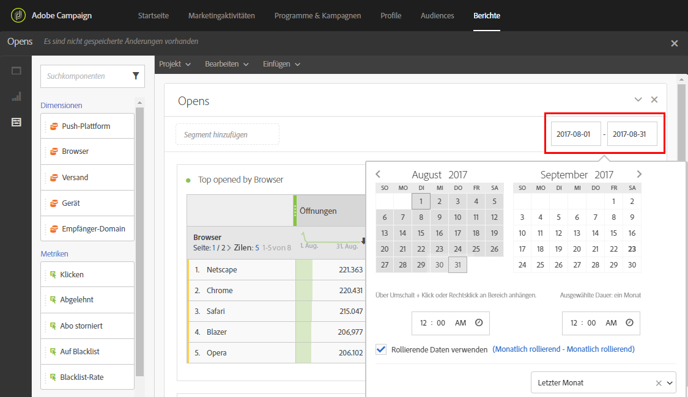

# Berichtszeitraum definieren{#defining-the-report-period}

>[!NOTE]
>
>Datenberichte sind nur für die letzten drei Jahre verfügbar. Weitere Informationen zu Datenspeicherungszeiträumen erhalten Sie vom Adobe-Beratungspersonal oder von Ihren technischen Admins.

Bevor Sie einen Bericht erstellen oder öffnen, müssen Sie einen Zeitraum festlegen. Rechts oben neben dem Bericht können Sie auf den jeweiligen Zeitraum zugreifen.

Standardmäßig wird für den Filterzeitraum einer Kampagne oder eines Programms das Anfangs- und Enddatum des Programms oder der Kampagne herangezogen. Bei einem Versand entspricht das Anfangsdatum dem Sendedatum und das Enddatum dem Sendedatum zuzüglich 7 Tage.

Um den Filter zu ändern, wählen Sie ein Anfangsdatum und einen Zeitraum oder verwenden Sie einen vordefinierten Zeitraum, wie z. B. letzte Woche, vor zwei Monaten etc.

Der Bericht wird automatisch aktualisiert, sobald ein Filter angewendet oder geändert wird. Die Ereignisse innerhalb eines Zeitraums werden durch den ausgewählten Berichtszeitraum bestimmt. Dabei handelt es sich nicht unbedingt um alle Daten Ihrer Sendungen, die in diesem Zeitraum durchgeführt wurden. Wenn z. B. ein Versand vom 1. bis 5. Januar stattfindet und als Berichtszeitraum der 1. bis 2. Januar definiert wird, sehen Sie nur einen Teil der Daten. Dies kann sich auf die Anzahl der Öffnungen/Klicks auswirken, da Öffnungen oder Klicks auch noch einen Monat nach dem Versand auftreten können.

