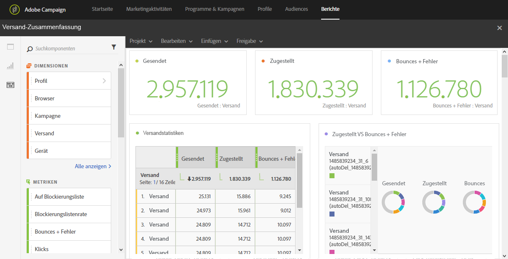

# Versandzusammenfassung{#delivery-summary}

Der Bericht **[!UICONTROL Versandzusammenfassung]bietet einen Überblick über die wichtigsten Informationen zu einer oder mehreren E-Mails.**

Für jede Tabelle werden Zusammenfassungen und Grafiken erstellt. Die Darstellung dieser Details können Sie in deren Einstellungen ändern.

Die Tabelle **Versandstatistiken** enthält die Daten für gesendete E-Mails, z. B.:

* **[!UICONTROL Verarbeitet/gesendet]**: Die Gesamtzahl der gesendeten Nachrichten
* **[!UICONTROL Zugestellt]**: Die Anzahl der erfolgreich gesendeten Nachrichten in Bezug auf die Gesamtzahl der gesendeten Nachrichten. Gemeldete Fehler (Bounces) werden abgezogen. Doch Beschwerden (als Spam gekennzeichnete Nachrichten) und Abwesenheitsnotizen (beispielsweise "Nicht im Büro") bleiben eingeschlossen.
* **[!UICONTROL Bounces + Fehler]**: Die Anzahl der über alle Sendungen hinweg kumulierten Fehler und der automatischen Bounce-Verarbeitung in Bezug auf die Gesamtzahl der gesendeten Nachrichten.

Die Tabelle **Open and clicks** enthält für jeden Versand die verfügbaren Daten zur Empfängeraktivität, wie beispielsweise:

* **Klicks**: Die Anzahl der Klicks auf einen Inhalt in einem Versand.
* **Öffnungen**: Die Anzahl der Öffnungen einer Nachricht in einem Versand.
* **Einzelöffnungen**: Die Anzahl der Empfänger, die den Versand geöffnet haben.
* **Einzelklicks**: Die Anzahl der Empfänger, die einen Inhalt in einem Versand angeklickt haben.

In der Tabelle **Domänenverteilung** wird der Status der Sendungen nach Empfänger-Domain angezeigt.
