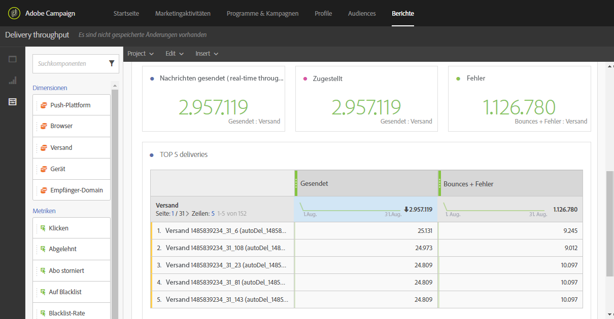

# Versanddurchsatz{#delivery-throughput}

Dieser Bericht fasst alle Informationen zusammen, die den Durchsatz eines Versands bzw. mehrerer Sendungen betreffen. Der Bericht zeigt folgende Kennzahlen:

* Anzahl der verarbeiteten Nachrichten pro Stunde,
* Die Tabelle **[!UICONTROL 5 häufigste Zustellungen]** und die komplementären Zusammenfassungen enthalten die fünf Sendungen mit der höchsten Anzahl an zugestellten Nachrichten.

>[!NOTE]
>
>Auf der Seite **[!UICONTROL Versanddurchsatz]** wird die Durchsatzgeschwindigkeit bei der Weiterleitung Ihrer Nachrichten von Campaign über den erweiterten MTA (Message Transfer Agent) von Adobe Campaign angezeigt.
