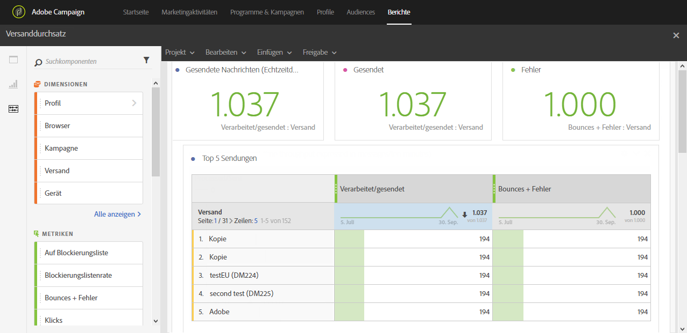

# Versanddurchsatz{#delivery-throughput}

Dieser Bericht fasst alle Informationen zusammen, die den Durchsatz eines Versands bzw. mehrerer Sendungen betreffen. Der Bericht zeigt folgende Kennzahlen:

* Anzahl der verarbeiteten Nachrichten pro Stunde,
* Die Tabelle **[!UICONTROL Top 5 deliveries]** und die jeweiligen Zusammenfassungen enthalten die fünf Sendungen mit der höchsten Anzahl an zugestellten Nachrichten.

>[!NOTE]
>
>The **[!UICONTROL Delivery throughput]** page displays the throughput speed for the relay of your messages from Campaign over to the Adobe Campaign Enhanced MTA.
