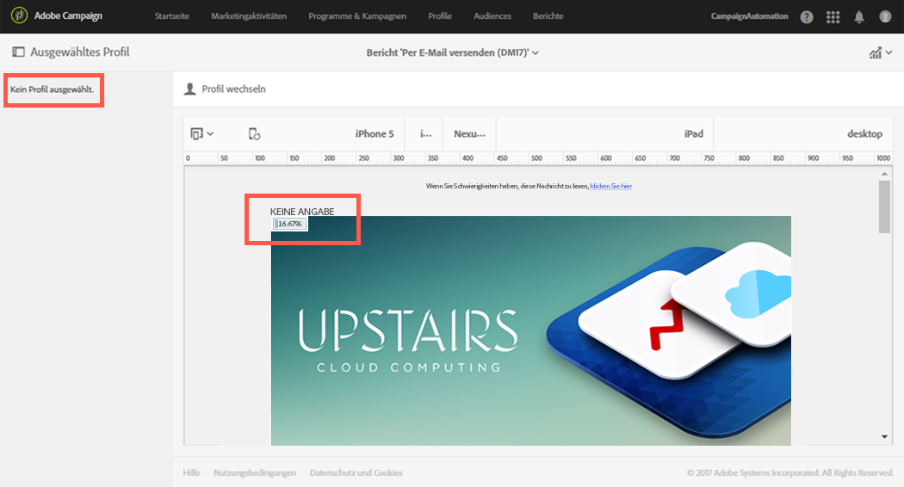
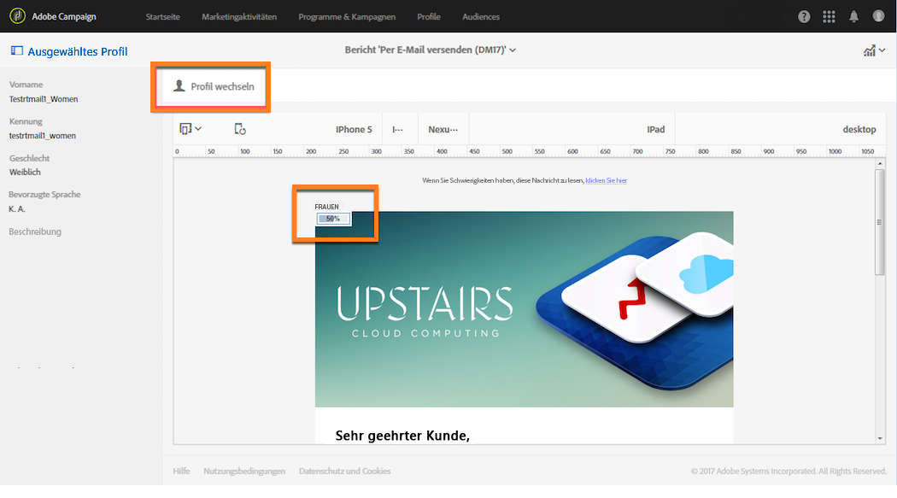
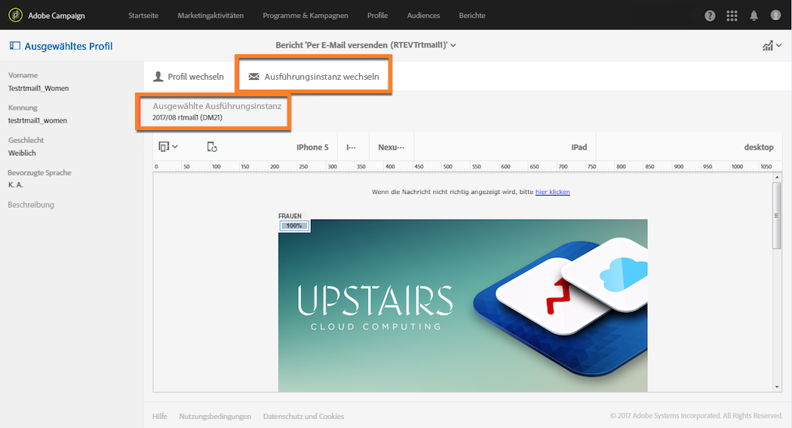

# Klicks{#hot-clicks}

Dieser Bericht kann über die Schaltfläche **[!UICONTROL Berichte]** in jedem Versand oder jeder Transaktionsnachricht geöffnet werden.

Er zeigt den (HTML- und/oder Text-) Inhalt der Nachricht sowie den Prozentsatz der Klicks auf jeden Link.

Wenn Sie für Ihren Versand dynamischen Inhalt erstellt haben, können Sie die Prozentsätze für jede von Ihnen definierte Bedingung einsehen. Weiterführende Informationen zum Einfügen von bedingtem Inhalt in einen Versand finden Sie im Abschnitt [Dynamische Inhalte definieren](../../designing/using/personalization.md#defining-dynamic-content-in-an-email).

Nehmen wir zum Beispiel an, Sie hätten einen Versand mit den folgenden Bedingungen erstellt:

* Der Link im Hauptbild ändert sich je nachdem, ob der Empfänger ein Mann oder eine Frau ist.
* Sie haben auch einen Link zu einem speziellen Angebot eingefügt, das nur für Empfänger sichtbar ist, die mindestens 25 Jahre alt sind.

Wählen Sie nach dem Versand der Nachricht aus dem Versand-Dashboard **[!UICONTROL Berichte]** > **[!UICONTROL Klicks]**.

Standardmäßig ist kein Profil ausgewählt. Angezeigt werden nur Klicks durch Empfänger, deren Geschlecht unbekannt ist und die unter 25 Jahre alt sind oder deren Alter unbekannt ist.

Um Klicks für Frauen anzuzeigen, wählen Sie die Schaltfläche **[!UICONTROL Profil wechseln]** und dann das Testprofil einer Frau. Um Klicks für Männer anzuzeigen, gehen Sie analog vor und wählen Sie ein Testprofil für Männer aus.

Um Klicks für Empfänger anzuzeigen, die mindestens 25 Jahre alt sind, klicken Sie auf die Schaltfläche **[!UICONTROL Profil wechseln]** und wählen Sie dann ein Testprofil aus, dessen Geburtsdatum dieser Bedingung entspricht.

Weiterführende Informationen zu Testprofilen finden Sie im Abschnitt [Über Testprofile](../../audiences/using/managing-test-profiles.md).

>[!NOTE]
>
>Die Anzahl der Klicks auf einen bestimmten Link ist der Prozentsatz aller Klicks auf alle bedingten Inhalte in einem Versand. Deshalb beläuft sich die Summe der für ein bestimmtes Testprofil angezeigten Prozentsätze möglicherweise nicht auf 100, wenn dynamischer Inhalt definiert wurde.

Analog können Sie für wiederkehrende Sendungen und Transaktionsnachrichten das Testprofil auswählen, das dem dynamischen Inhalt entspricht, den Sie darstellen möchten. Sie können aber auch die Klick-Prozentsätze entsprechend dem ausgewählten Ausführungsversand anzeigen.

Ein Ausführungsversand ist eine nicht funktionelle und nicht ausführbare technische Nachricht, die in den folgenden Fällen erstellt wird:

* Jedes Mal, wenn ein wiederkehrender Versand ausgeführt oder aktualisiert wird.

   Wenn der Workflow für diesen Versand beispielsweise einmal im Monat ausgeführt wird, gibt es einen Ausführungsversand pro Monat. Zusätzlich wird jedes Mal, wenn der Inhalt des Versands aktualisiert wird, ein zusätzlicher Ausführungsversand erstellt.

   Weiterführende Informationen zu wiederkehrendem E-Mail-Versand finden Sie im Abschnitt [E-Mail-Versand](../../automating/using/email-delivery.md).

* Standardmäßig einmal im Monat für Transaktionsnachrichten und jedes Mal, wenn eine Transaktionsnachricht bearbeitet und wieder publiziert wird

   Weiterführende Informationen zu Transaktionsnachrichten finden Sie im Abschnitt [Über den Versand von Transaktionsnachrichten](../../channels/using/about-transactional-messaging.md).

>[!NOTE]
>
>Da die Kennungen für die getrackten URLs bei jeder Ausführung unterschiedlich sind, können die Hot-Klick-Daten nicht für alle Ausführungssendungen einer bestimmten Nachricht aggregiert werden. Sie können nur jeweils für einen einzigen Ausführungsversand angezeigt werden.

Wählen Sie nach dem Versand der Nachricht aus dem Versand-Dashboard **[!UICONTROL Berichte]** > **[!UICONTROL Klicks]**.

Standardmäßig ist der letzte Ausführungsversand ausgewählt. Klicken Sie auf die Schaltfläche **[!UICONTROL Ausführungsversand ändern]**, um einen anderen Ausführungsversand auszuwählen.

Nur die Klick-Prozentsätze für die ausgewählte Versandausführung werden angezeigt.
