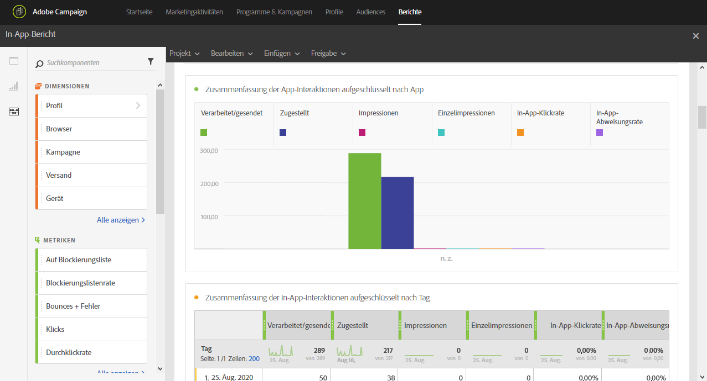
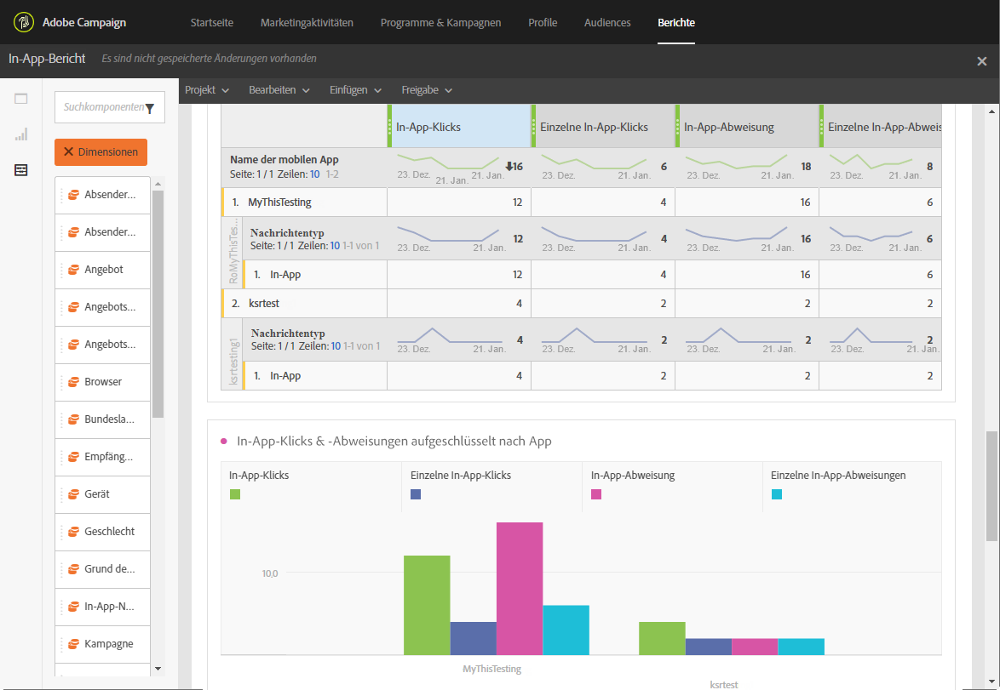

# In-App-Bericht{#in-app-report}

>[!CAUTION]
>
>Bitte beachten Sie, dass Sie die Metrik **[!UICONTROL Nachrichtentyp]** in die Tabellen ziehen müssen, um Ihre Daten nach Versandtyp (in diesem Fall In-App-Nachrichten) aufzuschlüsseln.

Der **In-App**-Bericht liefert Details zu In-App-Sendungen.

Für jede Tabelle werden Zusammenfassungen und Grafiken erstellt. Die Darstellung dieser Details können Sie in deren Einstellungen ändern.

Die erste Tabelle **Zusammenfassung der In-App-Interaktionen** ist in drei Kategorien unterteilt: nach Tag, nach Mobile App und nach Versand. Sie enthält alle verfügbaren Daten zu den Reaktionen der Empfänger auf den Versand.

* **[!UICONTROL Verarbeitet/gesendet]**: Die Gesamtzahl der gesendeten In-App-Nachrichten
* **[!UICONTROL Zugestellt]**: Anzahl der erfolgreich gesendeten In-App-Nachrichten in Bezug auf die Gesamtzahl der gesendeten Nachrichten
* **[!UICONTROL Impressionen]**: Gesamtzahl der In-App-Nachrichten, die von den Empfängern gesehen wurden, abhängig davon, ob die Trigger-Bedingung erfüllt worden ist.
* **[!UICONTROL Einzelimpressionen]**: Anzahl der Impressionen eines Empfängers
* **[!UICONTROL In-App-Klickrate]**: Prozentsatz der Benutzer, die auf Schaltfläche 1 oder Schaltfläche 2 geklickt haben, verglichen mit den Benutzern, die die Nachricht gesehen haben
* **[!UICONTROL In-App-Abweisungsrate]**: Prozentsatz der In-App-Nachrichten, die von Empfängern verworfen wurden.

Die zweite Tabelle **In-App-Klicks &amp; -Abweisungen** ist in drei Kategorien unterteilt: nach Tag, nach Mobile App und nach Versand. Sie enthält alle verfügbaren Daten zum Verhalten der Empfänger in jedem Versand.

* **[!UICONTROL In-App-Klicks]**: Gesamtzahl der Empfänger, die auf Schaltfläche 1 oder Schaltfläche 2 geklickt haben
* **[!UICONTROL Einzelne In-App-Klicks]**: Gesamtzahl der Klicks auf Schaltfläche 1 oder Schaltfläche 2 durch Empfänger
* **[!UICONTROL In-App-Abweisungen]**: Gesamtzahl der Nachrichten, die von Benutzern verworfen wurden, indem diese entweder die Schließen-Schaltfläche oder die automatische Funktion zum Entfernen der Nachricht verwendet haben
* **[!UICONTROL Einzelne In-App-Abweisungen]**: Anzahl der verworfenen In-App-Nachrichten durch Empfänger

