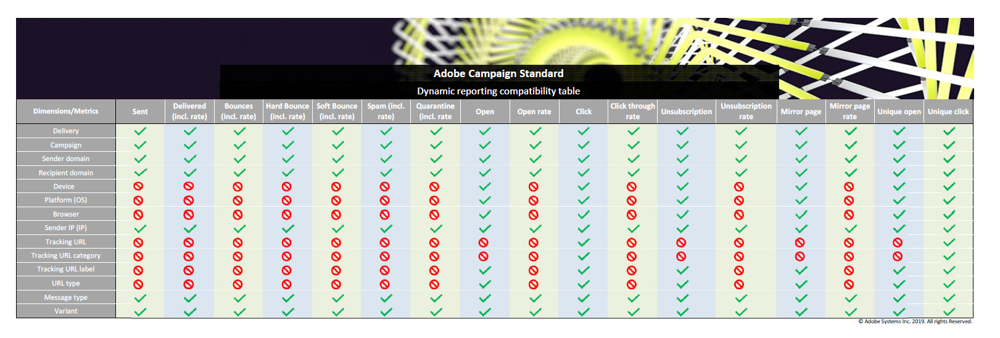

# Liste von Komponenten {#list-of-components}

Weiterführende Informationen zur Kompatibilität zwischen Dimensionen und Metriken finden Sie in dieser [Tabelle](/help/reporting/using/assets/dynamic_report_compatibility.pdf). Wenn zwei Komponenten nicht kompatibel sind, zeigt die Zelle den Wert **Kein** an.

## Dimensionen {#dimensions}

In der Tabelle unten finden Sie die Liste der Dimensionen, die in Berichten verwendet werden, sowie ihre Definitionen.

<table> 
 <thead> 
  <tr> 
   <th> Dimension  </th> 
   <th> Definition  </th> 
  </tr> 
 </thead> 
 <tbody> 
  <tr> 
   <td> Browser  </td> 
   <td> Browser, in dem die Nachricht geöffnet oder angeklickt wurde  </td> 
  </tr> 
  <tr> 
   <td> Kampagne  </td> 
   <td> Titel und Kennung Ihrer Kampagne  </td> 
  </tr> 
  <tr> 
   <td> Ort  </td> 
   <td> Der im Empfängerprofil gespeicherte Ort  </td> 
  </tr> 
  <tr> 
   <td> Land/Region  </td> 
   <td> Das im Empfängerprofil gespeicherte Land  </td> 
  </tr> 
  <tr> 
   <td> Versand  </td> 
   <td> Titel und Kennung des Versands  </td> 
  </tr> 
  <tr> 
   <td> Gerät  </td> 
   <td> Gerät, auf dem die E-Mail/SMS/Push-Benachrichtigung geöffnet/angesehen/angeklickt wurde.  </td> 
  </tr> 
  <tr> 
   <td> Grund des Fehlschlagens  </td> 
   <td> Fehlertypen, die bei jedem Versand zu Bounces führten, z. B. unbekannte Nutzer, ungültige Domain oder Postfach voll.  </td> 
  </tr> 
  <tr> 
   <td> Geschlecht  </td> 
   <td> Geschlecht der Empfänger, also männlich oder weiblich. Wenn dieses Feld im Empfängerprofil leer ist, ist der Wert unbestimmt.  </td> 
  </tr> 
  <tr> 
   <td> Aktionen bei In-App-Nachrichten  </td> 
   <td> Aktionen bei gesendeten In-App-Nachrichten, z. B. Aktionen auf Schaltfläche 1 oder 2 oder Verwerfungen.  </td> 
  </tr> 
  <tr> 
   <td> Nachrichtentyp  </td> 
   <td> Der für den Versand verwendete Kanal, beispielsweise E-Mail, SMS, Push-Benachrichtigung oder In-App-Nachricht  </td> 
  </tr> 
  <tr> 
   <td> Name der Mobile App  </td> 
   <td> Name der Mobile App  </td> 
  </tr> 
  <tr> 
   <td> Plattform  </td> 
   <td> Plattform des Geräts, auf dem die Nachricht geöffnet/angesehen/angeklickt wurde  </td> 
  </tr> 
  <tr> 
   <td> Profil  </td> 
   <td> Fasst native und benutzerdefinierte Profilfelder zusammen, die während der Erweiterung der Profilressource erstellt wurden. Weiterführende Informationen dazu finden Sie auf dieser <a href="../../developing/using/key-steps-to-add-a-resource.md">Seite</a> und in diesem <a href="../../reporting/using/creating-a-custom-profile-dimension.md">Beispiel</a>.  Beachten Sie, dass Daten für diese Dimension abgerufen werden, sobald die mit dem Profilfeld verknüpfte benutzerdefinierte Ressource veröffentlicht wird.  </td> 
  </tr> 
  <tr> 
   <td> Push-Plattform  </td> 
   <td> Plattform des Geräts, auf dem die Push-Benachrichtigung geöffnet wurde, wie iOS oder Android  </td> 
  </tr> 
  <tr> 
   <td> Empfänger-Domain  </td> 
   <td> Die zum Öffnen der E-Mail verwendete Domain  </td> 
  </tr> 
  <tr> 
   <td> Wiederkehrender Versand  </td> 
   <td> Titel und Kennung des wiederkehrenden Versands  </td> 
  </tr> 
  <tr> 
   <td> Absender-Domain  </td> 
   <td> Die zum Senden der E-Mail verwendete Domain  </td> 
  </tr> 
  <tr> 
   <td> Absender-IP  </td> 
   <td> Die zum Senden der E-Mail verwendete IP  </td> 
  </tr> 
  <tr> 
   <td> Bundesland/Kanton  </td> 
   <td> Das im Empfängerprofil gespeicherte Bundesland  </td> 
  </tr> 
  <tr> 
   <td> Tracking-URL  </td> 
   <td> URL, die der Benutzer in der Nachricht angeklickt hat  </td> 
  </tr> 
  <tr> 
   <td> Kategorie des URL-Trackings  </td> 
   <td> Die der Tracking-URL zugewiesene Kategorie  </td> 
  </tr> 
  <tr> 
   <td> Titel des URL-Trackings  </td> 
   <td> Der an die URL vergebene Titel, wie "Mirrorseite", "Kontakt" oder "Öffnung".  </td> 
  </tr> 
  <tr> 
   <td> Versand von Transaktionsnachrichten  </td> 
   <td> Titel und Kennung des Transaktionsnachrichtenversands  </td> 
  </tr> 
  <tr> 
   <td> Variante  </td> 
   <td> Variante der E-Mail im Fall von A/B-Tests  </td> 
  </tr> 
 </tbody> 
</table>

## Metriken             {#metrics}

In den Tabellen unten finden Sie nach Versandtyp geordnet die Liste der Metriken, die in Berichten verwendet werden, sowie ihre Definitionen.

### Metriken zu E-Mail und SMS             {#email-and-sms-metrics}

<table> 
 <thead> 
  <tr> 
   <th> Metrik  </th> 
   <th> Definition  </th> 
  </tr> 
 </thead> 
 <tbody> 
  <tr> 
   <td> Auf Blockierungsliste  </td> 
   <td> Anzahl der Empfänger, die eine E-Mail als Spam oder Junk gekennzeichnet haben  </td> 
  </tr> 
  <tr> 
   <td> Blockierungslistenrate  </td> 
   <td> Prozentsatz der Sendungen, die auf einer Blockierungsliste markiert sind.  </td> 
  </tr> 
  <tr> 
   <td> Bounces + Fehler  </td> 
   <td> Gesamtzahl der über alle Sendungen hinweg kumulierten Fehler und der automatischen Bounce-Verarbeitung in Bezug auf die Gesamtzahl der gesendeten Nachrichten  </td> 
  </tr> 
  <tr> 
   <td> Bounce- + Fehlerrate  </td> 
   <td> Prozentsatz der Bounce-E-Mails in Bezug auf die gesendeten E-Mails  </td> 
  </tr> 
  <tr> 
   <td> Klicks  </td> 
   <td> Die Anzahl der Klicks auf einen Inhalt in einem Versand.  </td> 
  </tr> 
  <tr> 
   <td> Durchklickrate  </td> 
   <td> Prozentsatz der Klicks in einem Versand  </td> 
  </tr> 
  <tr> 
   <td> Zugestellt  </td> 
   <td> Anzahl der erfolgreich gesendeten Nachrichten in Bezug auf die Gesamtzahl der gesendeten Nachrichten  </td> 
  </tr> 
  <tr> 
   <td> Zustellrate  </td> 
   <td> Prozentsatz der erfolgreich gesendeten Nachrichten  </td> 
  </tr> 
  <tr> 
   <td> Hardbounce  </td> 
   <td> Gesamtzahl der permanenten Fehler, beispielsweise einer falschen E-Mail-Adresse  </td> 
  </tr> 
  <tr> 
   <td> Hardbounce-Rate  </td> 
   <td> Prozentsatz der Sendungen, die permanent fehlgeschlagen sind  </td> 
  </tr> 
  <tr> 
   <td> Mirrorseite  </td> 
   <td> Die Anzahl der Empfänger, die den Mirrorseiten-Link angeklickt haben  </td> 
  </tr> 
  <tr> 
   <td> Mirrorseitenrate  </td> 
   <td> Prozentsatz der Klicks auf den Mirrorseiten-Link in Bezug auf die Gesamtzahl der Sendungen  </td> 
  </tr> 
  <tr> 
   <td> Klicks auf Angebot  </td> 
   <td> Die Anzahl der Klicks auf ein Angebot in einem Versand.  </td> 
  </tr> 
  <tr> 
   <td> Klickrate des Angebots  </td> 
   <td> Prozentsatz der Klicks auf ein Angebot.  </td> 
  </tr> 
  <tr> 
   <td> Öffnungen  </td> 
   <td> Anzahl der Öffnungen einer Nachricht in einem Versand.  </td> 
  </tr> 
  <tr> 
   <td> Öffnungsrate  </td> 
   <td> Prozentsatz der geöffneten Nachrichten  </td> 
  </tr> 
  <tr> 
   <td> Verarbeitet/gesendet  </td> 
   <td> Gesamtzahl der gesendeten Nachrichten  </td> 
  </tr> 
  <tr> 
   <td> Quarantäne  </td> 
   <td> Anzahl der Bounce-Nachrichten, aufgrund derer eine Adresse unter Quarantäne gestellt wurde  </td> 
  </tr> 
  <tr> 
   <td> Quarantänerate  </td> 
   <td> Prozentsatz der Quarantänen in Bezug auf die gesendeten Nachrichten  </td> 
  </tr> 
  <tr> 
   <td> Zurückgewiesen  </td> 
   <td> Anzahl der Sendungen, die von SMTP-Servern als Spam gekennzeichnet wurden  </td> 
  </tr> 
  <tr> 
   <td> Zurückweisungsrate  </td> 
   <td> Prozentsatz der Nachrichten, die als abgelehnt gekennzeichnet wurden  </td> 
  </tr> 
  <tr> 
   <td> Softbounce  </td> 
   <td> Gesamtzahl der temporären Fehler, beispielsweise einer vollen Inbox  </td> 
  </tr> 
  <tr> 
   <td> Softbounce-Rate  </td> 
   <td> Prozentsatz der Sendungen, die vorläufig fehlgeschlagen sind  </td> 
  </tr> 
  <tr> 
   <td> Einzelklicks  </td> 
   <td> Anzahl der Empfänger, die einen Inhalt in einem Versand angeklickt haben  </td> 
  </tr> 
  <tr> 
   <td> Einzelöffnungen  </td> 
   <td> Anzahl der Empfänger, die den Versand geöffnet haben  </td> 
  </tr> 
  <tr> 
   <td> Einzelabmeldungen  </td> 
   <td> Die Anzahl der Empfänger, die den Abmelde-Link angeklickt haben.  </td> 
  </tr> 
  <tr> 
   <td> Abmelderate  </td> 
   <td> Anzahl der Einzelabmeldungen im Vergleich zu den zugestellten Nachrichten.  </td> 
  </tr> 
  <tr> 
   <td> Abgemeldet  </td> 
   <td> Gesamtanzahl der Klicks auf den Abmelde-Link.  </td> 
  </tr> 
 </tbody> 
</table>

### Metriken zu Push-Benachrichtigungen             {#push-notification-metrics}

<table> 
 <thead> 
  <tr> 
   <th> Metrik  </th> 
   <th> Definition  </th> 
  </tr> 
 </thead> 
 <tbody> 
  <tr> 
   <td> Bounces + Fehler  </td> 
   <td> Gesamtzahl der über alle Sendungen hinweg kumulierten Fehler im Vergleich zur Gesamtzahl aller gesendeten Nachrichten, z. B. Fehler durch MCPNS oder Provider.  </td> 
  </tr> 
  <tr> 
   <td> Bounce- + Fehlerrate  </td> 
   <td> Prozentsatz der Bounce-Push-Benachrichtigungen in Bezug auf die gesendeten Push-Benachrichtigungen.  </td> 
  </tr> 
  <tr> 
   <td> Klicks  </td> 
   <td> Gibt an, wie oft eine Push-Benachrichtigung an das Gerät geschickt und vom Benutzer angeklickt wurde. Der Benutzer hat die Benachrichtigung entweder angesehen oder verworfen. Wenn er sie angesehen hat, wird sie beim Push-Öffnungstracking berücksichtigt.  </td> 
  </tr> 
  <tr> 
   <td> Durchklickrate  </td> 
   <td> Prozentsatz der Benutzer, die mit der Push-Benachrichtigung interagiert haben.  </td> 
  </tr> 
  <tr> 
   <td> Zugestellt  </td> 
   <td> Anzahl der erfolgreich gesendeten Push-Benachrichtigungen in Bezug auf die Gesamtzahl der gesendeten Push-Benachrichtigungen.  </td> 
  </tr> 
  <tr> 
   <td> Zustellrate  </td> 
   <td> Anzahl der erfolgreich gesendeten Push-Benachrichtigungen.  </td> 
  </tr> 
  <tr> 
   <td> Impressionen  </td> 
   <td> Gibt an, wie oft eine Push-Benachrichtigung an das Gerät gesendet und in der Benachrichtigungszentrale unverändert gelassen wurde. In den meisten Fällen sollte die Anzahl der Impressionen in etwa der Anzahl der Sendungen entsprechen. Dadurch wird sichergestellt, dass das Gerät die Nachricht erhalten und diese Informationen an den Server zurückgegeben hat.  </td> 
  </tr> 
  <tr> 
   <td> Verarbeitet/gesendet  </td> 
   <td> Gesamtzahl der gesendeten Push-Benachrichtigungen.  </td> 
  </tr> 
  <tr> 
   <td> Öffnungen  </td> 
   <td> Gesamtzahl der Push-Benachrichtigungen, die an das Gerät gesendet und vom Benutzer angeklickt wurden, sodass die App geöffnet wurde. Dies ist ähnlich der Klick-Kategorie mit dem Unterschied, dass keine Push-Öffnung ausgelöst wird, wenn die Benachrichtigung verworfen wird.  </td> 
  </tr> 
  <tr> 
   <td> Öffnungsrate  </td> 
   <td> Prozentsatz der geöffneten Push-Benachrichtigungen.  </td> 
  </tr> 
  <tr> 
   <td> Einzelklicks  </td> 
   <td> Anzahl der Interaktionen eindeutiger Benutzer mit der Push-Benachrichtigung, z. B. Klicks auf die Benachrichtigung oder die Schaltfläche.  </td> 
  </tr> 
  <tr> 
   <td> Einzelimpressionen  </td> 
   <td> Anzahl der Impressionen durch einen Empfänger.  </td> 
  </tr> 
  <tr> 
   <td> Einzelöffnungen  </td> 
   <td> Anzahl der Empfänger, die den Versand geöffnet haben  </td> 
  </tr> 
 </tbody> 
</table>

### Metriken zu In-App-Nachrichten             {#in-app-metrics}

<table> 
 <thead> 
  <tr> 
   <th> Metrik  </th> 
   <th> Definition  </th> 
  </tr> 
 </thead> 
 <tbody> 
  <tr> 
   <td> Zugestellt  </td> 
   <td> Gesamtzahl der In-App-Nachrichten, die vom Service Provider an das Gerät gesendet wurden.  </td> 
  </tr> 
  <tr> 
   <td> Impressionen  </td> 
   <td> Gesamtzahl der In-App-Nachrichten, die von den Empfängern gesehen wurden abhängig davon, ob die Trigger-Bedingung erfüllt worden ist.  </td> 
  </tr> 
  <tr> 
   <td> In-App-Klicks   </td> 
   <td> Gesamtzahl der Empfänger, die auf Schaltfläche 1 oder Schaltfläche 2 geklickt haben.  </td> 
  </tr> 
  <tr> 
   <td> In-App-Klickrate  </td> 
   <td> Prozentsatz der Benutzer, die auf Schaltfläche 1 oder Schaltfläche 2 geklickt haben, verglichen mit den Benutzern, die die Nachricht gesehen haben.  </td> 
  </tr> 
  <tr> 
   <td> In-App-Abweisung  </td> 
   <td> Gesamtzahl der Nachrichten, die von Benutzern verworfen wurden, indem diese entweder die Schließen-Schaltfläche oder die automatische Funktion zum Entfernen der Nachricht verwendet haben.  </td> 
  </tr> 
  <tr> 
   <td> In-App-Abweisungsrate  </td> 
   <td> Prozentsatz der In-App-Nachrichten, die von Empfängern verworfen wurden.  </td> 
  </tr> 
  <tr> 
   <td> Verarbeitet/gesendet  </td> 
   <td> Gesamtzahl der In-App-Nachrichten, die von Adobe Campaign als Teil des Versandvorgangs gesendet wurden.  </td> 
  </tr> 
  <tr> 
   <td> Einzelimpressionen  </td> 
   <td> Anzahl der Impressionen durch einen einzelnen Empfänger  </td> 
  </tr> 
  <tr> 
   <td> In-App-Einzelklicks  </td> 
   <td> Anzahl der Klicks auf Schaltfläche 1 oder Schaltfläche 2 durch Empfänger.  </td> 
  </tr> 
  <tr> 
   <td> Einzelne In-App-Abweisungen  </td> 
   <td> Anzahl der verworfenen In-App-Nachrichten durch Empfänger.  </td> 
  </tr> 
 </tbody> 
</table>

## Segmente {#segments}

In der Tabelle unten finden Sie die Liste der Segmente, die in Berichten verwendet werden, sowie ihre Definitionen.

<table> 
 <thead> 
  <tr> 
   <th> Segment  </th> 
   <th> Definition  </th> 
  </tr> 
 </thead> 
 <tbody> 
  <tr> 
   <td> Alter: Boomers 1  </td> 
   <td> Empfänger mit Geburtsjahr 1946 bis 1954  </td> 
  </tr> 
  <tr> 
   <td> Alter: Boomers 2  </td> 
   <td> Empfänger mit Geburtsjahr 1955 bis 1965  </td> 
  </tr> 
  <tr> 
   <td> Alter: von 18 bis 25  </td> 
   <td> Empfänger im Alter von 18 bis 25 Jahren  </td> 
  </tr> 
  <tr> 
   <td> Alter: von 26 bis 30  </td> 
   <td> Empfänger im Alter von 26 bis 30 Jahren  </td> 
  </tr> 
  <tr> 
   <td> Alter: von 31 bis 40  </td> 
   <td> Empfänger im Alter von 31 bis 40 Jahren  </td> 
  </tr> 
  <tr> 
   <td> Alter: von 41 bis 50  </td> 
   <td> Empfänger im Alter von 41 bis 50 Jahren  </td> 
  </tr> 
  <tr> 
   <td> Alter: Generation X  </td> 
   <td> Empfänger mit Geburtsjahr 1966 bis 1976  </td> 
  </tr> 
  <tr> 
   <td> Alter: Generation Y (Millennials)  </td> 
   <td> Empfänger mit Geburtsjahr 1977 bis 1994  </td> 
  </tr> 
  <tr> 
   <td> Alter: Generation Z  </td> 
   <td> Empfänger mit Geburtsjahrgang 1995 bis heute  </td> 
  </tr> 
  <tr> 
   <td> Alter: über 50  </td> 
   <td> Empfänger im Alter von über 50 Jahren  </td> 
  </tr> 
  <tr> 
   <td> Alter: unter 25  </td> 
   <td> Empfänger im Alter von unter 25 Jahren  </td> 
  </tr> 
  <tr> 
   <td> Alter: unter 30  </td> 
   <td> Empfänger im Alter von unter 30 Jahren  </td> 
  </tr> 
  <tr> 
   <td> Alter: unter 40  </td> 
   <td> Empfänger im Alter von unter 40 Jahren  </td> 
  </tr> 
  <tr> 
   <td> Alter: unter 50  </td> 
   <td> Empfänger im Alter von unter 50 Jahren  </td> 
  </tr> 
  <tr> 
   <td> Alter: Stille Generation  </td> 
   <td> Empfänger mit Geburtsjahr 1945 oder früher  </td> 
  </tr> 
  <tr> 
   <td> Alle Besuche  </td> 
   <td> Jeder Empfänger  </td> 
  </tr>
 </tbody> 
</table>
