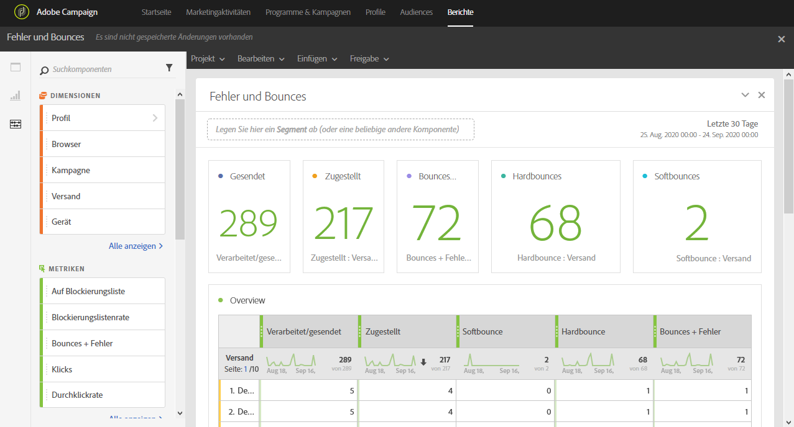

# Fehler und Bounces{#non-deliverables-and-bounces}

Der Bericht **[!UICONTROL Fehler und Bounces]** enthält Informationen zu allen beim Versand aufgetretenen Fehlern.

Die Tabelle **[!UICONTROL Übersicht]** enthält die verfügbaren Daten zu Fehlern, die bei jedem Versand aufgetreten sein könnten, z. B.:

* **Verarbeitet/gesendet**: die Anzahl an gesendeten E-Mails.
* **Zugestellt**: die Anzahl an zugestellten E-Mails.
* **Softbounce**: die Gesamtzahl der temporären Fehler, wie eine volle Inbox.
* **Hardbounce**: die Gesamtzahl der permanenten Fehler, wie eine falsche E-Mail-Adresse.
* **Bounces + Fehler**: die Anzahl an Nachrichten, die nicht zugestellt werden konnten.

Die Tabelle **Aufschlüsselung nach Domain** enthält die Bounces pro Empfänger-Domain.
