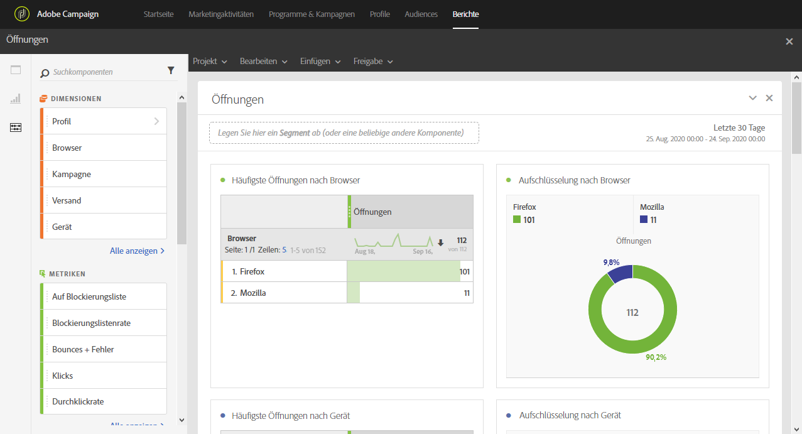

# Öffnungen{#opens}

Der Bericht **[!UICONTROL Öffnungen]** ermöglicht es, die Sendungen zu identifizieren, die am häufigsten angesehen wurden.

In vier Tabellen und Grafiken wird die Darstellung der Gesamtzahl der Empfänger dargestellt, die eine E-Mail geöffnet haben. Diese Tabellen sind geordnet nach:

* Browser
* Gerät
* Plattform
* Domain

Die Tabelle **[!UICONTROL TOP 5]** einschließlich der jeweiligen Diagramme enthalten die Sendungen mit der höchsten Anzahl an zugestellten Nachrichten.
