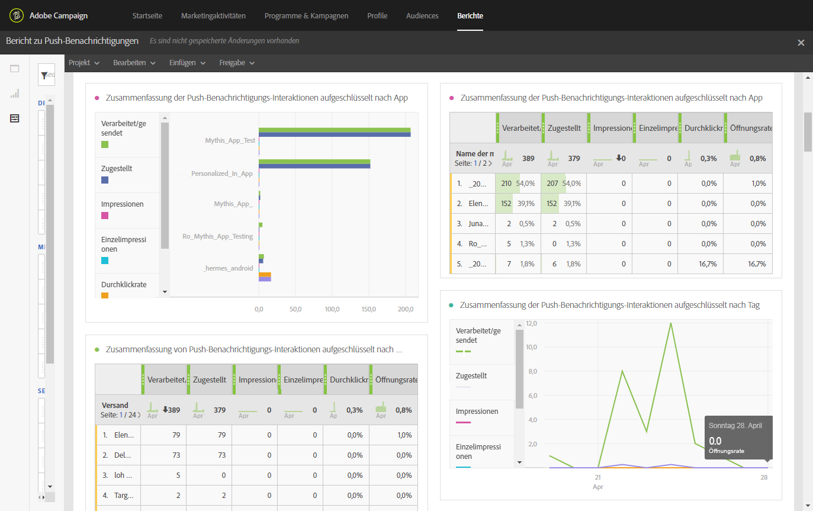
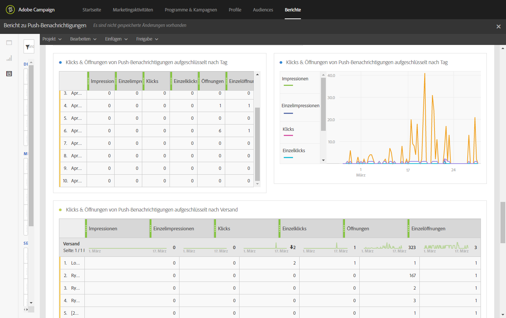

# Bericht zu Push-Benachrichtigungen{#push-notification-report}

>[!CAUTION]
>
>Bitte beachten Sie, dass Sie die Metrik **[!UICONTROL Nachrichtentyp]** in die Tabellen ziehen müssen, um Ihre Daten nach Versandtypen (in diesem Fall Push-Benachrichtigungen) aufzuschlüsseln.

Der Bericht zu **Push-Benachrichtigungen** liefert Details zur Marketing-Performance von Push-Benachrichtigungen in Adobe Campaign. Dieser native Bericht zeigt, wie Benutzer mit Push-Benachrichtigungen, Mobile Apps und Sendungen interagieren.

Die Mobile App muss entsprechend konfiguriert werden, um Push-Benachrichtigungen zu tracken. Weiterführende Informationen dazu finden Sie auf dieser [Seite](../../administration/using/push-tracking.md).

Für jede Tabelle werden Zusammenfassungen und Grafiken erstellt. Die Darstellung dieser Details können Sie in deren Einstellungen ändern.

Die erste Tabelle **Zusammenfassung der Interaktionen mit Push-Benachrichtigungen** ist in drei Kategorien unterteilt: nach Tag, nach Mobile App und nach Versand. Sie enthält alle verfügbaren Daten zu den Reaktionen der Empfänger auf den Versand.

* **[!UICONTROL Verarbeitet/gesendet]**: Gesamtzahl der gesendeten Push-Benachrichtigungen
* **[!UICONTROL Zugestellt]**: Anzahl der erfolgreich gesendeten Push-Benachrichtigungen in Bezug auf die Gesamtzahl der gesendeten Push-Benachrichtigungen
* **[!UICONTROL Impressionen]**: Gibt an, wie oft eine Push-Benachrichtigung an das Gerät gesendet und in der Benachrichtigungszentrale unverändert gelassen wurde. In den meisten Fällen sollte die Anzahl der Impressionen in etwa der Anzahl der Sendungen entsprechen. Dadurch wird sichergestellt, dass das Gerät die Nachricht erhalten und diese Informationen an den Server zurückgegeben hat.
* **[!UICONTROL Einzelimpressionen]**: Anzahl der Impressionen eines Empfängers
* **[!UICONTROL Durchklickrate]**: Prozentsatz der Benutzer, die mit der Push-Benachrichtigung interagiert haben
* **[!UICONTROL Öffnungsrate]**: Prozentsatz der geöffneten Push-Benachrichtigungen

Die zweite Tabelle **Klicks &amp; Öffnungen in Push-Benachrichtigungen** ist in drei Kategorien unterteilt: nach Tag, nach Mobile App und nach Versand. Sie enthält alle verfügbaren Daten zum Verhalten der Empfänger bei jedem Versand.

* **[!UICONTROL Impressions]**: Gesamtzahl der Push-Benachrichtigungen, die von Empfängern aufgerufen wurden
* **[!UICONTROL Einzelimpressionen]**: Anzahl der Impressionen eines Empfängers
* **[!UICONTROL Klicks]**: Gibt an, wie oft eine Push-Benachrichtigung an das Gerät geschickt und vom Benutzer angeklickt wurde. Der Benutzer hat die Benachrichtigung entweder angesehen oder verworfen. Wenn er sie angesehen hat, wird sie beim Push-Öffnungstracking berücksichtigt.
* **[!UICONTROL Einzelklicks]**: Anzahl der Interaktionen eines einzelnen Benutzers mit der Push-Benachrichtigung, z. B. Klicks auf die Benachrichtigung oder die Schaltfläche
* **[!UICONTROL Öffnungen]**: Gesamtzahl der Push-Benachrichtigungen, die an das Gerät gesendet und vom Benutzer angeklickt wurden, sodass die App geöffnet wurde. Dies ist ähnlich der Push-Klick-Kategorie mit dem Unterschied, dass keine Push-Öffnung ausgelöst wird, wenn die Benachrichtigung verworfen wird.
* **[!UICONTROL Einzelöffnungen]**: Die Anzahl der Empfänger, die den Versand geöffnet haben

