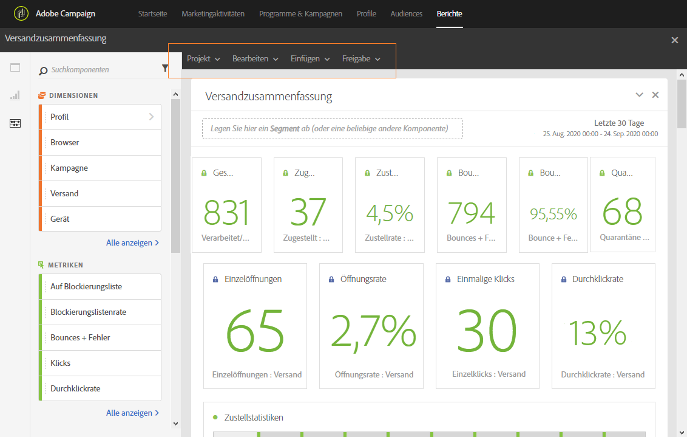
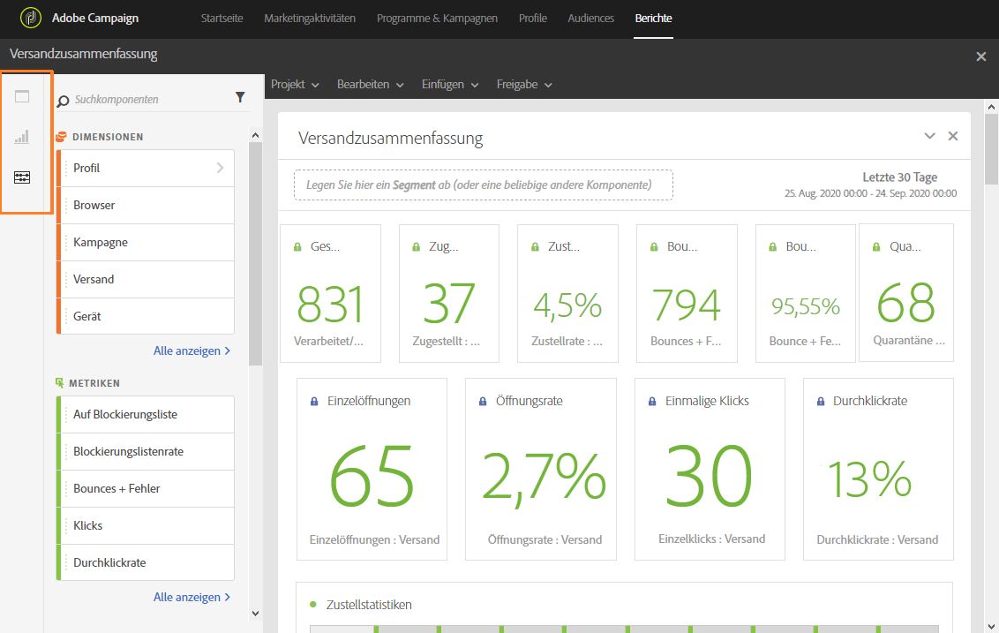
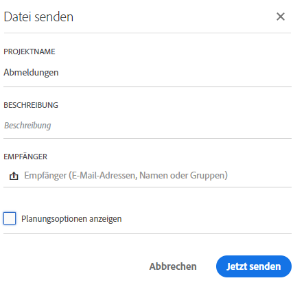
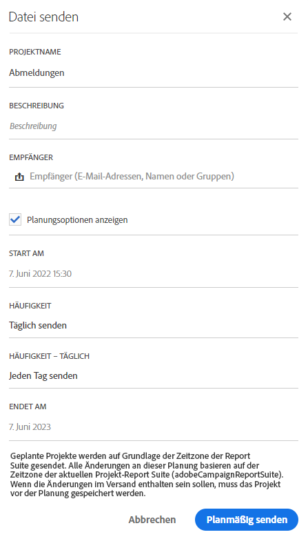
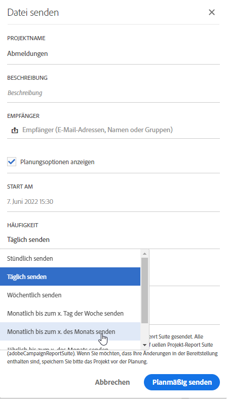
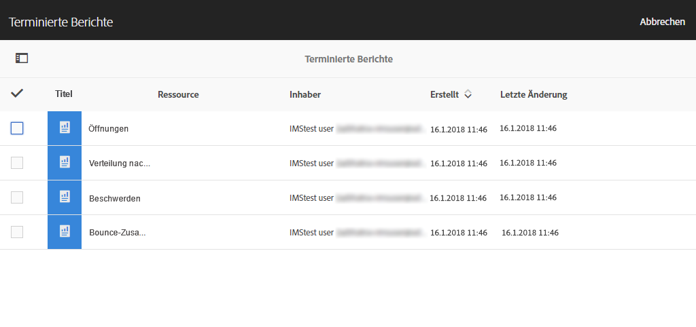

# Benutzeroberfläche für die Berichterstellung{#reporting-interface}

Über die am oberen Seitenrand befindliche Symbolleiste können Sie beispielsweise einen Bericht ändern, speichern oder ausdrucken.

Im Tab **Projekt** haben Sie folgende Möglichkeiten:

* **Öffnen...**: Öffnet einen zuvor erstellten Bericht oder eine Vorlage.
* **Speichern unter...**: Dupliziert Vorlagen, damit sie geändert werden können.
* **Projekt aktualisieren**: Aktualisiert Ihren Bericht auf der Basis neuer Daten und Filteränderungen.
* **CSV herunterladen**: Exportiert Ihre Berichte in eine CSV-Datei.

Im Tab **Bearbeiten** haben Sie folgende Möglichkeiten:

* **Rückgängig**: Bricht die zuletzt im Dashboard ausgeführte Aktion ab.
* **Alle löschen**: Löscht alle Bedienfelder in Ihrem Dashboard.

Im Tab **Einfügen** können Sie Ihre Berichte anpassen, indem Sie Diagramme und Tabellen zu Ihrem Dashboard hinzufügen:

* **Neues leeres Panel**: Fügt ein Neues leeres Panel zu Ihrem Dashboard hinzu.
* **Neue Freiform**: Fügt eine neue Freiformtabelle zu Ihrem Dashboard hinzu.
* **Neue Zeile**: Fügt ein neues Liniendiagramm zu Ihrem Dashboard hinzu.
* **Neuer Balken**: Fügt ein neues Balkendiagramm zu Ihrem Dashboard hinzu.

**Verwandte Themen:**

* [Panels hinzufügen](../../reporting/using/adding-panels.md)
* [Visualisierungen hinzufügen](../../reporting/using/adding-visualizations.md)
* [Komponenten hinzufügen](../../reporting/using/adding-components.md)
* [Berichte automatisch per E-Mail an Interessengruppen senden](https://helpx.adobe.com/de/campaign/kb/simplify-campaign-management.html#Reportandshareinsightswithallstakeholders)

## Tabs      {#tabs}

In den linken Tabs können Sie nach Bedarf Berichte erstellen und Daten filtern.

Über diese Tabs haben Sie Zugriff auf folgende Elemente:

* **[!UICONTROL Panels]**: Fügt Ihrem Bericht ein leeres Panel oder eine Freiform hinzu, um Ihre Daten zu filtern. Weiterführende Informationen finden Sie im Abschnitt zum Hinzufügen von Bedienfeldern.
* **[!UICONTROL Visualisierungen]**: Legen Sie die gewünschten Visualisierungselemente ab, um Ihren Bericht grafisch aufzubereiten. Weiterführende Informationen finden Sie im Abschnitt zum Hinzufügen von Visualisierungen.
* **[!UICONTROL Komponenten]**: Passen Sie Ihren Bericht mit unterschiedlichen Dimensionen, Metriken, Segmenten und Zeiträumen an.

## Symbolleiste {#toolbar}

Die Symbolleiste befindet sich über Ihrem Arbeitsbereich. Sie besteht aus verschiedenen Tabs, mit denen Sie beispielsweise einen Bericht ändern, speichern oder ausdrucken können.

**Verwandte Themen:**

* [Panels hinzufügen](../../reporting/using/adding-panels.md)
* [Visualisierungen hinzufügen](../../reporting/using/adding-visualizations.md)
* [Komponenten hinzufügen](../../reporting/using/adding-components.md)

### Projekt-Tab {#project-tab}

Im Tab **Projekt** haben Sie folgende Möglichkeiten:

* **Öffnen...**: Öffnet einen zuvor erstellten Bericht oder eine Vorlage.
* **Speichern unter...**: Dupliziert Vorlagen, damit sie geändert werden können.
* **Projekt aktualisieren**: Aktualisiert Ihren Bericht auf der Basis neuer Daten und Filteränderungen.
* **CSV herunterladen**: Exportiert Ihre Berichte in eine CSV-Datei.
* **[!UICONTROL Drucken]**: Druckt den Bericht.

### Bearbeiten-Tab {#edit-tab}

Im Tab **Bearbeiten** haben Sie folgende Möglichkeiten:

* **Rückgängig**: Bricht die zuletzt im Dashboard ausgeführte Aktion ab.
* **Alle löschen**: Löscht alle Bedienfelder in Ihrem Dashboard.

### Einfügen-Tab {#insert-tab}

Im Tab **Einfügen** können Sie Ihre Berichte anpassen, indem Sie Diagramme und Tabellen zu Ihrem Dashboard hinzufügen:

* **Neues leeres Panel**: Fügt ein Neues leeres Panel zu Ihrem Dashboard hinzu.
* **Neue Freiform**: Fügt eine neue Freiformtabelle zu Ihrem Dashboard hinzu.
* **Neue Zeile**: Fügt ein neues Liniendiagramm zu Ihrem Dashboard hinzu.
* **Neuer Balken**: Fügt ein neues Balkendiagramm zu Ihrem Dashboard hinzu.

### Freigabe-Tab      {#share-tab}

Im Tab **[!UICONTROL Freigabe]** können Sie Adobe Campaign-Benutzern Berichte mit einmaligen oder wiederkehrenden E-Mails senden. Die jeweiligen Benutzer erhalten dann eine E-Mail mit Ihrem Bericht im Anhang.

* **[!UICONTROL Bericht jetzt senden]**: Senden Sie Ihren Bericht an eine Liste ausgewählter Empfänger mit einer einmaligen E-Mail.

   1. Bei Bedarf können Sie im Fenster **[!UICONTROL Bericht senden]** eine Beschreibung hinzufügen.

      

   1. Wählen Sie die Empfänger aus der Dropdown-Liste aus. Beachten Sie, dass Sie keine Benutzer außerhalb Ihres Unternehmens auswählen können.
   1. Aktivieren Sie **[!UICONTROL Planungsoptionen anzeigen]**, wenn Sie wiederkehrende E-Mails senden möchten. Dies ist auch durch die Auswahl von **[!UICONTROL Bericht senden]** im Tab **[!UICONTROL Freigabe]** möglich.
   1. Klicken Sie auf **[!UICONTROL Jetzt senden]**. Ihre Empfänger erhalten dann eine E-Mail mit Ihrem Bericht im Anhang.

* **[!UICONTROL Bericht senden]**: Terminieren Sie Ihren Bericht und senden Sie wiederkehrende E-Mails an Empfänger.

   1. Bei Bedarf können Sie im Fenster **[!UICONTROL Bericht senden]** eine Beschreibung hinzufügen.
   1. Wählen Sie die Empfänger aus der Dropdown-Liste aus. Beachten Sie, dass Sie keine Benutzer außerhalb Ihres Unternehmens auswählen können.

      

   1. Durch die Auswahl des Start- und Enddatums in den Feldern **[!UICONTROL Start am]** und **[!UICONTROL Endet am]** konfigurieren Sie die Gültigkeit Ihrer E-Mail.
   1. Wählen Sie außerdem die Sendehäufigkeit der E-Mail.

      

   1. Wählen Sie **[!UICONTROL Planmäßig senden]** aus. Die Empfänger erhalten die wiederkehrende E-Mail entsprechend der ausgewählten Häufigkeit.

* **[!UICONTROL Terminierte Berichte]**: Suchen und konfigurieren Sie alle Ihre terminierten Berichte.

   1. Im Fenster **[!UICONTROL Terminierte Berichte]** finden Sie alle Berichte, die mit wiederkehrenden E-Mails gesendet werden.

      

   1. Wenn Sie einen terminierten Bericht löschen möchten, wählen Sie den jeweiligen Bericht und danach **[!UICONTROL Auswahl löschen aus]**.
   1. Um terminierte Berichte zu konfigurieren oder zu überprüfen, klicken Sie direkt auf den Bericht, den Sie ändern möchten.
   1. Das Fenster **[!UICONTROL Terminierten Bericht bearbeiten]** wird geöffnet, wo Sie die Empfänger oder die Häufigkeit Ihrer E-Mail-Sendungen nach Bedarf ändern können.

Die jeweiligen Benutzer erhalten dann eine E-Mail mit Ihrem Bericht im Anhang direkt in ihrer Inbox. Wenn Benutzer keine wiederkehrenden E-Mails mehr erhalten möchten, können Sie einen in jeder wiederkehrenden E-Mail verfügbaren Abmelde-Link verwenden.

**Verwandtes Thema:**

* [Berichte automatisch per E-Mail an Interessengruppen senden](https://helpx.adobe.com/de/campaign/kb/simplify-campaign-management.html#Reportandshareinsightswithallstakeholders)
