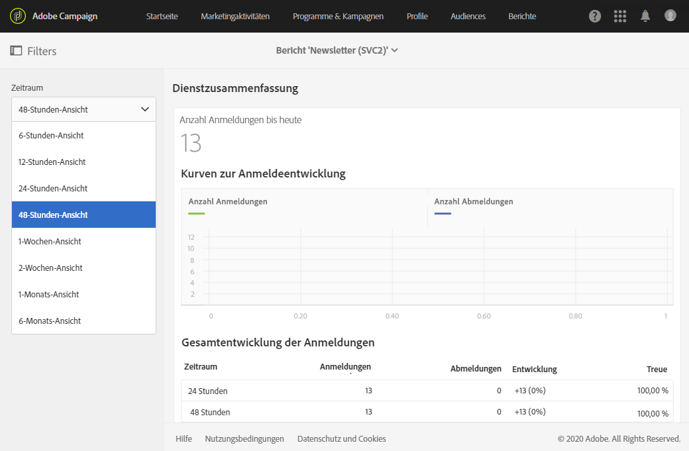

# Dienstzusammenfassung{#service-summary}

In der **[!UICONTROL Dienstzusammenfassung]** wird die Entwicklung von Anmeldungen und Abmeldungen für Ihren Dienst beschrieben.
Auf diesen Bericht kann nur von Ihrer Dienstseite aus über das erweiterte Menü **[!UICONTROL Profile &amp; Audiences]** > **[!UICONTROL Dienste]** zugegriffen werden. Weiterführende Informationen hierzu finden Sie auf dieser [Seite](../../audiences/using/monitoring-subscriptions.md#service-reports).

Die Visualisierung **[!UICONTROL Kurven zur Anmeldeentwicklung]** zeigt die Anzahl der Anmeldungen und Abmeldungen in Abhängigkeit vom in der Dropdown-Leiste gewählten **[!UICONTROL Zeitraum]**.

Die **[!UICONTROL Gesamtentwicklung der Anmeldungen]** ermöglicht Ihnen, die Entwicklung Ihrer Abonnenten über verschiedene Zeiträume hinweg zu sehen.
