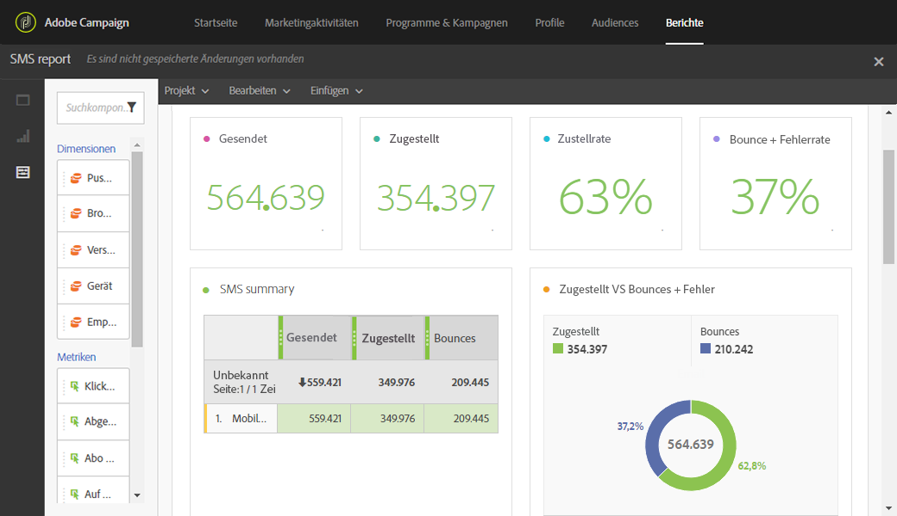

# SMS-Bericht{#sms-report}

Der Bericht **SMS** bietet Informationen zu SMS-Sendungen, wie die Anzahl der zugestellten Nachrichten und die Bounces.

Die Tabelle **SMS summary** einschließlich ihrer Grafiken und Zusammenfassungsnummern enthält Daten zu gesendeten SMS-Nachrichten.

* **Verarbeitet/gesendet**: die Anzahl an gesendeten SMS-Nachrichten.
* **Zugestellt**: die Anzahl an zugestellten SMS-Nachrichten.
* **Bounces + Fehler**: die Anzahl an Nachrichten, die nicht zugestellt werden konnten.

