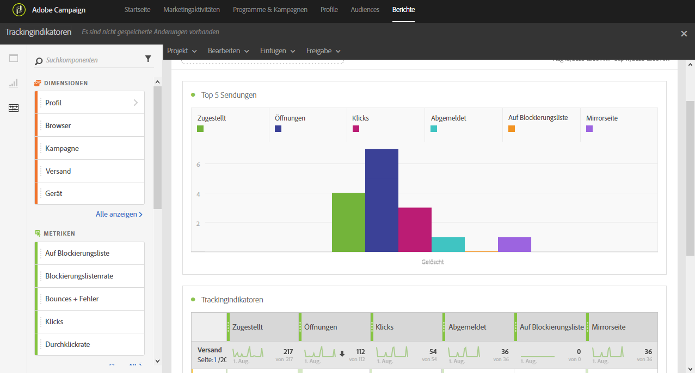

# Tracking-Indikatoren{#tracking-indicators}

Der Bericht **[!UICONTROL Trackingindikatoren]** enthält die wichtigsten Indikatoren zum Tracking des Verhaltens nach dem Empfang einer E-Mail-Nachricht.

>[!NOTE]
>
>Um auf diese Daten zugreifen zu können, muss das Tracking zum Zeitpunkt der Versandvorbereitung aktiviert sein.

Die Tabelle **[!UICONTROL Trackingindikatoren]** und das Diagramm **Top 5 Sendungen** enthalten die verfügbaren Daten für das Tracken von E-Mails, z. B.:

* **[!UICONTROL Zugestellt]**: Die Anzahl der erfolgreich gesendeten Nachrichten. Fehler (Bounces) werden abgezogen, doch Beschwerden (als Spam gekennzeichnete Nachrichten) und Abwesenheitsnotizen (beispielsweise &quot;Nicht im Büro&quot;) bleiben eingeschlossen.
* **Öffnungen**: Die Anzahl der Öffnungen einer Nachricht in einem Versand.
* **Klicken**: Die Anzahl der Klicks auf einen Inhalt in einem Versand.
* **Abgemeldet**: Gesamtanzahl der Klicks auf den Abmelde-Link.
* **Spam**: Die Anzahl der Empfänger, die eine E-Mail als Spam gekennzeichnet haben.
* **Mirrorseite**: Die Anzahl der Klicks auf die Mirrorseite.
