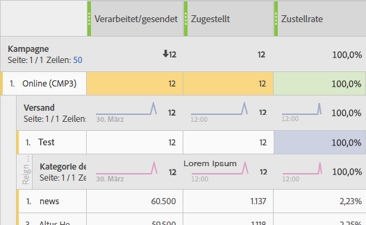

# Problembehebung{#troubleshooting}

In diesem Abschnitt finden Sie häufig gestellte Fragen zu dynamischen Berichten.

## Bei Einzelöffnungen und Einzelklicks entspricht die Zahl in der Aggregat-Zeile nicht der Zahl in den einzelnen Zeilen. {#unique-open-clicks-no-match}

Dies ist zu erwarten.
Im folgenden Beispiel möchten wir dieses Verhalten erläutern.

Eine E-Mail wird an Profil P1 und P2 gesendet.

P1 öffnet die E-Mail am ersten Tag zweimal und dann am zweiten Tag dreimal.

P2 öffnet die E-Mail am ersten Tag einmal und an den folgenden Tagen nicht mehr.
Im Folgenden finden Sie eine Darstellung der Interaktion der Profile mit der gesendeten E-Mail:

<table> 
 <thead> 
  <tr> 
   <th align="center"> <strong>Day</strong>   </th> 
   <th align="center"> <strong>Öffnungen</strong>   </th> 
   <th align="center"> <strong>Einzelöffnungen</strong>   </th> 
  </tr> 
 </thead> 
 <tbody> 
  <tr> 
   <td align="center"> Tag 1  </td> 
   <td align="center"> 2 + 1 = 3  </td> 
   <td align="center"> 1 + 1 = 2  </td> 
  </tr> 
  <tr> 
   <td align="center"> Tag 2  </td> 
   <td align="center"> 3 + 0 = 3  </td> 
   <td align="center"> 1 + 0 = 1  </td> 
  </tr>
 </tbody> 
</table>

To understand the overall number of unique opens, we need to sum up the row counts of **[!UICONTROL Unique Opens]** which gives us the value 3. Da für die E-Mail aber nur 2 Profile ausgewählt wurden, sollte die Öffnungsrate 150 % betragen.

To not obtain percentage higher than 100, the definition of **[!UICONTROL Unique Opens]** is maintained to be the number of unique broadlogs that were opened. In diesem Fall haben die Einzelöffnungen von P1 den Wert 1, auch wenn P1 die E-Mail an Tag 1 und Tag 2 geöffnet hat.

Dies ergibt die folgende Tabelle:

<table> 
 <thead> 
  <tr> 
   <th align="center"> <strong>Day</strong>   </th> 
   <th align="center"> <strong>Öffnungen</strong>   </th> 
   <th align="center"> <strong>Einzelöffnungen</strong>   </th> 
  </tr> 
 </thead> 
 <tbody> 
  <tr> 
   <td align="center"> Tag 1  </td> 
   <td align="center"> 6  </td> 
   <td align="center"> 2  </td>
  </tr> 
  <tr> 
   <td align="center"> Tag 2  </td> 
   <td align="center"> 3  </td> 
   <td align="center"> 2  </td> 
  </tr> 
 </tbody> 
</table>

>[!NOTE]
>
>Einzelzählungen basieren auf einem HLL-basierten Sketch. Dies kann bei großen Zahlen zu leichten Ungenauigkeiten führen.

## Die Anzahl der Öffnungen stimmt nicht mit der Anzahl in der Datenbank überein. {#open-counts-no-match-database}

This may be due to the fact that, heuristics are used in Dynamic reporting to track opens even when we can&#39;t track the **[!UICONTROL Open]** action.

For example, if a user has disabled images on their client and click on a link in the email, the **[!UICONTROL Open]** may not be tracked by the database but the **[!UICONTROL Click]** will.

Therefore, the **[!UICONTROL Open]** tracking logs counts may not have the same count in the database.

Solche Ereignisse werden hinzugefügt, da **ein E-Mail-Klick auf eine E-Mail-Öffnung hinweist**.

>[!NOTE]
>
>Da Einzelzählungen auf einem HLL-basierten Sketch basieren, können zwischen den Zahlen kleine Unterschiede auftreten.

## Was bedeuten die Farben in der Tabelle meiner Berichte? {#reports-color-signification}

Die Farben in Ihren Berichten sind zufällig gewählt und können nicht personalisiert werden. Sie stellen einen Fortschrittsbalken dar und sollen Ihnen helfen, den in den Berichten erzielten Höchstwert besser zu erkennen.

Im folgenden Beispiel hat die Zelle die gleiche Farbe, da ihr Wert 100 % beträgt.

If you change the **[!UICONTROL Conditional formatting]** to custom, when the value reaches the upper limit the cell will get greener. Wenn er umgekehrt jedoch den unteren Grenzwert erreicht, wird sie röter.

Zum Beispiel haben wir hier den Wert **[!UICONTROL Upper limit]** auf 500 und **[!UICONTROL Lower limit]** auf 0 gesetzt.

## Warum wird der Wert &quot;K. A.&quot; in meinen Berichten angezeigt?

Der Wert **K. A.** wird manchmal in Ihren dynamischen Berichten angegeben. Dafür gibt es zwei Gründe:

* Der Versand wurde gelöscht und wird hier als **K. A.** angegeben, sodass keine Diskrepanz in den Ergebnissen verursacht wird.
* When drag and dropping the **[!UICONTROL Transactional Delivery]** dimension to your reports, the value **N/A** might appear as a result. Dies geschieht, weil der dynamische Bericht alle Sendungen abruft, auch wenn sie keine Transaktionsnachrichten sind.
This can also happen when drag and dropping the **[!UICONTROL Delivery]** dimension to your report but in this case, the **N/A** value will represent transactional deliveries.
