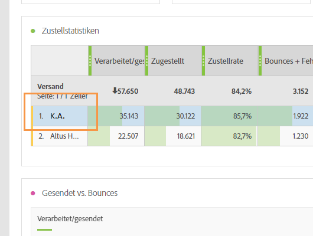

# Problembehebung{#troubleshooting}

In diesem Abschnitt finden Sie häufig gestellte Fragen zu dynamischen Berichten.

## Bei Einzelöffnungen und Einzelklicks entspricht die Zahl in der Aggregat-Zeile nicht der Zahl in den einzelnen Zeilen. {#unique-open-clicks-no-match}

Dies ist zu erwarten.
Im folgenden Beispiel möchten wir dieses Verhalten erläutern.

Eine E-Mail wird an Profil P1 und P2 gesendet.

P1 öffnet die E-Mail am ersten Tag zweimal und dann am zweiten Tag dreimal.

P2 öffnet die E-Mail am ersten Tag einmal und an den folgenden Tagen nicht mehr.
Im Folgenden finden Sie eine Darstellung der Interaktion der Profile mit der gesendeten E-Mail:

<table> 
 <thead> 
  <tr> 
   <th align="center"> <strong>Day</strong>   </th> 
   <th align="center"> <strong>Öffnungen</strong>   </th> 
   <th align="center"> <strong>Einzelöffnungen</strong>   </th> 
  </tr> 
 </thead> 
 <tbody> 
  <tr> 
   <td align="center"> Tag 1  </td> 
   <td align="center"> 2 + 1 = 3  </td> 
   <td align="center"> 1 + 1 = 2  </td> 
  </tr> 
  <tr> 
   <td align="center"> Tag 2  </td> 
   <td align="center"> 3 + 0 = 3  </td> 
   <td align="center"> 1 + 0 = 1  </td> 
  </tr>
 </tbody> 
</table>

Um die Gesamtzahl der Einzelöffnungen zu erhalten, müssen wir die Zeilenanzahl der **[!UICONTROL Einzelöffnungen]** addieren, was 3 ergibt. Da für die E-Mail aber nur 2 Profile ausgewählt wurden, sollte die Öffnungsrate 150 % betragen.

Um keinen Prozentsatz von mehr als 100 zu erhalten, wird zur Definition von **[!UICONTROL Einzelöffnungen]** die Anzahl der eindeutigen Broadlogs herangezogen, die geöffnet wurden. In diesem Fall haben die Einzelöffnungen von P1 den Wert 1, auch wenn P1 die E-Mail an Tag 1 und Tag 2 geöffnet hat.

Dies ergibt die folgende Tabelle:

<table> 
 <thead> 
  <tr> 
   <th align="center"> <strong>Day</strong>   </th> 
   <th align="center"> <strong>Öffnungen</strong>   </th> 
   <th align="center"> <strong>Einzelöffnungen</strong>   </th> 
  </tr> 
 </thead> 
 <tbody> 
  <tr> 
   <td align="center"> Tag 1  </td> 
   <td align="center"> 6  </td> 
   <td align="center"> 2  </td>
  </tr> 
  <tr> 
   <td align="center"> Tag 2  </td> 
   <td align="center"> 3  </td> 
   <td align="center"> 2  </td> 
  </tr> 
 </tbody> 
</table>

>[!NOTE]
>
>Einzelzählungen basieren auf einem HLL-basierten Sketch. Dies kann bei großen Zahlen zu leichten Ungenauigkeiten führen.

## Die Anzahl der Öffnungen stimmt nicht mit der Anzahl in der Datenbank überein. {#open-counts-no-match-database}

Der Grund dafür kann darin liegen, dass bei dynamischen Berichten heuristische Modelle verwendet werden, um Öffnungen zu tracken, selbst wenn die Aktion **[!UICONTROL Öffnungen]** nicht getrackt werden kann.

Wenn beispielsweise ein Benutzer die Bilder in seinem Client deaktiviert hat und auf einen Link in der E-Mail klickt, kann es vorkommen, dass die **[!UICONTROL Öffnung]** nicht von der Datenbank getrackt wird, der **[!UICONTROL Klick]** aber schon.

Deshalb kann es vorkommen, dass die Anzahl in den Trackinglogs für **[!UICONTROL Öffnungen]** nicht mit der in der Datenbank übereinstimmt.

Solche Ereignisse werden hinzugefügt, da **ein E-Mail-Klick auf eine E-Mail-Öffnung hinweist**.

>[!NOTE]
>
>Da Einzelzählungen auf einem HLL-basierten Sketch basieren, können zwischen den Zahlen kleine Unterschiede auftreten.

## Wie werden die Zahlen für wiederkehrende Sendungen/den Versand von Transaktionsnachrichten berechnet?

Bei wiederkehrenden Sendungen und dem Versand von Transaktionsnachrichten werden die Zahlen sowohl den über- als auch den untergeordneten Sendungen zugeordnet.

Nehmen Sie zum Beispiel einen wiederkehrenden Versand mit der Bezeichnung **R1**, der täglich an Tag 1 (RC1), Tag 2 (RC2) und Tag 3 (RC3) ausgeführt wird.

Nehmen wir an, dass nur eine einzige Person alle untergeordneten Sendungen mehrmals geöffnet hat. In diesem Fall wird für die einzelnen wiederkehrenden untergeordneten Sendungen als Anzahl der **[!UICONTROL Öffnungen]** 1 angezeigt.

Da jedoch dieselbe Person auf alle Sendungen geklickt hat, wird für den übergeordneten wiederkehrenden Versand unter **[!UICONTROL Einzelöffnungen]** ebenfalls 1 angezeigt.

Ab Adobe Campaign Standard-Version 19.2.1 lautet die Definition von **Einzelzählungen** nicht mehr **die Anzahl der einzelnen Personen, die mit einem Versand interagieren**, sondern **die Anzahl der einzelnen Nachrichten, mit denen interagiert wurde**.

Vor der Adobe Campaign Standard-Version 19.2.1 sahen Berichte folgendermaßen aus:

<table> 
 <thead> 
  <tr> 
   <th align="center"> <strong>Versand</strong>   </th> 
   <th align="center"> <strong>Gesendet</strong>   </th> 
   <th align="center"> <strong>Zugestellt</strong>   </th>
   <th align="center"> <strong>Öffnungen</strong>   </th> 
   <th align="center"> <strong>Einzelöffnungen</strong>   </th>
  </tr> 
 </thead> 
 <tbody> 
  <tr> 
   <td align="center"> <strong>R1  </td> 
   <td align="center"> <strong>100  </td> 
   <td align="center"> <strong>90  </td> 
   <td align="center"> <strong>10  </td> 
   <td align="center"> <strong>1  </td> 
  </tr> 
  <tr> 
   <td align="center"> RC1  </td> 
   <td align="center"> 20  </td> 
   <td align="center"> 20  </td> 
   <td align="center"> 6  </td> 
   <td align="center"> 1  </td> 
  </tr>
    <tr> 
   <td align="center"> RC2  </td> 
   <td align="center"> 40  </td> 
   <td align="center"> 30  </td> 
   <td align="center"> 2  </td> 
   <td align="center"> 1  </td> 
  </tr> 
    <tr> 
   <td align="center"> RC3  </td> 
   <td align="center"> 40  </td> 
   <td align="center"> 40  </td> 
   <td align="center"> 2  </td> 
   <td align="center"> 1  </td> 
  </tr>
 </tbody> 
</table>

Ab Adobe Campaign Standard-Version 19.2.1 sehen die Berichte wie folgt aus:

<table> 
 <thead> 
  <tr> 
   <th align="center"> <strong>Versand</strong>   </th> 
   <th align="center"> <strong>Gesendet</strong>   </th> 
   <th align="center"> <strong>Zugestellt</strong>   </th>
   <th align="center"> <strong>Öffnungen</strong>   </th> 
   <th align="center"> <strong>Einzelöffnungen</strong>   </th>
  </tr> 
 </thead> 
 <tbody> 
  <tr> 
   <td align="center"> <strong>R1  </td> 
   <td align="center"> <strong>100  </td> 
   <td align="center"> <strong>90  </td> 
   <td align="center"> <strong>10  </td> 
   <td align="center"> <strong>3  </td> 
  </tr> 
  <tr> 
   <td align="center"> RC1  </td> 
   <td align="center"> 20  </td> 
   <td align="center"> 20  </td> 
   <td align="center"> 6  </td> 
   <td align="center"> 1  </td> 
  </tr>
    <tr> 
   <td align="center"> RC2  </td> 
   <td align="center"> 40  </td> 
   <td align="center"> 30  </td> 
   <td align="center"> 2  </td> 
   <td align="center"> 1  </td> 
  </tr> 
    <tr> 
   <td align="center"> RC3  </td> 
   <td align="center"> 40  </td> 
   <td align="center"> 40  </td> 
   <td align="center"> 2  </td> 
   <td align="center"> 1  </td> 
  </tr> 
 </tbody> 
</table>

## Was bedeuten die Farben in der Tabelle meiner Berichte? {#reports-color-signification}

Die Farben in Ihren Berichten sind zufällig gewählt und können nicht personalisiert werden. Sie stellen einen Fortschrittsbalken dar und sollen Ihnen helfen, den in den Berichten erzielten Höchstwert besser zu erkennen.

Im folgenden Beispiel hat die Zelle die gleiche Farbe, da ihr Wert 100 % beträgt.

Wenn Sie die **[!UICONTROL bedingte Formatierung]in benutzerdefinierte Formatierung ändern, wird die Zelle grüner, wenn der Wert den oberen Grenzwert erreicht.** Wenn er umgekehrt jedoch den unteren Grenzwert erreicht, wird er röter.

For example, here, we set the **[!UICONTROL Upper limit]** to 500 and **[!UICONTROL Lower limit**] to 0.

## Warum wird der Wert "K/A"in meinen Berichten angezeigt?

Der Wert **K/A** kann manchmal in Ihren dynamischen Berichten erscheinen. Dies kann aus zwei Gründen angezeigt werden:

* Die Lieferung wurde gelöscht und wird hier als **K/A** angezeigt, um keine Diskrepanz in den Ergebnissen zu verursachen.
* Wenn Sie die Dimension " **[!UICONTROL Transaktionsbereitstellung]** "in Ihre Berichte ziehen und dort ablegen, wird der Wert **K/A** möglicherweise als Ergebnis angezeigt. Dies geschieht, weil der dynamische Bericht jede Auslieferung abruft, auch wenn sie nicht transaktional sind.
Dies kann auch passieren, wenn Sie die Dimension " **[!UICONTROL Auslieferung]** "in Ihren Bericht ziehen und dort ablegen. In diesem Fall stellt der **N/A** -Wert jedoch Transaktionslieferungen dar.
