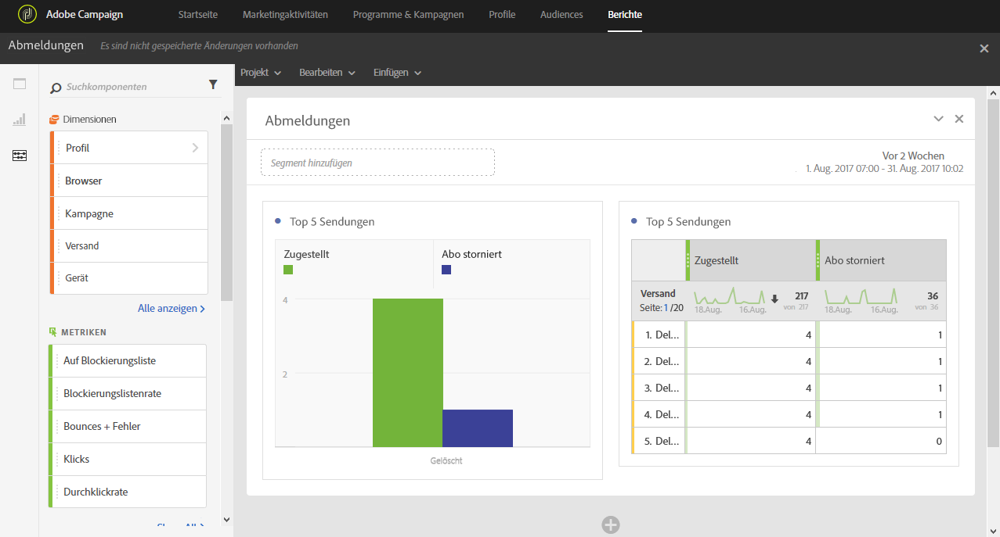

# Abmeldungen{#unsubscriptions}

Im Bericht **[!UICONTROL Abmeldungen]** werden die Sendungen identifiziert, die zu den meisten Abmeldungen geführt haben.

Die Tabelle **[!UICONTROL 5 HÄUFIGSTE Zustellungen]** einschließlich der entsprechenden Grafik enthält die fünf Sendungen mit der größten Anzahl an zugestellten Nachrichten und an Empfängern, die sich abgemeldet haben. Die hier aufgeführten Daten basieren auf der Anzahl der Klicks auf den Abmelde-Link der Nachricht.
