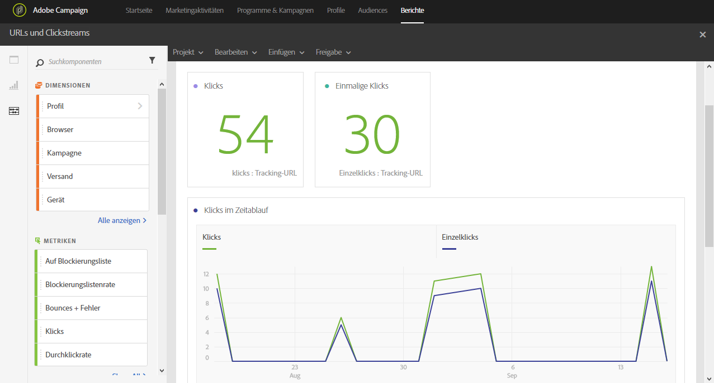

# URLs und Clickstreams{#urls-and-click-streams}

In **URLs und Clickstreams** werden die URLs angezeigt, die während eines Versands oder während mehrerer Sendungen als Teil einer Kampagne oder eines Programms am öftesten angeklickt wurden.

Für jede Tabelle werden Zusammenfassungen und Grafiken erstellt. Die Darstellung dieser Details können Sie in deren Einstellungen ändern.

Die Tabelle **Meistbesuchte Links** enthält für jeden Versand die verfügbaren Daten zur Empfängeraktivität, wie beispielsweise:

* **Klicken**: Die Anzahl der Klicks auf einen Inhalt in einem Versand.
* **Einzelklicks**: Die Anzahl der Empfänger, die einen Inhalt in einem Versand angeklickt haben.

