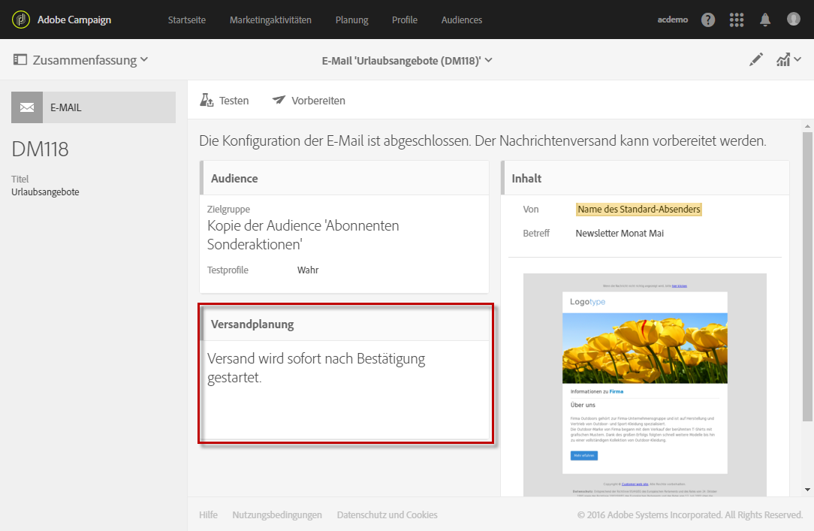
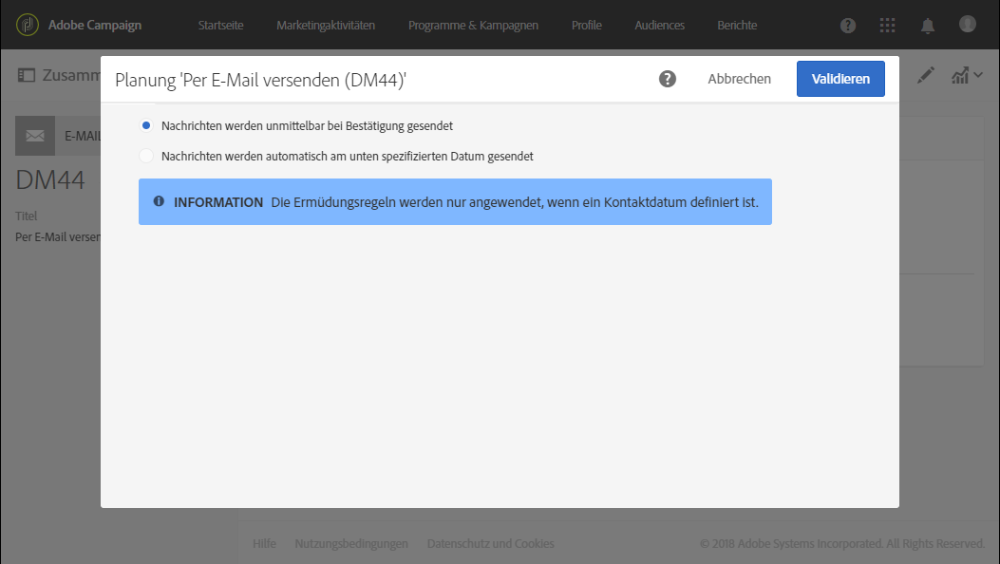
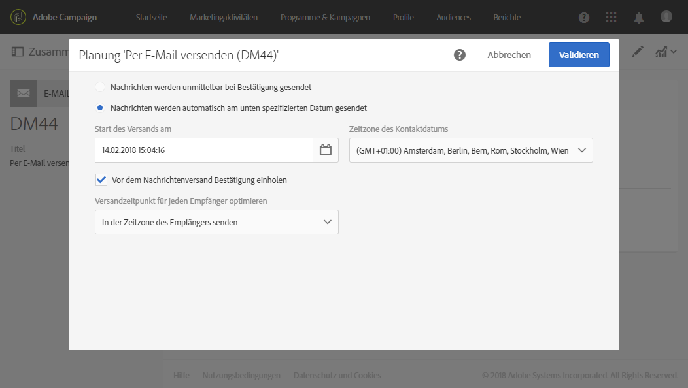

# Über die Planung von Sendungen{#about-scheduling-messages}

>[!IMPORTANT]
>
>Wenn Sie den Zeitplan eines Versands ändern, müssen Sie den Versand erneut vorbereiten, indem Sie auf die Schaltfläche **Vorbereiten** und danach auf **Bestätigen** klicken.

Der Zeitpunkt des Nachrichtenversands (E-Mails, SMS-Nachrichten oder Push-Benachrichtigungen) wird im Nachrichten-Dashboard in der Kachel **[!UICONTROL Planung]** definiert.

Unter **[!UICONTROL Planung]** können Sie Versandoptionen für E-Mails, SMS-Nachrichten oder Push-Benachrichtigungen festlegen:

* **[!UICONTROL Nachrichten werden unmittelbar bei Bestätigung gesendet]**: Nachrichten werden gesendet, sobald der Versand bestätigt wurde. Siehe [Versand bestätigen](../../sending/using/confirming-the-send.md).

  

* **[!UICONTROL Nachrichten werden automatisch am unten spezifizierten Datum gesendet]**: Nachrichten werden an einem späteren Datum gesendet. Geben Sie das gewünschte **Kontaktdatum** im Feld **Versandstart am** an.

  Sie können den Versand vorbereiten und bestätigen, die Nachrichten werden aber erst zum ausgewählten Zeitpunkt gesendet. Informationen zur Vorbereitung und Validierung des Versands finden Sie in den Abschnitten [Versandvorbereitung](../../sending/using/preparing-the-send.md) und [Versand bestätigen](../../sending/using/confirming-the-send.md).

  Mithilfe der Dropdown-Liste **[!UICONTROL Zeitzone des Kontaktdatums]** können Sie die für den Versand zu berücksichtigende Zeitzone anpassen. Wenn Sie beispielsweise im Feld **[!UICONTROL Start des Versands am]** 9:00 Uhr eingeben und in der Dropdown-Liste **[!UICONTROL Zeitzone des Kontaktdatums]** Brüssel, Kopenhagen, Madrid, Paris (GMT+1) auswählen, erhalten alle Empfänger die Nachricht um 9:00 Uhr Pariser Zeit. Folglich erhält ein Empfänger in Moskau (GMT+3) die Nachricht um 11:00 Uhr Moskauer Zeit.

  Aktivieren Sie die Option **[!UICONTROL Vor dem Nachrichtenversand Bestätigung einholen]**, wenn Sie den tatsächlichen Versand der Nachrichten von einer manuellen Bestätigung abhängig machen möchten. Standardmäßig ist diese Option aktiviert.

  

>[!IMPORTANT]
>
>Beim Duplizieren eines Versands werden alle Terminierungseinstellungen gelöscht. Der duplizierte Versand wird gestartet, sobald er validiert wurde, außer Sie geben ein neues Kontaktdatum an.

**Verwandte Themen**:

* [Versandzeitpunkt optimieren](../../sending/using/optimizing-the-sending-time.md)
* [Nachrichten in der Zeitzone des Empfängers senden](../../sending/using/sending-messages-at-the-recipient-s-time-zone.md)
* [Versanddatum berechnen](../../sending/using/computing-the-sending-date.md)
