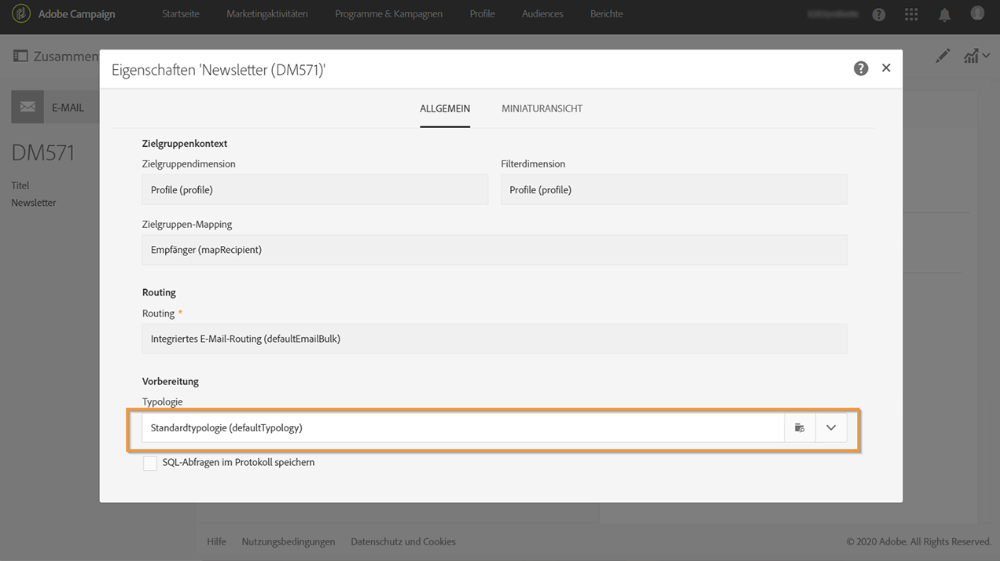

# Über Typologien und Typologieregeln{#about-typology-rules}

Mit Campaign Standard können Sie eine Nachricht mit einer **Typologie** verknüpfen, um zu überprüfen, ob die Nachricht gültig ist und Ihre Qualitätskriterien erfüllt.

Typologien sind Gruppen von **Typologieregeln**, die während der Nachrichtenanalyse ausgeführt werden. Damit können Sie sicherstellen, dass Ihre E-Mails immer bestimmte Elemente (z. B. einen Link zur Abmeldung oder eine Betreffzeile) oder Filterregeln enthalten, um Gruppen aus Ihrer beabsichtigten Zielgruppe auszuschließen (z. B. ehemalige Abonnenten, Konkurrenten oder Kunden, die nicht Mitglied im Treueprogramm sind).

In Campaign Standard stehen gebrauchsfertige Typologien und Typologieregeln zur Verfügung. Je nach Bedarf können Sie auch neue Regeln erstellen und zu vorhandenen oder neuen Typologien hinzufügen, um eine Verknüpfung zu Ihren Nachrichten herzustellen.

Die Schritte zum Erstellen und Anwenden einer Typologie für Nachrichten sind:

1. Richten Sie Typologieregeln ein (siehe [diesen Abschnitt](../../sending/using/managing-typology-rules.md#creating-a-typology-rule)).
1. Erstellen Sie eine Typologie und referenzieren Sie diese mit den Regeln, die Sie erstellt haben (siehe [diesen Abschnitt](../../sending/using/managing-typologies.md#creating-a-typology)).
1. Konfigurieren Sie Ihren Versand für die Verwendung der von Ihnen erstellten Typologie (siehe [diesen Abschnitt](../../sending/using/managing-typologies.md#applying-typologies-to-messages)).
1. Während der Nachrichtenvorbereitung werden Profile ausgeschlossen, wenn das Kriterium erfüllt wird. In den Logs können Sie die Ausführung von Ausschlüssen überprüfen.
