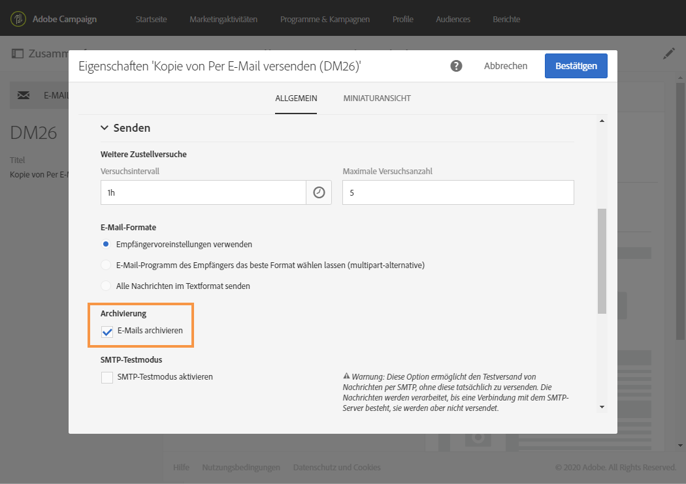

# Archivieren mit E-Mail-BCC{#archiving-emails}

Sie können Adobe Campaign so konfigurieren, dass von E­Mails, die von der Plattform per E-Mail-BCC gesendet werden, eine Kopie beibehalten wird.

Wenn Ihr Unternehmen aus Compliance-Gründen alle ausgehenden E-Mail-Nachrichten archivieren muss, können Sie diese Funktion aktivieren. So können Sie eine genaue, versteckte Kopie der jeweiligen gesendeten Nachrichten an eine BCC-E-Mail-Adresse (die für die Empfänger des Versands unsichtbar ist) senden, die von Ihnen angegeben werden muss.

Nachdem die Aktivierung durchgeführt wurde, aktivieren Sie E-Mail-BCC in der E-Mail-Versandvorlage über die Option **[!UICONTROL E-Mails archivieren]**.

>[!NOTE]
>
>Adobe Campaign selbst ermöglicht keine Verwaltung von archivierten Dateien. Sie können aber die gewünschten Nachrichten an eine bestimmte Adresse senden, wo sie mithilfe eines externen Systems verarbeitet und archiviert werden.

## Empfehlungen und Einschränkungen {#recommendations-and-limitations}

* Hierbei handelt es sich um eine optionale Funktion. Bitte prüfen Sie Ihren Lizenzvertrag und kontaktieren Sie den Ansprechpartner für Ihr Konto, um diese Funktion zu aktivieren.
* Die gewünschte BCC-Adresse muss dem Adobe-Team übermittelt werden, das die Adresse für Sie konfigurieren wird.
* Sie können nur eine einzige BCC-E-Mail-Adresse verwenden.
* Nur erfolgreich gesendete E-Mails werden berücksichtigt. Bounces werden nicht berücksichtigt.
* Aus Datenschutzgründen müssen BCC-E-Mails von einem Archivierungssystem bearbeitet werden, in dem personenbezogene Daten (PII, Personally Identifiable Information) sicher aufbewahrt werden.
* Bei der Erstellung einer neuen Versandvorlage ist E-Mail-BCC nicht standardmäßig aktiviert, selbst wenn diese Option erworben wurde. Sie muss manuell in jeder Versandvorlage aktiviert werden, in der sie verwendet werden soll.

>[!NOTE]
>
>Derzeit werden die archivierten E-Mails noch vom alten Archivierungsmodul gesendet, das ein einfaches SMTP-Relay verwendet.

## E-Mail-Archivierung aktivieren            {#activating-email-archiving}

Nach der Aktivierung wird E-Mail-BCC in der [E-Mail-Vorlage](../../start/using/marketing-activity-templates.md) über die folgende Option aktiviert:

1. Rufen Sie den Knoten **Ressourcen** > **Vorlagen** > **Versandvorlagen** auf.
1. Duplizieren Sie die vordefinierte Vorlage **[!UICONTROL Per E-Mail versenden]**.
1. Wählen Sie die duplizierte Vorlage aus.
1. Bearbeiten Sie mithilfe der Schaltfläche **[!UICONTROL Eigenschaften bearbeiten]** die Eigenschaften Ihrer Vorlage.
1. Erweitern Sie den Abschnitt **[!UICONTROL Senden]**.
1. Aktivieren Sie die Option **[!UICONTROL E-Mails archivieren]**, um eine Kopie aller gesendeten, auf dieser Vorlage basierenden Nachrichten aufzubewahren.

   

>[!NOTE]
>
>Wenn die an eine BCC-Adresse gesendeten E-Mails geöffnet und angeklickt werden, wird dies in der Versandanalyse in **[!UICONTROL Gesamtöffnungen]** und **[!UICONTROL Klicks]** berücksichtigt, was zu falschen Berechnungen führen könnte.
